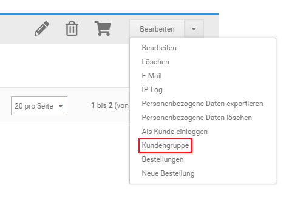
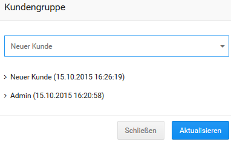

# Kundengruppen zuweisen {#kundengruppen_zuweisen}

Bestehende Kundenkonten kannst du unter Kunden \> Kunden einer Kundengruppe zuweisen.

1.  Wähle aus der Liste Kunden den Kunden aus, der einer neuen Kundengruppe zugewiesen werden soll
2.  Klicke über die Dropdown-Schaltfläche auf Kundengruppe
3.  Wähle die gewünschte Kundengruppe aus, der der gewählte Kunde zugewiesen werden soll
4.  Klicke auf Aktualisieren, um den Kunden der neuen Kundengruppe zuzuweisen

**Parent topic:**[Kundengruppen](12_5_Kundengruppen.md)

