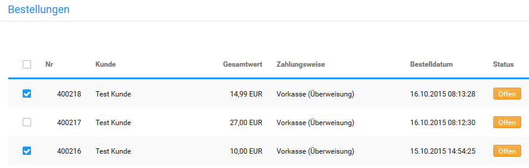

# Bestellstatus {#bestellstatus}

Über den Bestellstatus wird der aktuelle Stand der Bestellung festgelegt. Der Bestellstatus ist sowohl für den Shopbetreiber im Gambio Admin des Shops, als auch für den Kunden im Shopbereich sichtbar.

## Bestellstatus einer Bestellung ändern { .section}

Den Bestellstatus einer einzelnen Bestellung kannst du auf der Detailseite der Bestellung im Gambio Admin unter Bestellungen \> Bestellungen ändern.

")

1.  Klicke auf die farbige Status-Anzeige oder die Schaltfläche Bestellstatus ändern und wähle aus der Liste Neuer Bestellstatus den neuen Bestellstatus aus
2.  Aktiviere das Kontrollkästchen Kunde benachrichtigen, wenn der Kunde per E-Mail über die Änderung des Bestellstatus informiert werden soll
3.  Aktiviere das Kontrollkästchen Kommentare mitsenden, wenn der Inhalt des Feldes Kommentar in der Benachrichtigung mitgesendet werden soll
4.  Aktiviere das Kontrollkästchen Sendungsnummer mitsenden, wenn du dem Kunden mit der E-Mail-Benachrichtigung die Sendungsnummer und den Tracking-Link des jeweiligen Versanddienstleisters zuschicken möchtest.
5.  Wenn du das Kontrollkästchen Kommentare mitsenden aktiviert hast, trage in das Feld Kommentar einen persönlichen Kommentar ein, der in der Benachrichtigung mitgesendet werden soll
6.  Klicke auf Ausführen, um den Bestellstatus zu aktualisieren und je nach Auswahl dem Kunden eine Benachrichtigung per E-Mail zuzusenden

Der neue Bestellstatus ist im Shopbereich unter Ihr Konto \> Bestellungen für den Kunden einsehbar. Wenn du die Benachrichtigung aktiviert hast, wird der Kunde außerdem per E-Mail über die Änderung des Status seiner Bestellung informiert.

## Bestellstatus mehrerer Bestellungen gleichzeitig ändern { .section}

Den Bestellstatus mehrerer Bestellungen kannst du gleichzeitig in der Bestellübersicht unter Bestellungen \> Bestellungen ändern.

")

1.  Aktiviere die Kontrollkästchen in der ersten Spalte der Bestellübersicht-Liste bei den Bestellungen, deren Bestellstatus verändert werden soll
2.  Wähle über die Dropdown-Schaltfläche Status ändern aus und wähle den neuen Bestellstatus für alle aktivierten Bestellungen aus
3.  Aktiviere das Kontrollkästchen Kunde benachrichtigen, wenn die Kunden der Bestellungen per E-Mail über die Änderung des Bestellstatus informiert werden sollen
4.  Aktiviere das Kontrollkästchen Sendungsnummern mitsenden, wenn du den Kunden mit der E-Mail-Benachrichtung die Sendungsnummer und den Tracking-Link des jeweiligen Versanddienstleisters zuschicken möchtest.
5.  Aktiviere das Kontrollkästchen Kommentare mitsenden, wenn den Kunden der Inhalt des Feldes Kommentar in der Benachrichtigung mitgesendet werden soll
6.  Wenn du das Kontrollkästchen Kommentare mitsenden aktiviert hast, trage in das Feld Kommentar einen Kommentar ein, der allen Kunden in der Benachrichtigung mitgesendet werden soll
7.  Klicke auf Ausführen, um den Bestellstatus zu aktualisieren und je nach Auswahl den Kunden eine Benachrichtigung per E-Mail zuzusenden

Der neue Bestellstatus ist im Shopbereich unter Ihr Konto \> Bestellungen für die Kunden der gewählten Bestellungen einsehbar. Wenn du die Benachrichtigung aktiviert hast, werden die Kunden außerdem per E-Mail über die Änderung des Status ihrer Bestellungen informiert.

## Bestellstatus anlegen { .section}

Neue Bestellstatus kannst du im Gambio Admin deines Shops unter Bestellungen \> Bestellungen \> Bestellstatus anlegen. Klicke hierzu auf Erstellen.

1.  Trage im Feld Bestellstatus einen Namen für den neuen Bestellstatus ein
2.  Aktiviere die Einstellung als Standard definieren, wenn der neue Bestellstatus automatisch jeder eingehenden Bestellung zugewiesen werden soll
3.  Klicke auf Einfügen, um den neuen Bestallstatus anzulegen

## Bestellstatus löschen { .section}

Vorhandene Bestellstatus kannst du im Gambio Admin deines Shops unter Bestellungen \> Bestellungen \> Bestellstatus löschen. Der Standard-Bestellstatus sowie feststehende Bestellstatus können nicht gelöscht werden.

1.  Wähle aus der Liste Bestellstatus den zu löschenden Bestellstatus aus

    Der aktuell gewählte Bestellstatus wird grau hinterlegt

2.  Klicke in der rechten Spalte auf Löschen
3.  Stelle in der rechten Spalte sicher, dass du den korrekten Bestellstatus gewählt hast und klicke erneut auf Löschen, um das Löschen zu bestätigen

CAUTION:

Lösche nur Bestellstatus, die keiner Bestellung zugewiesen sind. Bestellungen, deren Bestellstatus gelöscht wurde, werden in der Bestellübersicht nicht mehr angezeigt und sind nur noch über die Direktsuche aufrufbar.

**Parent topic:**[Bestellungen abwickeln](13_1_Bestellungen_abwickeln.md)

