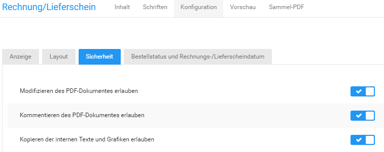

# Konfiguration {#rechnung_und_lieferschein_konfigurieren_konfiguration}

Auf der Registerkarte Konfiguration kannst du steuern, welche Inhalte auf der Rechnung angzeigt werden sollen und wie die gewählten Inhalte angezeigt werden.

## Anzeige { .section}

Auf der Registerkarte Konfiguration im Abschnitt Anzeige wählst du aus, welche Inhalte auf der Rechnung ausgegeben werden. Stelle über die Checkbox neben dem gewünschten Inhalt den Wert ✔ ein, wenn der Inhalt angezeigt werden soll, oder ✖, wenn der Inhalt nicht angezeigt werden soll.

Klicke nach vorgenommenen Änderungen auf Speichern, um die Änderungen für zukünftige Rechnungen zu übernehmen.

## Layout { .section}

Auf der Registerkarte Konfiguration im Abschnitt Layout kannst du die Abstände auf der Rechnung vorgeben. Mit den Listen Zoomfaktor der PDF im Reader und Seitenlayout der PDF im Reader stellst du das Verhalten der PDF-Rechnung im PDF-Betrachtungsprogramm ein. In der Liste Ausgabemodus kannst du auswählen, ob dir PDF-Dateien nach dem Erzeugen im Browser angezeigt oder direkt heruntergeladen werden.

Klicke nach vorgenommenen Änderungen auf Speichern, um die Änderungen für zukünftige Rechnungen zu übernehmen.

## Sicherheit { .section}

Auf der Registerkarte Konfiguration im Abschnitt Sicherheit kannst du die PDF-Sicherheitseinstellungen vorgeben. Klicke nach vorgenommenen Änderungen auf Speichern, um die Änderungen für zukünftige Rechnungen zu übernehmen.

## Bestellstatus und Rechnungsdatum { .section}

Auf der Registerkarte Konfiguration im Abschnitt Bestellstatus und Rechnungsdatum legst du fest, welchen Bestellstatus eine Bestellung erhalten soll, wenn die Rechnung erstellt oder per E-Mail versendet wurde. Wähle in der Liste Bestellstatus, der zur Ermittlung des Rechnungsdatum verwendet werden soll den Bestellstatus aus, der zur Ermittlung des Rechnungsdatums verwendet werden soll. Als Rechnungsdatum auf der Rechnung wird der Zeitpunkt des erstmaligen Erreichen des konfigurierten Bestellstatus verwendet.

Klicke nach vorgenommenen Änderungen auf Speichern, um die Änderungen für zukünftige Rechnungen zu übernehmen.

**Parent topic:**[Rechnung & Lieferschein konfigurieren](13_6_Rechnung_UND_Lieferschein_konfigurieren.md)

