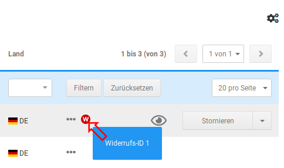
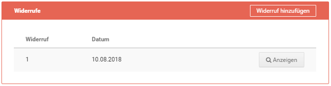

# Verwalten der Widerrufe im Gambio Admin {#verwalten_der_widerrufe_im_gambio_admin}

Unter Bestellungen \> Widerrufe werden die eingegangenen Widerrufe nach Datum absteigend sortiert aufgelistet. Über einen Klick auf die Schaltfläche Bearbeiten lassen sich die Details zum ausgewählten Widerruf anzeigen.

Die Bestellnummer kann über das zugehörige Eingabefeld geändert werden. Über die Schaltflächen Kunde aufrufen \(bei Gast-Kunden nicht vorhanden\) und Bestelldetails öffnen gelangst du direkt zur zugehörigen Kunden- bzw. Bestellungs-Detailseite. Neben den Kundendaten, Bestelldaten und dem eigentlichen Widerrufstext wird im unteren Bereich der Seite angezeigt, ob der Widerruf durch den Kunden oder den Administrator erzeugt wurde. Mit Klick auf Zurück gelangst du zurück zur Widerrufsübersicht. Mit Klick auf Löschen kann der gewählte Widerruf entfernt werden. Dies wird mit einer Sicherheitsabfrage bestätigt.

Der Menüpunkt Bestellungen \> Bestellungen enthält eine Anzeige neben der Spalte Status. Das dort eingeblendete Icon gibt an, dass für diese Bestellung ein Widerruf vorliegt. Mehrere eingegangene Widerrufe werden durch mehrere, aufeinanderfolgende Icons angezeigt. Mit einem Klick auf das rote Icon gelangst du direkt zum jeweiligen Widerruf. Die zugehörige ID wird als Tooltip angezeigt, wenn der Mauszeiger über dem Symbol platziert wird.

Zudem kann sowohl aus der Bestellübersicht als auch aus der Bestelldetailansicht zu der gewählten Bestellung ein Widerruf durch den Administrator erstellt werden. Es öffnet sich das vorausgefüllte Online-Widerrufsformular in einem neuen Tab bzw. neuem Fenster \(je nach Browser-Einstellung\).

In den Bestelldetails werden die zu dieser Bestellung eingegangenen bzw. angelegten Widerrufe angezeigt. Die Auflistung erfolgt unter Angabe der ID und dem Datum des Widerrufs. Mit Klick auf Anzeigen wird der entsprechende Widerruf aufgerufen.

Hat der Kunde bei einem Download oder einer Dienstleistung auf sein Widerrufsrecht verzichtet, wird unter der Widerrufsliste zudem ein neuer Bereich Widerrufsverzicht aufgeführt. Hier wird die Meldung Verzicht auf Widerrufsrecht bei Dienstleistung: JA bzw. Verzicht auf Widerrufsrecht bei Downloadartikel: JA angezeigt.

**Parent topic:**[Widerrufe](13_7_Widerrufe.md)

