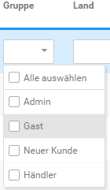
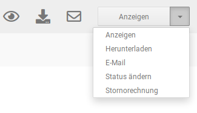

# Aktionen {#rechnungsuebersicht_aktionen}

Mit einem Klick auf die Spaltenüberschrift kann die Tabelle nach der jeweiligen Spalte sortiert werden \(ein Klick: aufsteigende Sortierung, erneuter Klick: absteigende Sortierung\). Rechts neben den Spaltenüberschriften befindet sich die Seitenanzeige und die Seitenauswahl. Oberhalb der Seitenauswahl kann über das Zahnrad-Symbol die Einstellungsseite aufgerufen werden \(siehe Einstellungen\).

Über die blau hevorgehobene Leiste können die Rechnungen nach bestimmten Kriterien gefiltert werden. Hierzu stehen Eingabefelder, Datumsauswahlen und Dropdowns zur Verfügung. Wähle die jeweiligen Filter-Kriterien aus bzw. trage diese ein und klicke anschließend auf die Schaltfläche Filtern. Über Klick auf Zurücksetzen kann der Filter-Vorgang rückgängig gemacht werden. Zudem kann über das Dropdown am rechten Ende der Leiste die Anzahl der Rechnungen pro Seite eingestellt werden.

Wenn du den Mauszeiger in die Zeile einer Rechnung bewegst, werden die möglichen Aktionen als Icons eingeblendet. Von links nach rechts sind dies anzeigen, herunterladen undE-Mail. Zudem wird eine Dropdown-Schaltfläche angezeigt. Mit Status ändern kann der Status der zugehörigen Bestellung angepasst werden. Über Stornorechnung kann zu einer bestehenden Rechnung eine Stornorechnung erzeugt werden, wenn die Bestellung storniert werden soll.

**Parent topic:**[Rechnungsübersicht](13_8_Rechnungsuebersicht.md)

