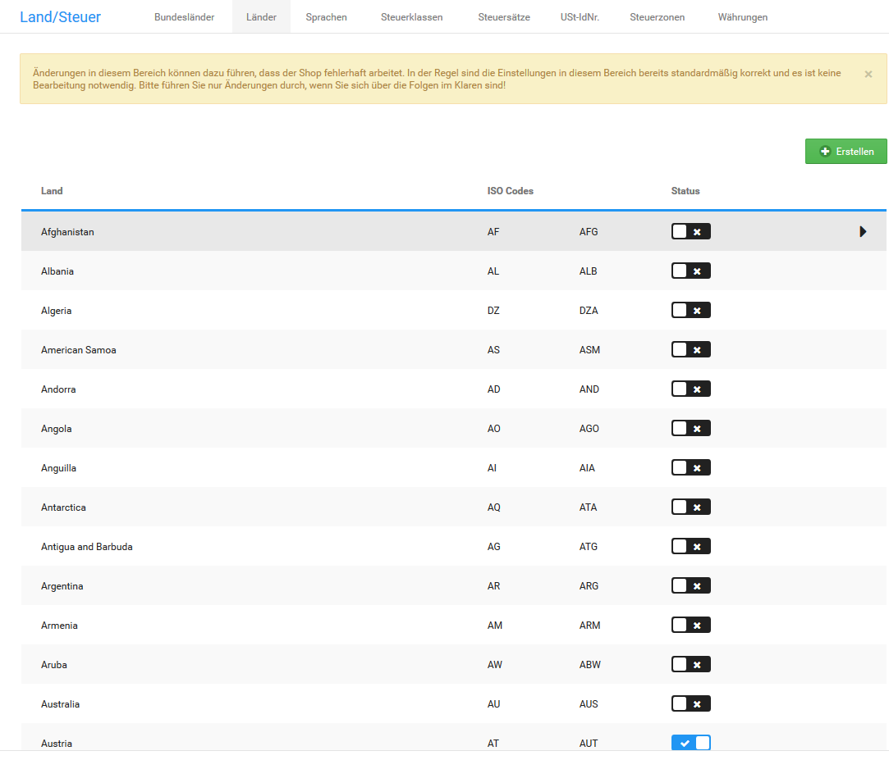

# Länder aktivieren {#laender_aktivieren}

Länder, die Kunden beim Anlegen einer Adresse auswählen können, müssen einzeln aktiviert werden. Für die Ländergruppe Deutschland, Österreich und Schweiz sowie für alle Länder findest du unterhalb der Länderliste Schaltflächen zum gleichzeitigen Aktivieren.

Klicke auf D, A, CH aktivieren, um die Ländergruppe Deutschland, Österreich und Schweiz zur Auswahl in Adressformularen zu aktivieren.

Klicke auf alle aktivieren, um alle Länder zur Auswahl in Adressformularen zu aktivieren.

## Einzelne Länder aktivieren { .section}

So aktivierst du ein einzelnes Land zur Auswahl in Adressformularen:

1.  Rufe deinen Onlineshop im Gambio Admin unter Shop Einstellungen \> Land/Steuer \> Länder auf
2.  Suche das gewünschte Land aus der Liste aus
3.  Klicke auf das Kästchen in der Spalte Status, sodass dort ein Haken angezeigt wird.

**Parent topic:**[Länder](6_1_Laender.md)

