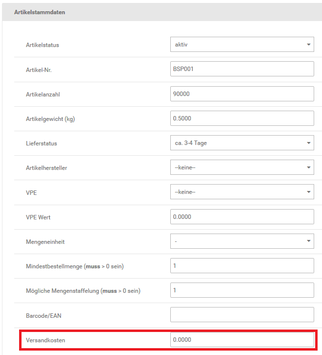

# Weitere {#weitere}

Neben den gewicht- und kostenbasierten Versandarten stehen weitere Versandarten mit Sonderfunktionen zur Verfügung.

## Artikel-Versandkosten { .section}

Im Artikel-Versandkosten-Modul werden die grundsätzlichen Versandkosten gewichtbasiert nach Zonen berechnet. Zusätzlich zu den gewichtbasierten Versandkosten werden die in der Artikel-Eingabemaske hinterlegten Versandkosten aus den Artikeln des Warenkorbs berechnet. Die Versandkosten werden dabei nicht je Position, sondern je Artikel berechnet.

**Note:** Die Artikel-Versandkosten sollten nicht gemeinsam mit dem Zusammenfassungs-Modul Versandkostenzuschlag verwendet werden. Beide Module arbeiten mit dem Versandkosten- Feld der Artikel-Eingabemaske, die zusätzlichen Versandkosten werden bei gleichzeitiger Verwendung doppelt berechnet.

CAUTION:

Bei der Verwendung des Moduls Artikelversandkosten sollte in jedem Fall eine Staffelung eingetragen werden. Anderenfalls kann es im Bestellvorgang zu einer Fehlermeldung kommen und das Modul ist nicht verfügbar.

Hierzu kann eine fiktive Staffelung verwendet werden, die die Versandkosten nicht verändert, z.B.

9999999:0

## Beispielhafte Konfiguration des Artikel-Versandkosten-Moduls { .section}

Wir gehen in unserem Beispiel davon aus dass für alle Artikel abweichende Versandkosten pro Stück verwendet werden sollen. Dabei soll berücksichtigt werden, dass für den gesamten Versand bis 31 Kilo Gewicht jedoch mindestens 5 Euro Versandkosten berechnet werden sollen. Dies gilt für alle Versandländer, diese sind in Zone 1 Länder eingetragen.

Nehmen wir der Einfachheit halber an, du hast 3 Artikel: Apfelkuchen, Buchstabensuppe und Citrusfrüchte. Für Apfelkuchen sollen pro Exemplar 2.50 Euro Versand berechnet werden, für Buchstabensuppe 3.50 Euro und Citrusfrüchte 4.50 Euro. Diese Versandkosten wurden in den Artikeln \(Artikel \> Artikel / Kategorien, Schaltfläche Bearbeiten\) hinterlegt.

Um den Mindestversand zu gewährleisten, legen wir für Zone 1 Versandkosten mit folgender Staffelung pauschale Versandkosten bis 31 Kilo fest:

31:2.5

Die Versandkosten pro Exemplar der verschiedenen Artikel und der eingetragenen Staffelung im Modul werden addiert. Als Beispiel folgende Bestellung:

**Note:**

|Artikel|Anzahl|Einzelversand|Gesamtversand|
|-------|------|-------------|-------------|
|Apfelkuchen|2|2.50 Euro|5.00 Euro|
|Buchstabensuppe|3|3.50 Euro|10.50 Euro|
|Citrusfrüchte|1|4.50 Euro|4.50 Euro|
|Versand bis 31 kg| | |2.50 Euro|
|**Summe**| | |22.50 Euro|

## Pauschale Versandkosten { .section}

Bei der Versandart Pauschale Versandkosten wird bei jeder Bestellung eine Versandkostenpauschale berechnet. Die Pauschale ist unabhängig vom Bestellgewicht, der Anzahl der Artikel und dem Warenwert.

## Versandkosten pro Stück { .section}

Mit der Versandart Versandkosten pro Stück wird ein pauschaler Versandkostenwert für jeden Artikel berechnet, der im Warenkorb liegt.

**Parent topic:**[Versandarten](7_1_Versandarten.md)

