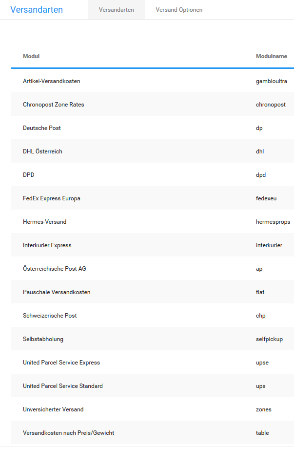

# Versandarten {#versandarten}

Im Gambio Admin unter Module \> Versandarten stehen dir verschiedene Module zur Verfügung, mit denen du deine Versandkosten konfigurieren kannst.

**Note:** Bitte beachte, dass die bei den Modulen für bestimmte Versanddienstleister hinterlegten Versandkosten unter Umständen nicht aktuell sind, da diese nur als Beispiel dienen.

-   **[Gewichtbasiert](7_1_1_Gewichtbasiert.md)**  

-   **[Kostenbasiert](7_1_2_Kostenbasiert.md)**  

-   **[Versandkostenfrei](7_1_3_Versandkostenfrei.md)**  

-   **[Weitere](7_1_4_Weitere.md)**  

-   **[Liste der Versandarten](7_1_5_Liste_der_Versandarten.md)**  

**Parent topic:**[Module](7_Module.md)

