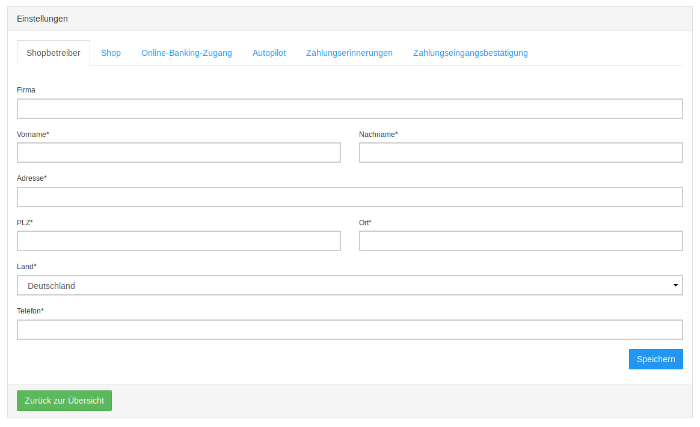
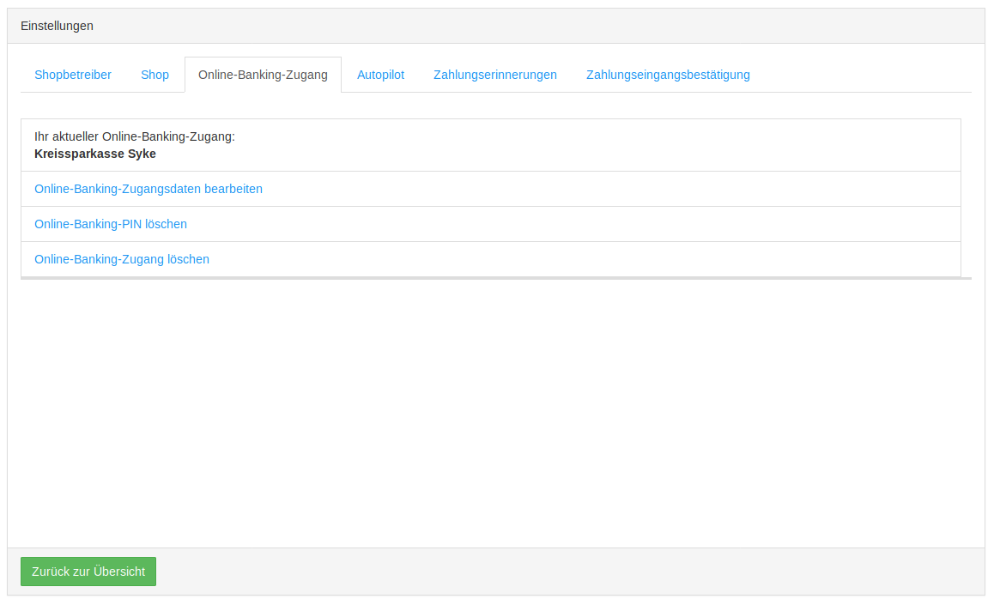
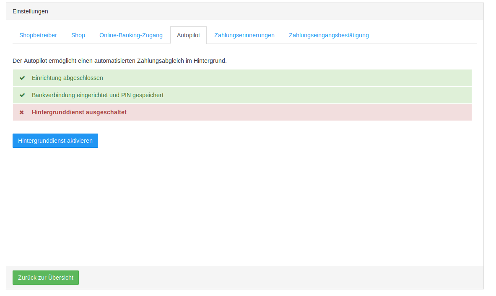

# Weitere Einstellungen {#giro_connect_weitere_einstellungen}

Ist GiroConnect eingerichtet, findet man dort einen weiteren Tab Weitere Einstellungen, der wiederrum auf 6 Tabs aufgeteilt ist.

Im Tab Shopbetreiber können die Adressdaten nachträglich geändert und ggf. korrigiert werden.

Im Tab Shop können die Login-Daten geändert werden, falls ein anderes Administratorkonto für den Abgleich verwendet werden soll. Auch eine Änderung der Shop-URL \(z.B. nach Domainänderungen\) oder des gewünschten Zielstatus bei abgeglichenen Bestellungen ist möglich.

Im Falle einer Kontoänderung können im Tab Online-Banking-Zugang die Daten bearbeitet oder PIN und Zugang gelöscht werden.

Der Autopilot ist für den automatisierten Zahlungsabgleich zuständig. Die Zahlungen können bei aktiviertem Autopiloten einer Bestellung komplett zugeordnet werden, wenn die Daten für eine eindeutige Zuordnung ausreichen. Dieser Hintergrunddienst ist standardmäßig aus und muss daher erst über den Button Hintergrunddienst aktivieren gestartet werden.

Es können Vorlagen für Zahlungserinnerungen eingerichtet werden, die manuell oder automatisch an säumige Kunden versendet werden können. In dieser Übersicht werden die angelegten Vorlagen aufgeführt und die Anzahl der offenen und versendeten Mails genannt. Auch können über die Schaltfläche Zahlungserinnerung hinzufügen weitere Vorlagen angelegt werden.

Beim Anlegen oder Ändern einer Vorlage öffnet sich ein neues Fenster, das den Standardtext für Zahlungserinnerungen enthält. Dieser kann beliebig angepasst werden. Zur Verfügung stehen die Platzhalter <\[bestellung\]\> \(Bestellnummer\), <\[datum\]\> \(Bestelldatum\), <\[betrag\]\> \(Zahlbetrag\) und <\[frist\]\> \(Zahlungsfrist\). Auch der Betreff kann frei geändert werden. Unter Tage für Zahlungsfrist kann eingestellt werden, wieviele Tage nach Bestelleingang eine Mail versendet werden soll. Bei Automatisch senden kann ausgewählt werden, ob die Mails automatisch versendet werden sollen. Soll vor dem Versand noch selektiert werden, darf diese Option nicht gewählt sein.

Im Verlauf der Zahlungserinnerungen wird aufgeführt, welche Zahlungserinnerungen noch nicht ausgeführt, welche versendet und welche vom Versand ausgenommen wurden.

Es können automatisch Zahlungseingangsbestätigungen an den Kunden versendet werden. Genau wie bei den Zahlungserinnerungen gibt es eine Übersicht mit der Anzahl der offenen und versandten Mails und es lassen sich die Vorlagen anpassen.

Beil Klick auf Verlauf öffnet sich eine Liste der Mails.

**Parent topic:**[GiroConnect](7_2_3_GiroConnect.md)

