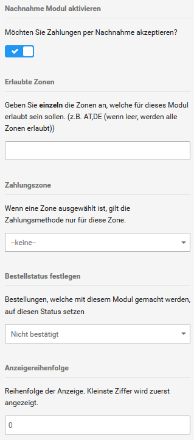

# Nachnahme {#nachnahme}

Bei der Zahlung per Nachnahme bezahlt der Kunde die Ware direkt bei der Zustellung beim ausliefernden Postboten. Nach der erfolgten Zustellung erhältst du den vom Kunden an den Zusteller gezahlten Rechnungsbetrag vom zustellenden Unternehmen.

1.  Wähle unter Module \> Zahlungsweisen \> Sonstige das Modul Nachnahme aus
2.  Klicke in der rechten Spalte auf Installieren
3.  Klicke in der rechten Spalte auf Bearbeiten
4.  Nimm die Konfiguration des Moduls anhand der Tabelle Konfiguration der Zahlungsweise Nachnahme vor
5.  Klicke auf Aktualisieren, um die Änderungen an der Konfiguration zu übernehmen

|Feldname|Beschreibung|
|--------|------------|
|Kürzel für Bestellübersicht|Kürzel dass für die Zahlungsweise in der Bestellübersicht angezeigt wird|
|Nachnahme Modul aktivieren|Bei ✔ kann der Kunde die Zahlungsweise im Bestellvorgang auswählen \[✔\]|
|Erlaubte Zonen|kommagetrennte Liste der zweistelligen ISO-Codes für Länder, aus denen die Zahlungsweise verwendet werden darf \(alle Länder bei keinem Eintrag\)|
|Zahlungszone|Steuerzone, aus der die Zahlungsweise verwendet werden darf \(überschreibt Erlaubte Zonen\) \[--keine--\]|
|Bestellstatus festlegen|Bestellstatus, der einer Bestellung mit dieser Zahlungsweise nach Eingang zugewiesen wird \[Standard\]|
|Anzeigereihenfolge|Anzeigereihenfolge Reihenfolge, in der installierte Zahlungsmodule im Bestellprozess angezeigt werden \(je größer die Zahl, desto weiter unten wird das Modul angezeigt\); einmaliger Wert je Modul \[0\]|
|Warenkorb Obergrenze|Maximaler Bestellbetrag, bis zu dem per Nachnahme bestellt werden kann|
|Ausschließende Versandarten|Legt fest, bei welchen Versandarten Nachnahme nicht zur Verfügung steht|

**Note:** Für die Zahlung per Nachnahme fällt beim zustellenden Unternehmen in der Regel eine Bearbeitungsgebühr an. Wie du die Nachnahmegebühr deinem Kunden in Rechnung stellst, erfährst du im Kapitel Zusammenfassung \> Gebühren.

**Parent topic:**[Sonstige](7_2_3_Sonstige.md)

