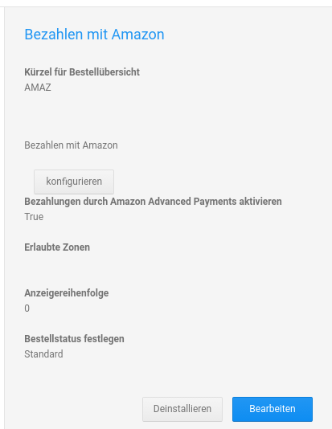

# Installation {#bezahlen_ueber_amazon_installation}

Bezahlen mit Amazon kann unter Module \> Zahlungsweisen \> Sonstige installiert werden. Wähle hierzu den gezeigten Modul-Eintrag aus und klicke in der rechten Spalte auf Installieren. Anschließend kann das Modul bearbeitet oder konfiguriert werden.

## Bearbeitung { .section}

|Feldname|Beschreibung|
|--------|------------|
|Kürzel für Bestellübersicht|Kürzel für die Zahlungsweise, die in der Bestellübersicht angezeigt wird|
|Bezahlungen durch Amazon Advanced Payments aktivieren|Modul aktivieren/deaktivieren|
|Erlaubte Zonen|Das Modul kann hier auf bestimmte Länder eingeschränkt werden. Soll die Anzeige nur in Deutschland erfolgen, genügt die Angabe 'DE' \(ohne Anführungszeichen\).|
|Anzeigereihenfolge|Nummer für die Anzeigereihenfolge bei der Auflistung der Zahlungsweisen im Bestellvorgang|
|Bestellstatus festlegen|Bestellungen mit der Zahlungsweise Bezahlen über Amazon erhalten diesen Bestellstatus|

**Parent topic:**[Bezahlen über Amazon \(amazonadvpay\)](7_2_4_BezahlenUeberAmazon.md)

