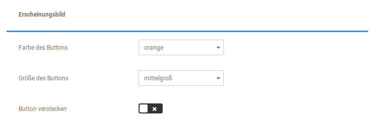
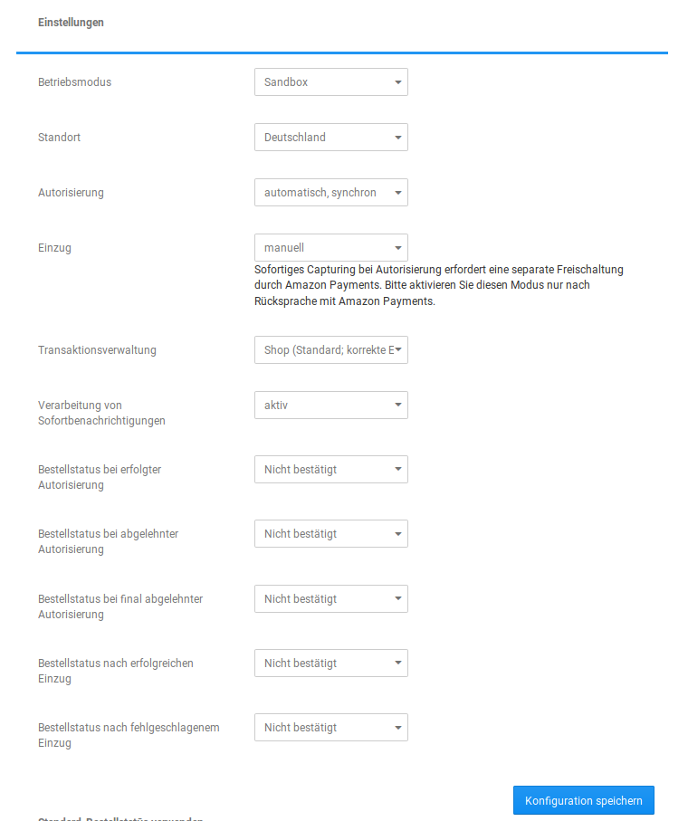
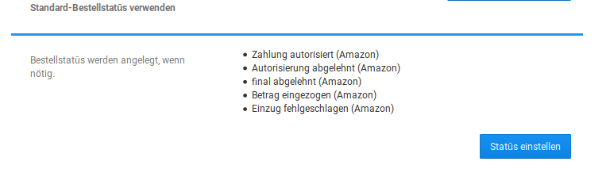
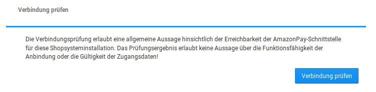

# Konfiguration {#bezahlen_ueber_amazon_konfiguration}

Wurde das Modul installiert, kann über die Schaltfläche konfigurieren die Konfigurationsseite des Moduls aufgerufen werden.

## Zugangsdaten { .section}

|Feldname|Beschreibung|
|--------|------------|
|Händlernummer|13-stellige Kombination aus Großbuchstaben und Zahlen. Diese erhältst du von Amazon.|
|Access Key ID|20-stellige Kombination aus Großbuchstaben und Zahlen. Diese erhältst du von Amazon.|
|Secret Access Key|40-stellige Kombination aus Groß- und Kleinbuchstaben, Sonderzeichen und Zahlen. Diese erhältst du von Amazon.|
|Händler-URL|Diese URL sollte im Amazon Seller Central hinterlegt werden, damit die automatische Übertragung von Daten von Amazon in den Shop gewährleistet ist \(Rechnungsdaten, Status\).|

## Erscheinungsbild { .section}

|Feldname|Beschreibung|
|--------|------------|
|Farbe des Buttons|Es kann zwischen den Buttonfarben Orange und Beige gewählt werden.|
|Größe des Buttons|Es stehen mittelgroß, groß und extragroß zur Auswahl.|
|Versteckter Button|Anzeige des Buttons an- oder ausschalten.|

## Einstellungen { .section}

|Feldname|Beschreibung|
|--------|------------|
|Betriebsmodus|zwischen Sandbox- und Livebetrieb \(produktiv\) umschalten. Der Sandbox-Modus sollte nicht verwendet werden, wenn der Shop online geschaltet ist.|
|Standort|Standort des Shops|
|Autorisierung|Die Autorisierung der Zahlungen kann automatisch synchron \(Standard\), automatisch asynchron oder manuell erfolgen. Die Autorisierung kann direkt im Zuge der Bestellung geschehen oder später manuell.-   manuell: nur in Spezialfällen, sollte allgemein vermieden werden
-   synchron: sofortige Sicherstellung, dass die Autorisierung gültig ist
-   asynchron: verzögerungsfreier Bestellabschluss, Autorisierung erfolgt ggf. später oder gar nicht

|
|Einzug|kann manuell oder sofort bei Autorisierung erfolgen, letzteres erfordert eine separate Freischaltung durch Amazon Payments, sollte nur nach Rücksprache mit Amazon ausgewählt werden.|
|Transaktionsverwaltung|kann zwischen Shop \(Standard\) und externes ERP-System umgeschaltet werden. Bei der Einstellung externes ERP-System werden der Bestellung nachgelagerte Aufgaben nicht vom Shop, sondern einem ERP-System übernommen. Hierfür muss ein APA-kompatibles ERP-System zur Verfügung stehen.|
|Verarbeitung von Sofortbenachrichtigungen|Erlaubt die Verwendung von IPN \(Instant Payment Notification\)-Nachrichten über die gleichnamige Schnittstelle von Amazon. Diese Einstellung sollte i.d.R. aktiviert sein, um Statusaktualisierungen ohne den Button Daten aktualisieren zu ermöglichen. Dies erfordert ein aktuelles SSL-Zertifikat und das Hinterlegen der Händler-URL im Seller Central.|
|Bestellstatus bei erfolgter Autorisierung|Standard: Zahlung autorisiert \(Amazon\)|
|Bestellstatus bei abgelehnter Autorisierung|Standard: Autorisierung abgelehnt \(Amazon\)|
|Bestellstatus bei final abgelehnter Autorisierung|Standard: final abgelehnt \(Amazon\)|
|Bestellstatus nach erfolgreichen Einzug|Standard: Betrag eingezogen \(Amazon\)|
|Bestellstatus nach fehlgeschlagenem Einzug|Standard: Einzug fehlgeschlagen \(Amazon\)|

## Standard-Bestellstatūs verwenden { .section}

Sind die oben erwähnten Bestellstatus noch nicht im Shop vorhanden, so können diese hierüber angelegt werden. Die Verwendung ist jedoch optional.

## Verbindung prüfen { .section}

Hierüber kann geprüft werden, ob Amazon erreichbar ist. Dies sagt jedoch nichts darüber aus, ob die Konfiguration korrekt vorgenommen wurde. Betätigt man den Button, erhält man am oberen Ende der Seite eine Rückmeldung wie diese:

**Parent topic:**[Bezahlen über Amazon \(amazonadvpay\)](7_2_4_BezahlenUeberAmazon.md)

