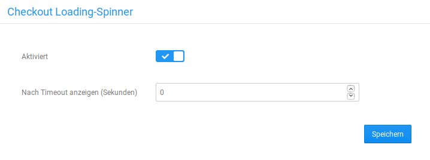

# Checkout Loading-Spinner {#checkout_loading_spinner}

Der Checkout Loading-Spinner soll bei längeren Ladeprozessen im Bestellvorgang eine animierte Grafik anzeigen, die dem Kunden verdeutlicht, dass seine Eingaben verarbeitet werden. Dies soll verhindern, dass die Kunden annehmen, der Shop würde nicht reagieren und den Kauf womöglich abbrechen.

## Installation { .section}

Das Modul kann unter Module \> Modul-Center installiert werden. Wähle hierzu den Eintrag Checkout Loading-Spinner aus und klicke auf die Schaltfläche Installieren in der rechten, unteren Bildschirm-Ecke.

## Konfiguration { .section}

Nach der Installation kann das Modul konfiguriert werden. Wähle hierzu den Eintrag Checkout Loading-Spinner aus und klicke auf die Schaltfläche Bearbeiten, in der rechten, unteren Bildschirm-Ecke.

Setze den Haken für Aktiviert, um den Checkout Loading-Spinner zu verwenden. Über das Feld Nach Timeout anzeigen \(Sekunden\) kannst du die Zeit festlegen, nach der der Checkout Loading-Spinner während des Ladevorgangs angezeigt wird. Standardeinstellung ist hier 0, sodass der Spinner immer angezeigt wird, wenn er aktiviert wurde. Stellt man hier eine Sekundenanzahl ein, wird die Animation nur dann angezeigt, wenn sich das Laden der Zahlungsweisenseite tatsächlich um den festgelegten Zeitraum verzögert.

**Parent topic:**[Modul-Center](7_4_Modul_Center.md)

