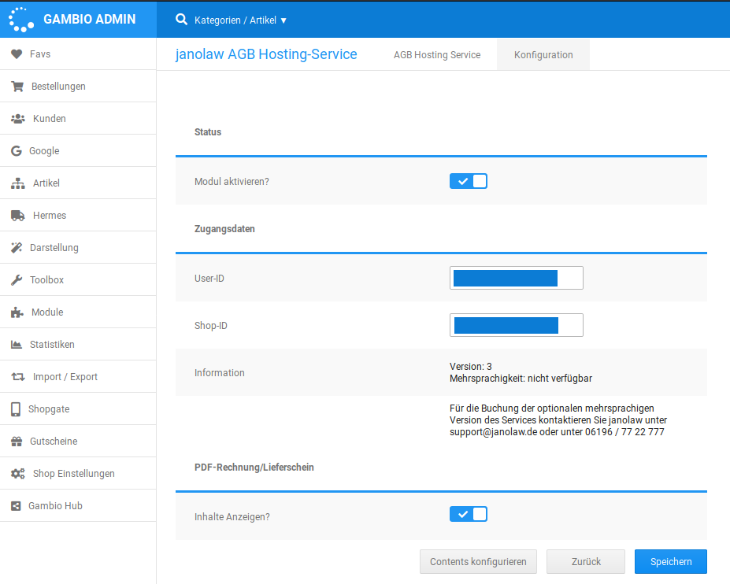

# Konfiguration {#janolaw_konfiguration}

Über den Button Bearbeiten kann man die Moduleinstellungen aufrufen. Es wird der Inhalt des ersten Tabs AGB Hosting Service angezeigt, der über die Anmeldung bei Janolaw informiert. Im zweiten Reiter findet die Konfiguration des Moduls selbst statt.

## Status { .section}

Mit der Option Modul aktivieren kann das Modul aktiviert oder deaktiviert werden.

## Zugangsdaten { .section}

User-ID und Shop-ID erhältst du von Janolaw. Nach Eingabe der Daten wird unter Information ein Hinweis zum Inhalt des gebuchten Pakets, sowie die Kontaktdaten des Janolaw-Supports angezeigt.

## PDF-Rechnung/Lieferschein { .section}

Hier kann ausgewählt werden, ob die Janolaw-Rechtstexte für AGB und Widerruf automatisch in der PDF-Rechnung bzw. im PDF-Lieferschein eingebunden werden sollen.

## Contents konfigurieren { .section}

Mit Klick auf den Button Contents konfigurieren werden die Janolaw-Rechtstexte automatisch in die Content-Seiten eingebunden und sind damit im Shop aufrufbar.

**Parent topic:**[Janolaw](7_4_17_Janolaw.md)

