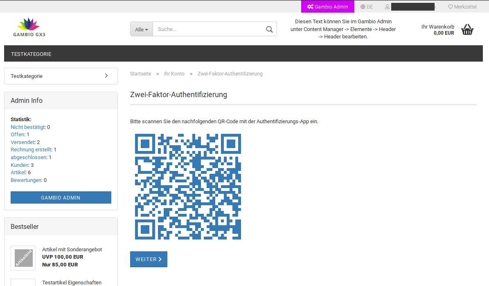
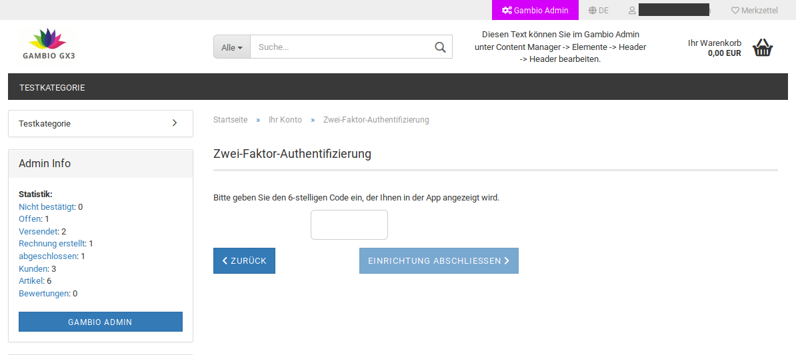
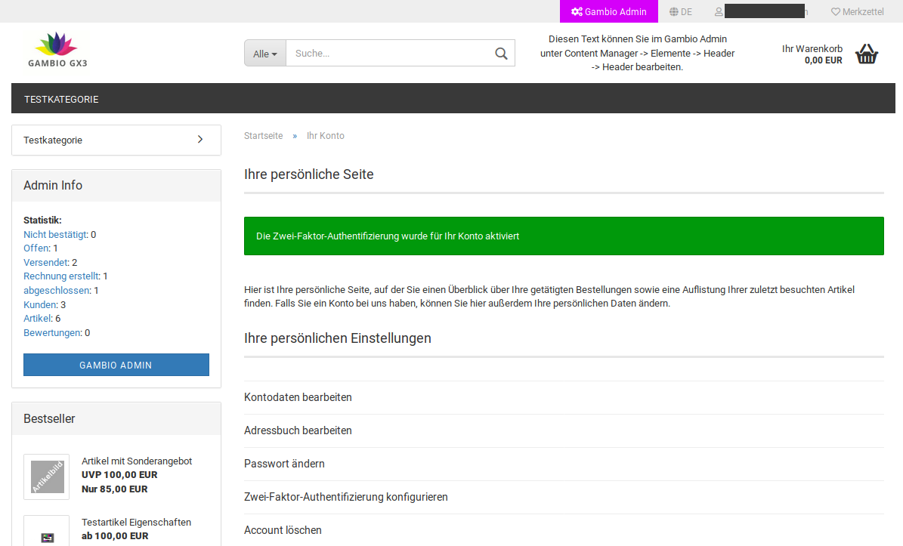

# Installation und Einrichtung {#zwei_faktor_authentifizierung_installation_und_einrichtung}

Das Modul kann unter Module \> Modul-Center installiert werden. Wähle hierzu den Eintrag Zwei-Faktor-Authentifizierung aus der Liste aus und klicke auf die Schaltfläche Installieren, in der rechten, unteren Bildschirmecke.

Nach der Installation kann das Modul über einen Klick auf Bearbeiten eingerichtet werden.

## Erste Seite der Einrichtung { .section}

Die erste Seite beschreibt allgemein, wozu die Zwei-Faktor-Authentifizierung dient. Klicke auf Einrichten, um den Vorgang fortzusetzen. Über einen Klick auf Weiter gelangst du zur nächsten Seite der Einrichtung.

## QR-Code { .section}

Der angezeigte QR-Code muss über die jeweils installierte Handy-App gescannt werden.

## Darstellung in der App { .section}

Die App zeigt einen 6-stelligen Code an.

## Code eintragen { .section}

Der Code aus der App muss dann im Shop eingetragen werden.

## Bestätigung { .section}

War die Authentifizierung erfolgreich, wird eine Bestätigung angezeigt und das Kundenkonto aufgerufen.

## Code nicht korrekt { .section}

Erhält man die Rückmeldung, der eingegebene Code sei nicht korrekt, so kann dies drei uns bekannte Gründe haben.

-   Der Code wurde tatsächlich falsch eingetippt
-   Der Code wurde erst Minuten nach dem Erstellen eingetippt und ist daher nicht mehr gültig
-   Die Serverzeit weicht von der tatsächlichen Zeit ab, was im Ergebnis dem vorherigen Fall entspricht. Wende dich hier bitte an deinen Hosting-Anbieter, damit dieser die Serverzeit korrigieren kann.

**Parent topic:**[Zwei-Faktor-Authentifizierung](7_4_19_ZweiFaktorAuthentifizierung.md)

