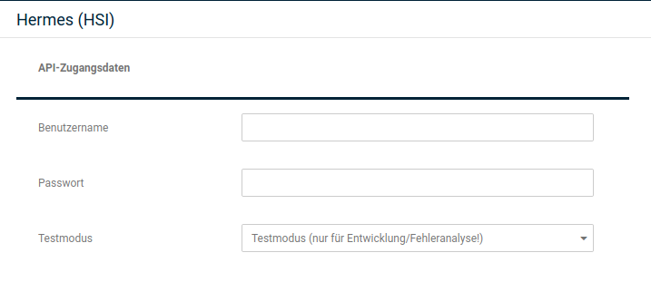
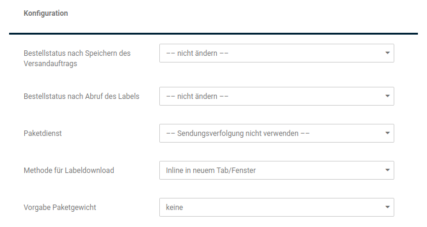

# Konfiguration {#hermes_hsi_konfiguration}

## API-Zugangsdaten { .section}

Im ersten Schritt erlaubt die Konfiguration nur die Eingabe der API-Daten. Diese Daten erhältst du bei deinem Vertragspartner Hermes. Zudem kann zwischen Live- und Testbetrieb gewählt werden.

## Absender { .section}

Damit die Label mit den nötigen Angaben erstellt werden können, musst du hier deine Adressdaten hinterlegen.

## Konfiguration { .section}

|Feldname|Beschreibung|
|--------|------------|
|Bestellstatus nach Speichern des Versandauftrags|Wenn gewünscht, kann direkt nach dem Erstellen des Labels ein abweichender Bestellstatus gesetzt werden. Dieser kann hier ausgewählt werden.|
|Bestellstatus nach Abruf des Labels|Nach dem Abruf des Labels kann der Bestellstatus ebenfalls geändert werden, eine Auswahl ist über das Dropdown-Menü möglich.|
|Paketdienst|Hier kann unter den verfügbaren Paketdiensten gewählt werden, die unter Shop Einstellungen \> Paketdienste konfiguriert werden können. Für jeden Paketdienst kann dort eingerichtet werden, welcher Trackinglink für die Sendungsverfolgung verwendet wird. Als Standard sollte hier Hermes gewählt werden. Der Paketdienst MyHermes betraf nur Sendungen, dessen Label über PriPS \(PrivatPaketService\) erstellt wurden, was aktuell \(20.03.2020\) nur noch über die Hermes-Webseite möglich ist.|
|Methode für Labeldownload|Hier kann gewählt werden, ob das Label beim Abruf direkt im Browserfenster geöffnet werden oder zuerst heruntergeladen werden soll. Da es in der Vergangenheit in einigen Browserversionen Probleme beim Öffnen und Drucken von PDF-Dateien gab, kann diese Option helfen, eben diese Probleme zu vermeiden.|
|Vorgabe Paketgewicht|Das Sendungsgewicht kann berechnet werden, sofern in den Artikeln ein Artikelgewicht hinterlegt wurde. An dieser Stelle kann gewählt werden, ob die Berechnung nur das Artikelgewicht oder zusätzlich noch das Verpackungsgewicht einschließt.|

## Vorgabe-Abmessungen { .section}

Wenn du häufig bestimmte Kartongrößen verwendest, so kannst du die Abmessungen dafür hier eintragen. So muss diese bei der Labelerstellung dann nur noch ausgewählt werden, statt die Maße manuell eintragen zu müssen.

**Note:**

Die vorausgefüllten Werte dienen nur der Illustration.

**Parent topic:**[Hermes HSI](7_4_23_HermesHSI.md)

