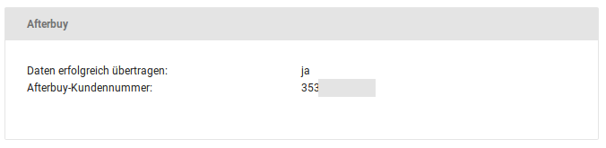

# Afterbuy {#afterbuy}

## Installation { .section}

Das Afterbuy-Modul kann unter Module \> Modul-Center installiert werden. Wähle hierzu den Eintrag Afterbuy \(neu\) aus und klicke auf die Schaltfläche Installieren, in der rechten, unteren Bildschirmecke.

## Konfiguration { .section}

Nachdem das Afterbuy-Modul installiert worden ist, kann es konfiguriert werden. Wähle hierzu unter Module \> Modul-Center den Eintrag Afterbuy \(neu\) aus und klicke auf die Schaltfläche Bearbeiten, in der rechten, unteren Bildschirmecke. Du gelangst zur Konfigurationsseite, hier können die Daten von Afterbuy hinterlegt werden.

|Feldname|Beschreibung|
|--------|------------|
|Aktiv|Schaltet das Modul ein oder aus|
|Partner-ID|Die Afterbuy Partner-ID, die du von Afterbuy erhalten hast|
|Partner Passwort|Das Afterbuy-Passwort für die Schnittstelle|
|User ID|Die User-ID entspricht dem Benutzernamen, mit dem man sich bei Afterbuy anmelden kann|
|Bestellstatus nach Übertragung|Hier kann der Bestellstatus ausgewählt werden, der nach der Übertragung zu Afterbuy gesetzt wird|
|Bezahlt-Bestellstatus|Manuell kann jede Bestellung unabhängig vom Bestellstatus übertragen werden. Wird die Übertragung zu Afterbuy aber über einen CronJob automatisch ausgeführt, so werden dabei nur die Bestellungen übertragen, die den hier ausgewählten Status haben. Alle anderen Bestellungen bleiben unberührt|
|CronJob-URL|Die CronJob-URL kann bei deinem Hoster hinterlegt werden. Damit ist die automatische Übertragung zu Afterbuy möglich.|

## Bedienung { .section}

In der Bestellübersicht unter Bestellungen \> Bestellungen kann über die Dropdown-Schaltfläche der jeweiligen Bestellung der Eintrag an Afterbuy übertragen ausgewählt werden.

Die Übertragung wird durch eine entsprechende Meldung bestätigt, welche die Afternbuy-Kundennummer enthält.

Nach der Übertragung an Afterbuy wird der Bestellstatushistorie ein entsprechender Eintrag hinzugefügt. DIe Historie kann über die Detailseite der Bestellung eingesehen werden. Du erreichst die Detailseite wahlweise über das Augen-Symbol oder den Eintrag Anzeigen der jeweiligen Dropdown-Schaltfläche.

**Parent topic:**[Modul-Center](7_4_Modul_Center.md)

