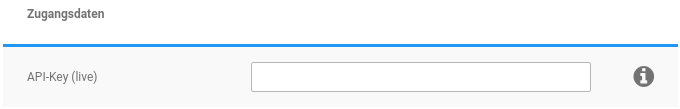

# Konfiguration {#shipcloud_konfiguration}

## Zugangsdaten { .section}

Die notwendigen Zugangsdaten erhältst du von Shipcloud. Bewege den Mauszeiger über das Info-Symbol um den Tooltipp anzuzeigen. Dieser enthält einen Link zu Shipcloud.

Logge dich bei Shipcloud ein und klicke oben rechts auf deine E-Mail-Adresse. Wähle hier den Punkt API-Key bzw. API-Schlüssel aus.

Es werden sowohl der Live- als auch der Sandbox API-Schlüssel angezeigt.

## Sonstige Einstellungen { .section}

|Feldname|Beschreibung|
|--------|------------|
|API-Key \(Sandbox\)|Hier kann der Key für die Sandbox hinterlegt werden, wenn das Modul im Testbetrieb verwendet werden soll.|
|Live-Modus|Hier muss gewählt werden, in welchem Modus das Modul aktuell betrieben wird.|
|Erweitertes Logging|Hier kann das Logging deaktiviert werden. Allerdings kann ohne Logging keine Analyse erfolgen, wenn es zu einem Problem kommt, da die hierfür notwendigen Detail-Informationen ohne Logging nicht mehr verzeichnet werden. Dieser Punkt sollte daher grundsätzlich aktiviert sein.|
|API-Timeout|Grenze für Zeitüberschreitungen bei Zugriffen auf die Shipcloud-Schnittstelle \(Sekunden\). Standard: 20 SekundenCAUTION:

Erhöhe diesen Wert nur, wenn es beim Abruf von Labels vermehrt zu Zeitüberschreitungen kommt.

|
|Tracking-Link-Vorlage|Unter Shop Einstellungen \> Paketdienste befinden sich standardmäßig einige Tracking-Link-Vorlagen, die für den Versand der Sendungsnummer benutzt werden. Da das Label über Shipcloud erstellt wurde, empfehlen wir die gleichnamige Vorlage zu verwenden.|
|Bestellstatus nach Labelerzeugung|Wenn der Bestellstatus nach dem Erstellen des Labels geändert werden soll, muss dieser hier ausgewählt werden.|
|E-Mail-Benachrichtigung nach Bestellstatusänderung|Wurde dieser Punkt aktiviert, werden Kunden automatisch über die eingestellte Änderung des Bestellstatus' informiert.|
|E-Mail-Adresse des Kunden an Shipcloud weitergeben und Telefonnummer des Kunden an Shipcloud weitergeben|Ist diese Einstellung abgeschaltet, werden die Kontaktdaten des Kunden nicht an Shipcloud weitergegeben, selbst wenn dieser im Bestellvorgang der Weitergabe zugestimmt hat.|
|Sendungsankündigung verwenden|DHL, DPD, Hermes und GLS bieten eine eigene Sendungsankündigung an. Erlaubt der Kunde die Weitergabe seiner Kontaktdaten an die Versanddienstleister, kann hiermit übergeben werden, dass die dienstleistereigene Ankündigung verwendet werden soll.

|
|Inhaltsangabe automatisch vorausfüllen|Bei Sendungen in andere Länder muss unter bestimmten Bedingungen eine Inhaltsangabe mit übermittelt werden. Diese kann automatisch ausgefüllt werden, wenn diese Option gesetzt wurde.|
|Warenwert übertragen ab und Warenwert übertragen bis|Bei Sendungen über DHL den Warenwert \(für Höherversicherung\) übertragen, wenn er in das hier konfigurierbare Intervall fällt.|

## Absender { .section}

Die Absenderdaten müssen komplett ausgefüllt sein.

Die Daten werden im Regelfall direkt aus den Einstellungen unter Shop Einstellungen \> Mein Shop bezogen und können in der Konfiguration des Moduls nachträglich angepasst werden.

## Bankverbindung für Nachnahme { .section}

Die Bankverbindung sollte ebenfalls komplett hinterlegt werden. Dies ist vor allem dann wichtig, wenn die Zahlung per Nachnahme angeboten wird.

## Webhook \(automatische Statusaktualisierung\) { .section}

Wurden Webhooks noch nicht konfiguriert, wird hier ein Button angezeigt, über den diese eingerichtet werden können.

Innerhalb der Einstellungen kann für jeden Sendungsstatus ein Bestellstatus zugeordnet werden.

## Dienstanbieter { .section}

In diesem Bereich kannst du festlegen, welche Dienstanbieter du für den Versand verwenden möchtest. Die Auswahl hängt hierbei davon ab, welche Anbieter du bei Shipcloud hast freischalten lassen. Jene Dienstanbieter, für die der Haken Vorauswahl gesetzt worden ist, werden für die Kostenermittlung der Label-Erstellung vorausgewählt.

Hier muss beachtet werden, dass Diensteanbieter hinzukommen oder wegfallen können, wenn die Kooperationen zwischen Shipcloud und den einzelnen Dienstleistern sich ändern.

**Parent topic:**[Shipcloud](7_4_6_Shipcloud.md)

