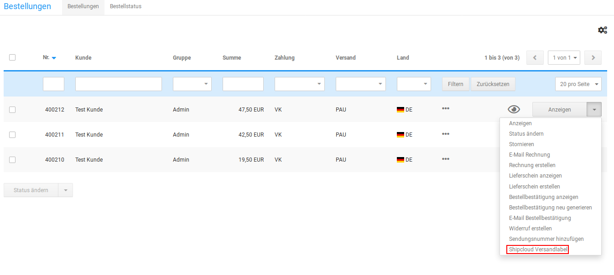
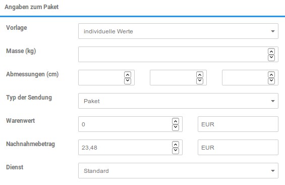
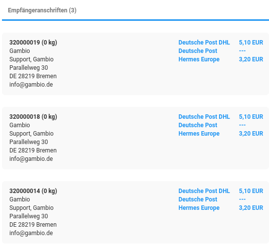
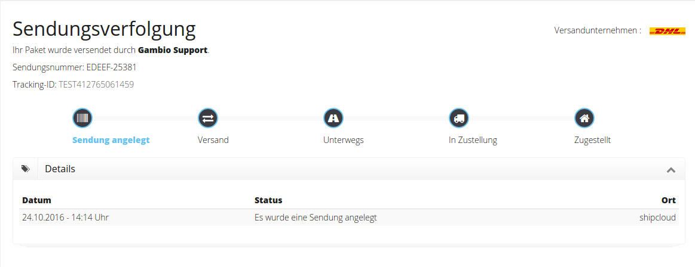
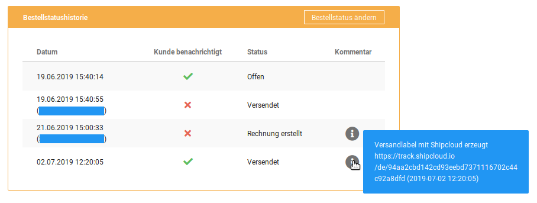

# Labelerstellung {#shipcloud_labelerstellung}

## Funktion aufrufen { .section}

Die Labelerstellung erfolgt im Gambio Admin in der Bestellübersicht unter Bestellungen \> Bestellungen. Soll nur für eine Bestellung ein Label erstellt werden, kann die Funktion über die Dropdown-Schaltfläche der jeweiligen Bestellung aufgerufen werden. Werden Bestellungen in der Mehrfachauswahl angehakt, kann die zugehörige Dropdown-Schaltfläche links unten verwendet werden. Es öffnet sich ein Popup mit möglichen Einstellungen zur Labelerstellung.

## Angaben zum Empfänger { .section}

Die aufgeführten Lieferadressen sollten kurz auf Richtigkeit geprüft werden. Beim Einzelaufruf ist auch eine Korrektur der Daten möglich.

## Angaben zum Paket { .section}

Die Größen- und Gewichtsangaben können individuell erfasst oder über eine Paketvorlage ausgewählt werden. Hierbei ist zu beachten, dass die möglichen Größen und Gewichte sich je nach Versanddienstleister unterscheiden können. Gleiches gilt für das allgemeine Angebot, so bieten z.B. nicht alle Dienstleister Briefsendungen an.

Das Feld Nachnahmebetrag wird nur bei Nachnahmebestellungen angezeigt. Ist dies nicht der Fall, hat der Kunde bei der Bestellung eine andere Zahlungsweise ausgewählt. Zudem muss beachtet werden, dass nicht jeder Paketdienstleister die Abwicklung von Nachnahmesendungen anbietet.

## Versandkosten ermitteln { .section}

Über die Schaltfläche Versandkosten ermitteln kannst du dir verschiedene Preise ausgeben lassen. Die Angabe nicht möglich bzw. das Fehlen von Preisen in den Abbildungen lässt sich darauf zurückführen, dass der Transport von Sendungen in den angegebenen Abmessungen vom jeweiligen Dienstleister nicht angeboten wird.

## Versandlabel erzeugen und löschen { .section}

Mit Klick auf Versandlabel erzeugen können die benötigten Label erstellt werden, es öffnet sich ein neues Dialogfenster. Dort wird der Zeitpunkt der Erzeugung protokolliert sowie die Tracking-Nummer und der Preis ausgegeben. Hier kann das Versandlabel aufgerufen oder gelöscht werden.

Über die Schaltfläche Sendungsverfolgung wird man zur Sendungsverfolgungsseite weitergeleitet.

## Tracking-Link versenden { .section}

Mit Erstellen des Versandlabels wird die Sendungsnummer automatisch in den Bestelldetails eingetragen. Auch wird ein entsprechender Vermerk in der Bestellstatushistorie hinterlegt. Nun kann von hier aus der Bestellstatus geändert und im gleichen Zug eine Information an den Kunden versendet werden, welche den Tracking-Link enthält, sofern dies ausgewählt worden ist.

## Ausnahmen { .section}

Das Anlegen des Tracking-Links sowie der Versand des Tracking-Links ist bei Versand über GLS nicht möglich. Im Gegensatz zu anderen Dienstleistern, wird die Sendungsnummer bei GLS erst bei der Abholung der Sendungen erstellt und ist damit zum Zeitpunkt der Labelerstellung im Shop noch nicht bekannt. Somit kann diese Nummer natürlich auch nicht in der Bestellung hinterlegt und an den Kunden versendet werden. Bei Sendungen über GLS ist es daher nötig, die Sendungsnummer manuell in der Bestellung zu hinterlegen.

**Parent topic:**[Shipcloud](7_4_6_Shipcloud.md)

