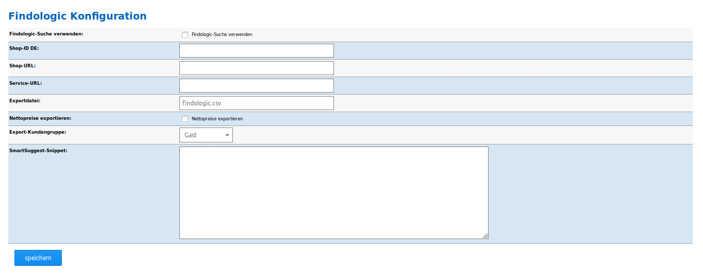

# Konfiguration {#findologic_konfiguration}

Nach der Installation kann das Findologic-Modul konfiguriert werden. Rufe hierzu unter Module \> Modul-Center den Eintrag Findologic auf und klicke auf die Schaltfläche Bearbeiten, in der rechten, unteren Bildschirmecke.

|Feldname|Beschreibung|
|--------|------------|
|Findologic-Suche verwenden|Setze den Haken, wenn du die Findologic-Suche verwenden möchtest.|
|Shop-ID EN / Shop-ID DE|Die Shop-IDs für Englisch und Deutsch erhältst du direkt von Findologic.|
|Shop-URL|Die Shop-URL ist standardmäßig schon voreingetragen und entspricht der URL des aktuellen Shops.|
|Service-URL|Hier soll die Findologic Service-URL eingetragen werden. Diese erhältst du von Findologic.|
|Exportdatei|Dateiname, den die Export-Datei tragen soll. Diese wird im Verzeichnis /export abgelegt.|
|Nettopreise exportieren|Hier kann ausgewählt werden, ob die Preise netto exportiert werden sollen.|
|Export-Kundengruppe|Wenn Staffelpreise bzw. Kundengruppenpreise im Shop hinterlegt wurden, sollte hier die Kundengruppe ausgewählt werden, deren Preise exportiert werden sollen.|
|SmartSuggest-Snippet|Das Snippet ist bei Findologic erhältlich und kann in dieses Feld kopiert werden. Dies führt dann dazu, dass im Shop bei der Direktsuche nicht mehr die shopeigenen Suchvorschläge gezeigt werden, sondern die Suchvorschläge von Findologic.|

**Note:**

Die Export-Datei kann standardmäßig unter

https://www.shop.de/export/findologic.csv

abgerufen werden, wobei www.shop.de durch deine tatsächliche Shopadresse ersetzt werden muss.

Exportiert werden folgende Daten:

-   Artikel\*ID
-   Artikelname
-   Beschreibung
-   Preis \(aktuell\)
-   Normalpreis
-   Link zum Artikel
-   Link zum Hauptartikelbild
-   Attribute
-   Zusatzbegriffe für Suche
-   Kundengruppen
-   Anzahl verkaufte
-   Datum der Anlage \(Unix Timestamp\)
-   Lieferzeit

**Parent topic:**[Findologic](7_4_7_Findologic.md)

