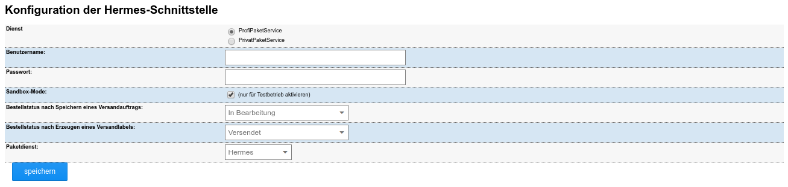

# Konfiguration {#hermes_konfiguration}

Du erreichst die Konfigurationsseite wahlweise unter Module \> Modul-Center, indem du den Eintrag Hermes-Versand auswählst und auf Bearbeiten klickst, oder den neuen Menüeintrag Hermes \> Konfiguration aufrufst.

|Feldname|Beschreibung|
|--------|------------|
|Dienst|Es kann zwischen PrivatPaketService \(kurz: PriPS\) für Privatkunden und ProfiPaketService \(kurz: ProPS\) für Geschäftskunden ausgewählt werden. Der PrivatPaketService kann ohne Login-Daten verwendet werden, allerdings bietet dieser einen geringeren Leistungsumfang als der Service für Geschäftskunden.|
|Benutzername & Passwort|Benutzername und Passwort müssen nur für ProPS angegeben werden. Du erhältst diese Daten direkt von Hermes.|
|Sandbox-Mode|Der Sandbox-Modus kann aktiviert werden, wenn du die Funktion des Moduls testen möchtest. Bitte beachte, dass diese Einstellung vor dem Erstellen von Labels im Geschäftsbetrieb wieder abgeschaltet werden muss.|
|Bestellstatus auswählen|Du kannst festlegen, ob der Status der Bestellung nach Speichern eines Auftrags bzw. Erzeugen eines Labels geändert werden soll. Durch eine Änderung des Status' lassen sich Bestellungen in der Übersicht leichter zuordnen.|
|Paketdienst|Wird ProPS verwendet, ist der Paketdienst Hermes, bei PriPS muss hier MyHermes ausgewählt werden. Hiermit wird der Tracking-Link festgelegt, der dem Kunden in der Statusbenachrichtigung zugesendet wird. Sendungen, deren Label über PriPS erstellt wurden, können nicht über den Link für ProPS nachverfolgt werden und umgekehrt.|

**Parent topic:**[Hermes](7_4_8_Hermes.md)

