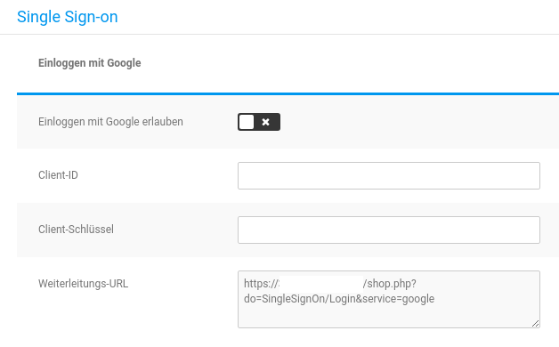
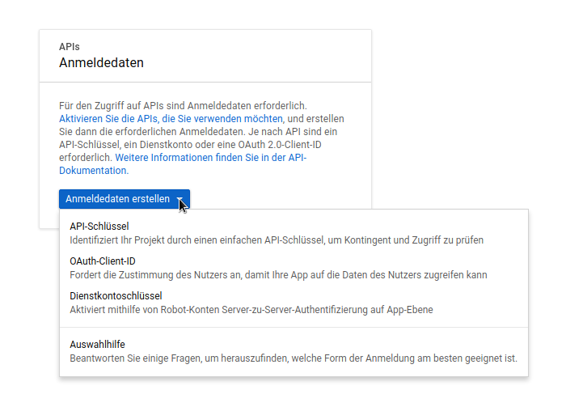
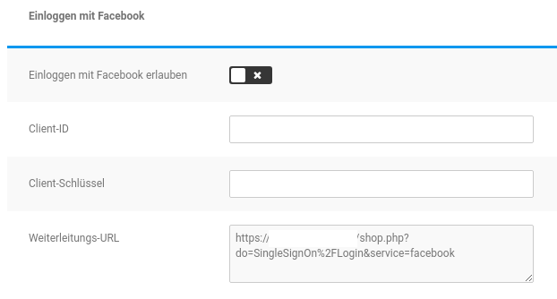
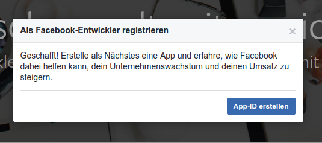
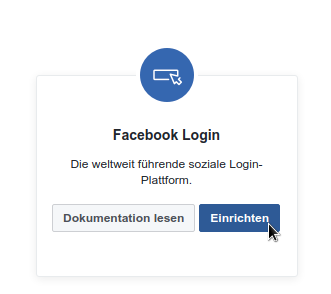
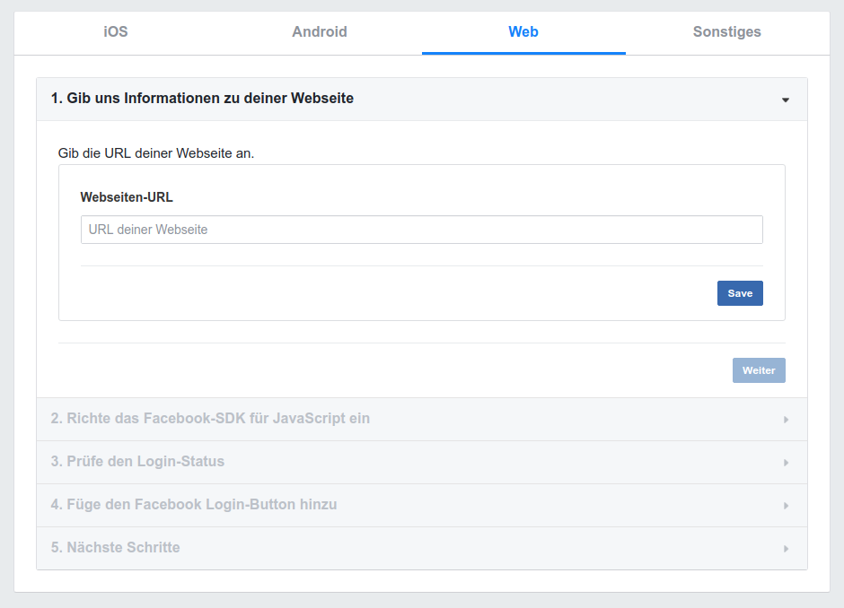
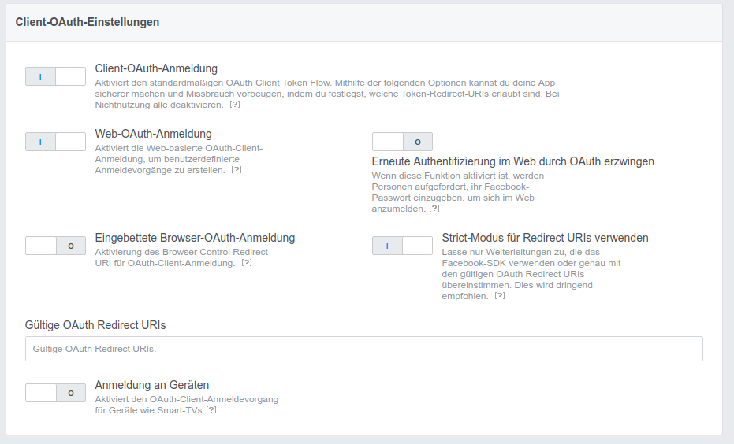
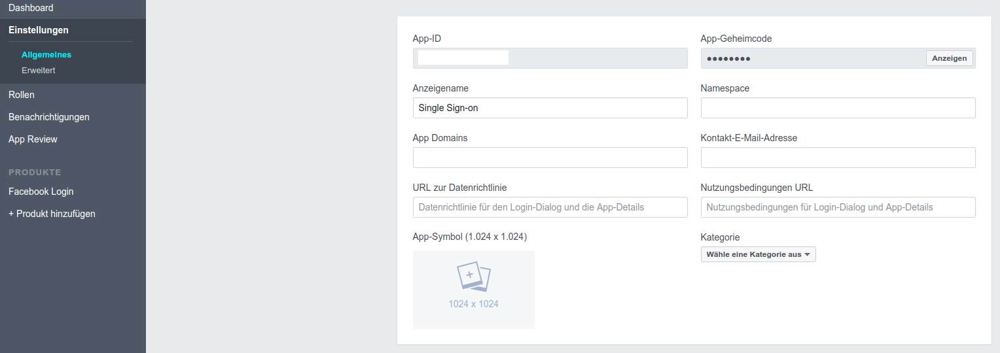
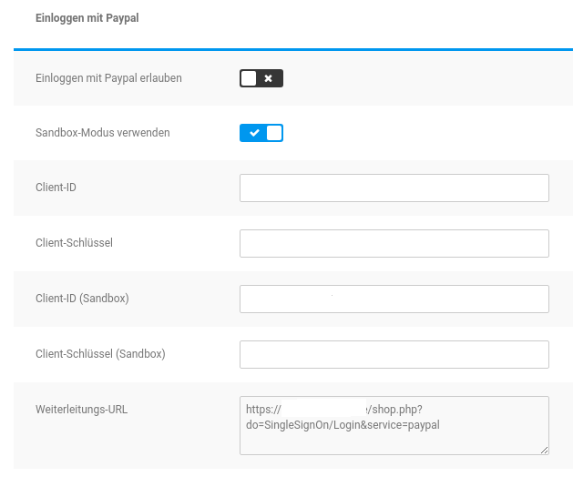
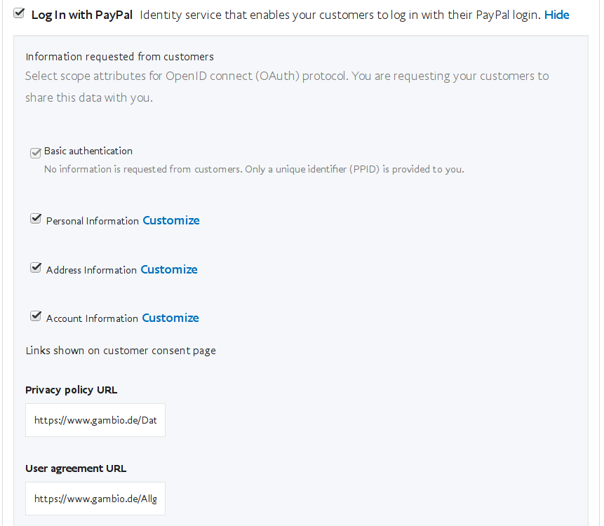

# Konfiguration {#single_sign_on_konfiguration}

Nach Installation des Moduls kann dieses mit Klick auf Bearbeiten konfiguriert werden. Für die verschiedenen Anbieter müssen jeweils die benötigten Zugangsdaten hinterlegt werden.

## Google { .section}

Client-ID und Client-Schlüssel erhältst du direkt bei Google unter folgender URL:

https://console.developers.google.com/apis/credentials

Sofern du bei Google noch kein Projekt angelegt hast, das als Sammlung für Einstellungen verstanden werden muss, wirst du aufgefordert dies zu tun. Wähle einen beliebigen Namen \(für deine Wiedererkennung\) und klicke auf Projekt erstellen.

Wähle über die Dropdown-Schaltfläche Anmeldedaten erstellen den Eintrag OAuth-Client-ID aus. Klicke auf der sich nun öffnenden Seite auf Zustimmungsbildschirm konfigurieren.

Wähle dort deine E-Mail-Adresse aus und vergib einen Produktnamen, beispielsweise deinen Shopnamen. Gib zudem noch die URL deines Shops, die URL der Datenschutzerklärung und der AGB ein. Speichere die Angaben abschließend.

Wähle auf dem folgenden Bildschirm als Anwendungstyp Webanwendung aus und trage unten die Weiterleitungs-URL ein, die du in der Modulkonfiguration findest. Wenn du deine Daten gespeichert hast, erhältst du ein Popup mit Client-ID und Clientschlüssel. Kopiere und hinterlege diese im Modul. Dein Single Sign-on für Google ist damit fertig eingerichtet.

## Facebook { .section}

Hier werden Client-ID und Schlüssel benötigt. Öffne folgenden Link in deinem Browser:

https://developers.facebook.com/

und logge dich mit deinem Facebook-Konto ein. Sofern du dich noch nicht als FacebookDeveloper registriert hast, klicke rechts oben auf Los gehts und folge den Schritten des Assistenten, der eine neue App anlegt. Wenn du dich bereits als Developer registriert hast, sollte über den Punkt oben rechts die passende App für den Shop respektive eine neue App für den Shop angelegt werden.

Es muss innerhalb der App nun das Produkt Facebook Login eingerichtet werden. Klicke bei Facebook Login auf Einrichten.

Klicke im folgenden Bildschirm links im Menü auf Einstellungen. In der Produktkonfiguration sind Client-OAuth-Anmeldung und Web-OAuth-Anmeldung zu aktivieren, alle anderen Optionen können abgeschaltet bleiben. Die in der Modulkonfiguration angezeigte Weiterleitungs-URL ist unter Gültige OAuth Redirect URIs zu hinterlegen.

Bei Facebook werden Client-ID und Secret als App-ID und App-Geheimcode bezeichnet. Um App-ID und Geheimcode zu finden, klicke nun noch einmal ganz oben links im Menü auf den Punkt Einstellungen. Du findest hier die App-ID, kannst dir den App-Geheimcode anzeigen lassen und überträgst diese in die Modulkonfiguration.

## Paypal { .section}

Client und Secret sind identisch mit den Daten des PayPal & PayPal PLUS-Moduls und werden automatisch übernommen, sofern das Zahlungs-Modul schon konfiguriert wurde. Wir gehen hier davon aus, dass die Konfiguration des Zahlungsmoduls bereits vorgenommen wurde und somit schon eine passende "REST-App" auf der Seite https://developer.paypal.com/ vorhanden ist, aber noch geeignet weiter konfiguriert werden muss.

Nach dem Login klickst du in der linken Leiste einmal auf My Apps & Credentials. Du findest dort den Abschnitt REST API apps. Klicke dort die App an, die du für deinen Shop angelegt hast. Hier fährst du dann mit den Sandbox App Settings fort:

Unter dem obersten Punkt Return-URL klickst du auf den Link Show. Fülle das nun angebotene Feld mit dem Inhalt des Feldes Weiterleitungs-URL aus der Modulkonfiguration.

Aktiviere den Haken für Log In with PayPal und klicke dann auf Advanced Options. Setze hier die folgenden Haken: Basic authentication, Personal Information, Address Information und Account Information, um möglichst viele Daten von deinen Kunden zu erhalten, sodass diese nur noch wenige Felder ausfüllen müssen.

Im Feld Privacy policy URL sollte der Link zu deiner Datenschutzerklärung hinterlegt werden.

Achte darauf dass der Punkt Enable customers who have not yet confirmed their email address with PayPal to log in to your app nicht aktiviert wird, da das Single Sign-on-Modul generell darauf vertraut, dass die erhaltenen Benutzerdaten gesichert sind.

## Amazon { .section}

Mit Einführung des Single Sign-on-Moduls erhält das bislang schon verfügbare AmazonPayModul einen zusätzlichen Betriebsmodus. Sofern Single Sign-on über Amazon konfiguriert ist, wird dieses automatisch im Single Sign-on-Modus betrieben. In diesem Modus fallen vor allem auch die bislang nötigen Amazon-Gast-Accounts weg, da Single Sign-on immer reguläre Kundenkonten erzeugt.

Um die zugehörigen Zahlungsmodule und Login Module zu konfigurieren müssen im Seller Central unter

https://sellercentral-europe.amazon.com

Einstellungen vorgenommen werden.

Nach dem Login auf der Amazon Seite kannst du über Integration \> Integrationsressourcen \> Access Keys abrufen auf eine Übersicht wechseln. Mit dem ButtonZugangsdaten kopieren kann ein JSON-Block abgerufen werden, der in die Konfiguration des AmazonPay-zahlungsmoduls zu kopieren ist. Das Zahlungsmodul allein erlaubt dann schon Zahlungen, ist aber noch nicht im Single Sign-on Modus.

Im Single Sign-on-Modul im Gambio Admin müssen dann noch weitere Zugangsdaten konfiguriert werden. Dazu wechselst du im Seller Central über den Dropdown ganz oben auf Login mit Amazon. Dort kann man dann ClientID und Secret herauskopieren um sie in den Shop in die Konfiguration des Single Sign-On Moduls zu übertragen. Die Rückleitungs-URL, wie im Shop angezeigt, muss bei Amazon hinterlegt werden; dies kannst du über Return URLs und Javascript Origins konfigurieren.

**Parent topic:**[Single Sign-on](7_6_SingleSign_on.md)

