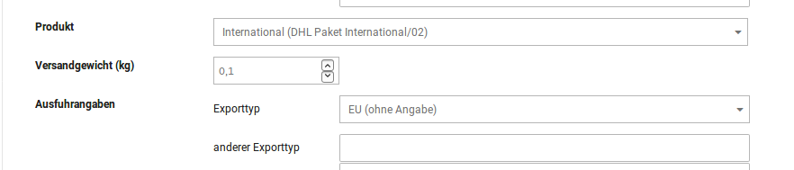

# Label in Länder außerhalb der EU erstellen {#dhl_geschaeftskundenversand_verwendung_label_ausserhalb_eu}

Bei Sendungen in Länder außerhalb der EU gilt es, die Ausfuhrangaben bei der Labelerstellung korrekt zu tätigen.

|Feldname|Beschreibung|
|--------|------------|
|Produkt|Bei Sendungen in Länder außerhalb der EU wird automatisch das korrekte Produkt eingestellt. Hierzu muss zuvor ein Produkt für internationale Sendungen in der Modulkonfiguration hinterlegt werden. Produkt und Teilnahmenummer erhältst du direkt von DHL, sofern dies von deinem Vertrag abgedeckt wird.|
|Versandgewicht|Das Versandgewicht wird in aktuellen Shopversionen vorausgefüllt und darf nicht weniger als 0,1 betragen, da dies das angenomme Mindestverpackungsgewicht ist. Wurde in den Artikeln ein Versandgewicht hinterlegt, werden diese addiert und automatisch in das Feld Versandgewicht eingetragen.|
|Ausfuhrangabe Exporttyp|Voreingestellt ist hier EU \(keine Angabe\). Bei Sendungen in Länder außerhalb der EU muss jedoch ein anderer Exporttyp gewählt werden. Neben den Exporttypen Geschenk, Warenmuster, Dokument und Warenretoure gibt es noch den Typen anderer.|
|Ausfuhrangabe anderer Exporttyp|Wird der Exporttyp anderer gewählt, muss im Feld anderer Exporttyp ein Vermerk dazu hinterlassen werden, wie z.B. ein Hinweis auf den Inhalt.|

Weiter unten in den Ausfuhrangaben werden die Artikel der Bestellung aufgeführt. Wurde das Versandgewicht in den Artikeln hinterlegt, so ist dies hier bereits vorausgefüllt. Ansonsten muss das Gewicht für einen Artikel in die jeweilige Zeile im Feld Masse hinterlegt werden. Aus der Menge der Artikel und den jeweiligen Gewichten muss dann das Gesamtgewicht errechnet und weiter oben in das Feld Versandgewicht eingetragen werden.

**Parent topic:**[Verwendung](7_7_3_Verwendung.md)

