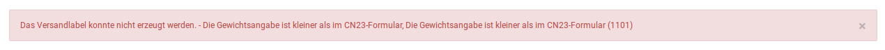

# Mögliche Meldungen {#dhl_geschaeftskundenversand_verwendung_moegliche_meldungen}

Die Meldung Die angegebene Art der Sendung ist nicht gültig bedeutet bei Sendungen ins Ausland meist, dass kein oder ein ungültier Exporttyp angegeben wurde oder das kein Produkt für den internationalen Versand hinterlegt ist.

Bitte prüfe die hinterlegten Produkte und erstelle das Label mit allen Angaben erneut.

Die Meldung Die Gewichtsangabe ist kleiner als im CN23-Formular sagt aus, dass das Versandgewicht geringer ist als das Gesamtgewicht der in den Ausfuhrangaben eingetragenen Artikel.

Bitte prüfe und korrigiere die angegebenen Gewichte.

Die Meldung Versandetikett wurde erzeugt ist eine Erfolgsmeldung. Darunter finden sich die Sendungsnummer sowie in der Spalte Label ein Link zum Versandlabel und ein Link zum Exportlabel.

**Parent topic:**[Verwendung](7_7_3_Verwendung.md)

