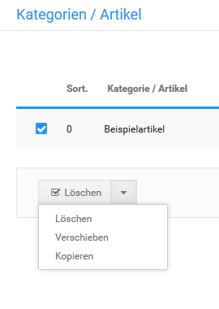

# Artikel kopieren {#artikel_kopieren}

Artikel lassen sich unter Artikel \> Artikel / Kategorien kopieren. Markiere die Artikel, die du kopieren möchtest, indem du in den zugehörigen Boxen die Haken setzt. In der Leiste unter der Auflistung wird nun der Dropdown-Button angezeigt. Klicke auf der rechten Seite des Buttons auf den nach unten weisenden Pfeil und anschließend auf Kopieren.

Es wird der Bereich Kopieren nach in einem neuen Fenster angezeigt. Im oberen Teil dieser Spalte findest du eine Auflistung der Artikel, die kopiert werden sollen. Darunter ist der Bereich Mehrfach, hier ist der komplette Kategorie-Baum deines Shops aufgeführt. Durch Anhaken der entsprechenden Boxen werden die Zielkategorien gewählt, in die die Artikel kopiert werden sollen.

Im Bereich Einfach kann als Ziel nur eine Kategorie ausgewählt werden.

**Note:** Wenn unter Mehrfach ein oder mehr Haken gesetzt sind, wird die Einstellung unter Einfach komplett ignoriert. Wenn Einfach verwendet werden soll, darf unter Mehrfach kein Haken gesetzt sein.

Im Bereich Kopiermethode wird festgelegt, ob der Artikel verlinkt oder dupliziert werden soll. Beide Methoden ermöglichen es, Artikel an mehreren Stellen im Shop sichtbar zu machen. Die Auswahl unterscheidet sich folgendermaßen:

Verlinken

-   Der Artikel ist nur ein Mal im Shop vorhanden
-   Änderungen, die an einem Artikel vorgenommen werden, wirken sich auf alle anderen Vorkommen des Artikels aus

Duplizieren

-   Der Artikel ist mehrfach im Shop vorhanden
-   Änderungen wirken sich nur auf einen Artikel aus, die anderen Vorkommen des Artikels bleiben unverändert

Verlinken ist immer dann von Vorteil, wenn Artikel in identischer Form an mehreren Stellen vorkommen sollen. Änderungen müssen nur an einem Artikel vorgenommen werden, dies verhindert, dass bei mehreren Änderungen an mehreren Artikeln Details vergessen werden. Duplizieren kann verwendet werden, wenn verschiedene Abwandlungen eines Artikels angelegt werden sollen, die unabhängig voneinander sind.

Unter Kopieroptionen für Artikel kann eingestellt werden ob

-   Attribute
-   Sonderangebote
-   Cross Selling

übernommen werden sollen.

Mit Klick auf Kopieren wird der Kopiervorgang gestartet. Am Ende des Kopiervorganges wird jeweils die unterste, ausgewählte Kategorie aus der Liste angezeigt.

**Parent topic:**[Artikel](8_2_Artikel.md)

