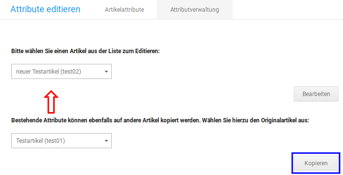

# Attributverwaltung {#attributverwaltung}

Über die Attributverwaltung können die Optionswerte eines Artikels geändert \(Attribute editieren\) bzw. einem beliebigen Artikel neue Attribute und Optionswerte zugewiesen werden.

Über das Dropdown Bitte wählen Sie einen Artikel aus der Liste zum Editieren kann ein Artikel ausgewählt werden. Bestätige die Auswahl mit einem Klick auf Bearbeiten. Bei einem Artikel ohne Optionswerte sind standardmäßig alle Attribute eingeklappt.

Klicke auf das Plus-Zeichen, das zusammen mit dem jeweiligen Attribut aufgeführt wird \(in der Abbildung rot markiert\), um die zugehörigen Optionswerte anzuzeigen.

Um einen Optionswert dem Artikel zuzuweisen, setze den jeweiligen Haken in der ersten Spalte. Die Eingabefelder werden nun nicht mehr ausgegraut und können mit entsprechendem Inhalt gefüllt werden.

Es stehen die folgenden Eingabefelder zur Verfügung:

|Feldname|Beschreibung|
|--------|------------|
|Sort.|Sortierreihenfolge. In dieser Reihenfolge wird der Optionswert angezeigt|
|Artikel Nr.|Artikelnummer für den jeweiligen Optionswert. Dient als Zusatz zur Artikelnummer des Hauptartikels|
|EAN|Europäische Artikelnummer für den jeweiligen Optionswert|
|Lager|Lagerstand des Optionswerts|
|VPE|Verpackungseinheit. im linken Feld kann der VPE-Wert eingetragen und im rechten Feld die zugehörige Verpackungseinheit ausgewählt werden \(siehe Kapitel Verpackungseinheiten\)|
|Gewicht|Gewicht des jeweiligen Optionswertes in Kilogramm, wird mit dem Gewicht des Hauptartikels verrechnet|
|Präfix Gewicht|legt fest ob das Gewicht zum Gewicht des Hauptartikels hinzugezählt \(+\) oder davon abgezogen \(-\) wird|
|Preis|Preis des jeweiligen Optionswerts in der Standardwährung, wird mit dem Preis des Hauptartikels verrechnet|
|Präfix Preis|legt fest, ob der Preis des Optionswerts zum Preis des Hauptartikels hinzugezählt \(+\) oder davon abgezogen \(-\) wird|

Bestätige vorgenommene Eingaben mit einem Klick auf Speichern.

## Attribute kopieren { .section}

Zugewiesene Optionswerte können bei Bedarf auch von einem Artikel kopiert und direkt einem anderen Artikel zugeordnet werden. Auf diese Weise lassen sich schnell mehrere Artikel mit den gleichen Auswahlmöglichkeiten versehen.

Hierbei werden die eingestellten Optionswert des Artikels aus dem unteren Dropdown-Menü auf den Artikel im oberen Dropdown-Menü kopiert. Wähle daher die gewünschten Artikel in beiden Menüs aus und klicke dann auf Kopieren.

Abschließend werden die Optionswerte des Ziel-Artikels nochmals angezeigt. Du hast so die Möglichkeit noch abschließende Änderungen vorzunehmen, diese müssen anschließend mit Klick auf Speichern bestätigt werden.

**Parent topic:**[Artikelattribute](8_3_Artikelattribute.md)

