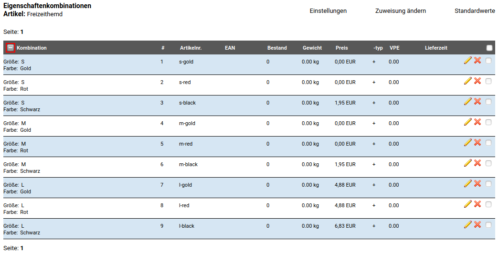
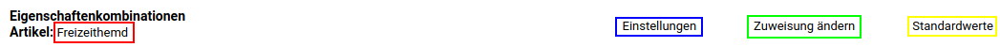
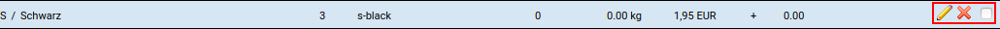
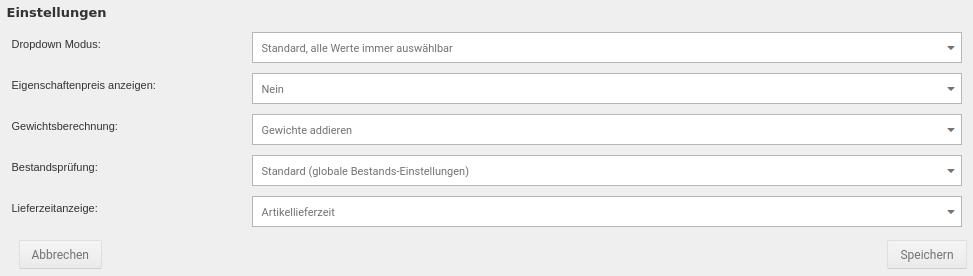

# Kombinationsübersicht {#artikeleigenschaften_kombinationsuebersicht}

## Aufruf der Kombinationsübersicht aus der Artikelübersicht { .section}

Über die Dropdown-Schaltfläche am hinteren Ende des Artikels kann der Eintrag _**Eigenschaften**_ ausgewählt werden.

## Aufruf der Kombinationsübersicht aus der Artikeldetailseite { .section}

Über die mit _**Sonderangebot**_ beschriftete Schaltlfäche kann im Dropdown der Eintrag _**Eigenschaften**_ ausgewählt werden.

## Kombinationsübersicht { .section}

In der Kombinationsübersicht werden die dem Artikel zugeordnenten Kombinationen aufgelistet. Über das Plus-Zeichen, in der linken oberen Ecke der Tabelle kann die Ansicht ausgeklappt werden, um die Namen der zugehörigen Eigenschaften mit anzuzeigen.

Im oberen Bereich der Seite stehen verschiedene Links zur Verfügung, diese sind von links nach rechts:

-   Link zur Artikelmaske
-   Link zur Einstellungsseite
-   Link zur Eigenschaftenauswahl
-   Link zur Standardwerte-Maske

Für jeden einzelnen Eintrag stehen am Ende der Zeile die Funktionen

-   Bearbeiten \(Bleistift-Symbol\)
-   Löschen \(Mülltonnen-Symbol\)
-   Eintrag auswählen \(Mehrfachauswahl\)

zur Verfügung.

## Einstellungsseite { .section}

|Feldname|Beschreibung|
|--------------|------------|
DropDown-Modus|Der Dropdown-Modus legt fest, wie die einzelnen Eigenschaftswerte im Artikel ausgewählte werden können:|
-   _**Standard**_: |alle Werte immer auswählbar: Alle möglichen Kombinationen können ausgewählt werden. Bei Auswahl von nicht konfigurierten Kombinationen erscheint ein Hinweistext _**Diese Kombination existiert nicht...**_
-   _**Reihenfolge der Auswahl beliebig, nur mögliche Werte auswählbar**_: |Nach Auswahl eines Eigenschaftenwertes werden in der zweiten Optionsauswahl alle Werte angezeigt, ausgewählt werden können nur Kombinationen, die konfiguriert wurden.
-   _**Reihenfolge der Auswahl vorgegeben, nur mögliche Werte auswählbar**_: |Der zweite \(dritte, vierte\) Eigenschaftswert kann erst ausgewählt werden, wenn der vorangegangene Wert ausgewählt wurde. Alle möglichen Kombinationen werden angezeigt, ausgewählt werden können nur Kombinationen, die konfiguriert wurden.

|Feldname|Beschreibung|
|--------------|------------|
Eigenschaftenpreis anzeigen|Wenn diese Einstellung aktiviert ist, werden die Aufpreise der einzelnen Eigenschaftswerte angezeigt.

!!! note "Hinweis"

    Es wird nur der Aufpreis des jeweiligen Eigenschaftswerts angezeigt, wenn dieser eingetragen ist, nicht jedoch der Aufpreis für die Kombination \(Kombinationsfestpreis\).

    Der Kombinationsfestpreis kann anders sein, als der aus den Eigenschaften berechnete Preis.

|Feldname|Beschreibung|
|--------------|------------|
Gewichtsberechnung|Bei der Gewichtsberechnung sind zwei Einstellungen möglich:
-   _**Gewichte addieren**_:| das eingetragene Artikelgewicht und das Gewicht der jeweiligen Eigenschaften-Kombination werden zusammengerechnet
-   _**Artikelgewicht ersetzen**_: |das eingetragene Artikelgewicht wird bei Auswahl einer Eigenschaften-Kombination durch dessen Gewicht ersetzt

|Feldname|Beschreibung|
|--------------|------------|
Bestandsprüfung|Die Bestandsprüfung verfügt über vier Auswahlmöglichkeiten:
-   _**Standard**_ |\(globale Bestands-Einstellungen\): die globalen Einstellungen für Eigenschaften-Kombinationen werden verwendet
-   _**Artikelbestand**_: |Nur der Artikelbestand wird geprüft und angezeigt
-   _**Kombinationsbestand**_: |Nur der Kombinationsbestand wird geprüft und angezeigt, wenn eine Kombination ausgewählt wurde
-   _**Keine Prüfung**_: |Es findet keine Bestandsprüfung statt

|Feldname|Beschreibung|
|--------------|------------|
Lieferzeitanzeige|Mit dieser Einstellung wird festgelegt, welche Lieferzeit für den Lieferstatus verwendet wird:-   _**Artikellieferzeit**_: es wird die im Artikel eingestellte Lieferzeit verwendet
-   _**Kombinationslieferzeit**_: |es wird die in der ausgewählten Kombination eingestellte Lieferzeit verwendet

**Parent topic:**[Artikeleigenschaften](8_4_Artikeleigenschaften_.md)

