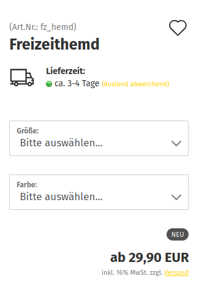
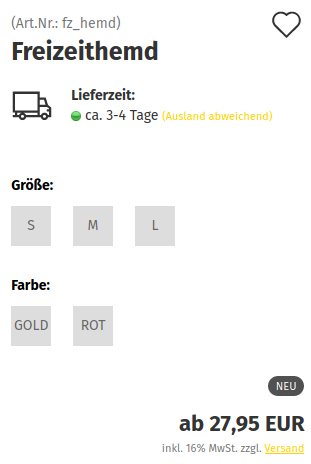
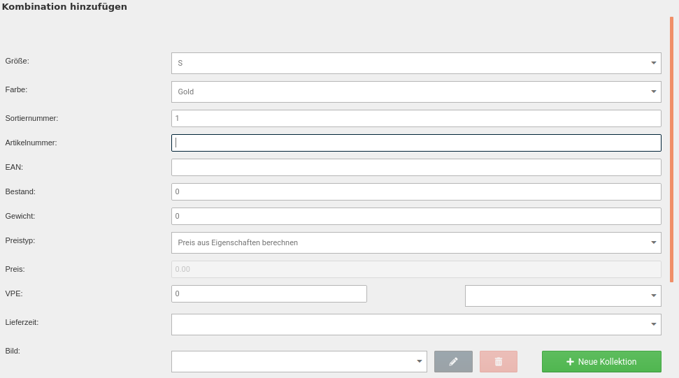
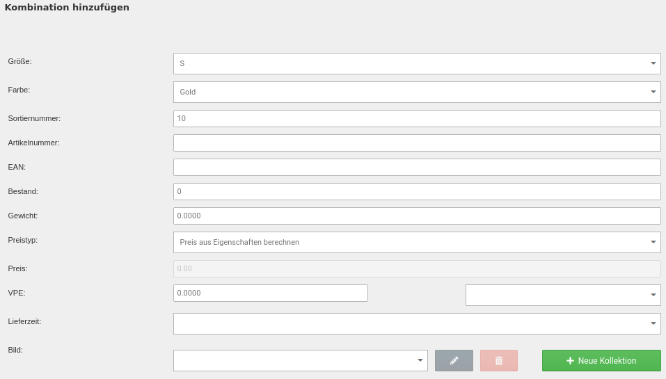
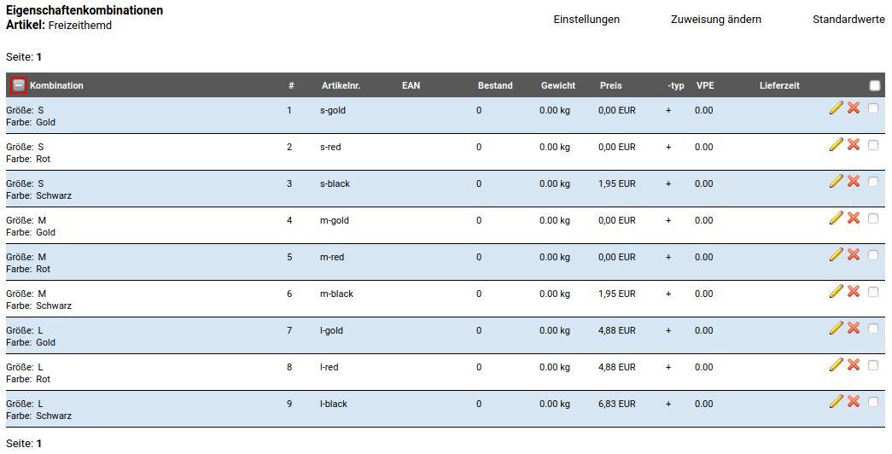
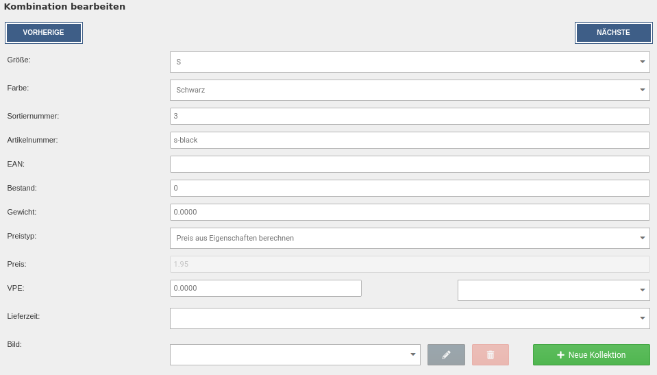

# Artikeleigenschaften {#artikeleigenschaften}

Über Artikeleigenschaften lassen sich Varianten eines Artikels anlegen. Der Artikel wird hierbei im Shop mit einer oder mehreren Auswahlen angezeigt.

Eigenschaften eignen sich für Artikel, dessen Auswahlmöglichkeiten sich nicht vom Hauptartikel trennen lassen, wie z.B. Farbe und Größe eines Kleidungsstücks.

!!! example "Beispiel"
    Es wird ein Artikel _**Freizeithemd**_ mit den Eigenschaften _**Farbe**_ und _**Größe**_ angelegt.

    Der Artikel kann erst in den Warenkorb gelegt werden, wenn alle Auswahlen getroffen worden sind. Eine solche Auswahl wird als Eigenschaften-Kombination bezeichnet und kann individuell bearbeitet werden.

!!! danger "Achtung"
    Eigenschaftswerte werden untereinander kombiniert, bei drei Eigenschaften mit je vier Werten zur Auswahl entstehen vier hoch drei \(4 x 4 x 4\) Kombinationen. Eine hohe Anzahl an Eigenschaftswerten kann den Server stark auslasten. Falls beim Erstellen der Kombinationen wesentliche Verzögerungen auftreten, sollten stattdessen Artikelattribute verwendet werden.

Es muss immer zwischen den angelegten Eigenschaften und den zugewiesenen Kombinationen unterschieden werden.

!!! example "Beispiel"
    Die Eigenschaft _**Farbe**_ hat die Werte _**rot**_, _**schwarz**_ und _**gold**_. Die Eigenschaft _**Größe**_ hat die Werte _**S**_, _**M**_ und _**L**_.

    Der Artikel _**Freizeithemd**_ ist in der Farbe _**schwarz**_ mit den Größen _**M**_ und _**L**_ und in der Farbe _**rot**_ mit den Größen _**S**_, _**M**_ und _**L**_ vorhanden.

    Der Artikel hat die Kombinationen:

    -   schwarz, M
    -   schwarz, L
    -   rot, S
    -   rot, M
    -   rot, L

-   **[Eigenschaften erstellen und bearbeiten](8_4_1_EigenschaftenErstellenUndBearbeiten.md)**  

-   **[Eigenschaftswerte erstellen und bearbeiten](8_4_2_EigenschaftswerteErstellenUndBearbeiten.md)**  

-   **[Eigenschaften zuweisen](8_4_3_EigenschaftenZuweisen.md)**  

-   **[Kombinationen erstellen](8_4_4_KombinationenErstellen.md)**  

-   **[Kombinationsübersicht](8_4_5_Kombinationsuebersicht.md)**  

-   **[Kombinationen bearbeiten](8_4_6_KombinationenBearbeiten.md)**  

-   **[Kombinationen löschen](8_4_7_KombinationenLoeschen.md)**  

-   **[Kombinationen hinzufügen](8_4_8_KombinationenHinzufuegen.md)**  

**Parent topic:**[Artikel & Kategorien](8_Artikel_UND_Kategorien.md)

# Kombinationen erstellen {#artikeleigenschaften_kombinationen_erstellen}

Das Zuweisen der Eigenschaftswerte zu einem Artikel kann manuell oder automatisch erfolgen. Hierbei werden die einzelnen Eigenschaftswerte miteinander kombiniert. Jede Variante, die vom Kunden ausgewählt werden kann, wird als Eigenschaften-Kombination bezeichnet.

!!! example "Beispiel"
    Es wird ein Artikel _**Freizeithemd**_ angelegt. Dieser ist in der Farbe _**schwarz**_ in den Größen _**M**_ und _**L**_ und in der Farbe _**rot**_ in den Größen _**S**_, _**M**_ und _**L**_ vorhanden.

    Der Artikel hat die Kombinationen:

    -   schwarz, M
    -   schwarz, L
    -   rot, S
    -   rot, M
    -   rot, L

## Kombinationen automatisch ermitteln { .section}

Das automatische Ermitteln der Kombinationen ist die einfachste Möglichkeit.

Setze die Haken für die Eigenschaften, die du kombinieren möchtest. Bei Bedarf kannst du auch über das Plus-Zeichen die jeweilige Eigenschaft aufklappen und einzelne Eigenschaftswerte für die Kombination auswählen. Klicke auf _**Kombinationen automatisch ermitteln**_. Überzählige Kombinationen - also Varianten eines Artikels, die du nicht anbieten möchtest - können auch nachträglich wieder gelöscht werden.

## Kombinationen manuell erstellen { .section}

Beim manuellen Erstellen der Kombinationen wird jede Variante des Artikels einzeln angelegt.

Setze zunächst den Haken bei allen Eigenschaften, aus denen du Eigenschaftswerte übernehmen möchtest und klicke auf _**Kombinationen manuell erstellen**_.

Es wird die Auflistung der aktuell vorhandenen Kombinationen angezeigt, die ganz zu Anfang leer ist. Klicke auf _**Kombination hinzufügen**_, um eine neue Kombination zu erstellen.

Es wird der Dialog zum Anlegen einer neuen Kombination angezeigt. Neben je einem Dropdown-Menü für jede Eigenschaft, gibt es die folgenden Einstellungen:

|Feldname|Beschreibung|
|--------|------------|
|Sortiernummer|Sortierreihenfolge der Kombination im Gambio Admin|
|Artikelnummer|Artikelnummer der Kombination / Variante|
|EAN|EAN \(Europäische Artikelnummer\) der Kombination / Variante|
|Bestand|Lagerstand der Kombination / Variante|
|Gewicht|Gewicht der Kombination / Variante|
|Preistyp|Soll der Aufpreis der Variante aus den Aufpreisen der Eigenschaftswerte berechnet \(Preis aus Eigenschaften berechnen\) oder als individueller Preis in die Kombination \(Kombinationsfestpreis\) eingetragen werden?|
|Preis|Kombinationsfestpreis der Kombination / Variante|
|VPE|Verpackungseinheit der Kombination / Variante|
|Lieferzeit|Lieferstatus der Kombination / Variante|
|Bild|Bild-Kollektion der Kombination / Variante \(siehe Kapitel _**Kollektionen**_\)|

Wähle die gewünschten Eigenschaftswerte aus und nimm, soweit möglich, die Eintragungen vor. Bestätige die Eingaben mit _**Speichern**_ bzw. _**Speichern & Schließen**_. Über _**Abbrechen**_ kannst du den Dialog wieder verlassen, ohne die Kombination anzulegen.

**Parent topic:**[Artikeleigenschaften](8_4_Artikeleigenschaften_.md)

# Eigenschaften zuweisen {#artikeleigenschaften_eigenschaften_zuweisen}

Eigenschaften können einem Artikel unter _**Artikel \> Artikel/Kategorien**_ zugewiesen werden.

## Aufruf aus der Artikelübersicht { .section}

Über die Dropdown-Schaltfläche am hinteren Ende des Artikels kann der Eintrag _**Eigenschaften**_ ausgewählt werden.

## Aufruf aus der Artikeldetailseite { .section}

Über die mit _**Sonderangebot**_ beschriftete Schaltlfäche kann im Dropdown der Eintrag _**Eigenschaften**_ ausgewählt werden.

**Parent topic:**[Artikeleigenschaften](8_4_Artikeleigenschaften_.md)

# Eigenschaftswerte erstellen und bearbeiten {#artikeleigenschaften_eigenschaftswerte_erstellen_und_bearbeiten}

## Eigenschaftswert hinzufügen { .section}

Über das Plus-Zeichen hinter der Eigenschaft kann ein neuer Eigenschaftswert hinzugefügt werden. Hierbei können die folgenden Einstellungen gemacht werden:

|Feldname|Beschreibung|
|--------|------------|
|Name \(de\)|Name des Eigenschaftswerts in der Sprache Deutsch|
|Name \(en\)|Name des Eigenschaftswerts in der Sprache Englisch|
|Sortiernummer|Sortierreihenfolge des Eigenschaftswerts innerhalb der Eigenschaft|
|Artikelnummer|\(Teil-\)Artikelnummer des Eigenschaftswerts|
|Bruttopreis|Brutto-Aufpreis auf den Hauptartikelpreis des Eigenschaftswerts|
|Bild|Bild zur Auswahl des Eigenschaftswerts bei _**Anzeigeart**_ _**Bild**_ der Eigenschaft|

## Eigenschaftswert bearbeiten { .section}

Über das Bleistift-Symbol lässt sich der jeweilige Eigenschaftswert bearbeiten. Es stehen die folgenden Einstellungen zur Verfügung:

|Feldname|Beschreibung|
|--------|------------|
|Name \(de\)|Name des Eigenschaftswerts in der Sprache Deutsch|
|Name \(en\)|Name des Eigenschaftswerts in der Sprache Englisch|
|Sortiernummer|Sotierreihenfolge des Eigenschaftswerts innerhalb der Eigenschaft|
|Artikelnummer|\(Teil-\)Artikelnummer des Eigenschaftswerts|
|Bruttopreis|Brutto-Aufpreis auf den Hauptartikelpreis des Eigenschaftswerts|
|Bild|Bild zur Auswahl des Eigenschaftswerts bei _**Anzeigeart**_ _**Bild**_ der Eigenschaft|

## Eigenschaftswert löschen { .section}

Über das Mülltonnen-Symbol kann ein bestehender Eigenschaftswert gelöscht werden. Es erfolgt eine Sicherheitsabfrage, in der das Löschen bestätigt werden muss.

!!! danger "Achtung"

    Eigenschaftstwerte sollten auf keinen Fall gelöscht werden, wenn diese noch in Eigenschaften-Kombinationen enthalten sind. Ist dies der Fall, wird eine entsprechende Warnung angezeigt.

**Parent topic:**[Artikeleigenschaften](8_4_Artikeleigenschaften_.md)

# Kombinationen löschen {#artikeleigenschaften_kombinationen_loeschen}

Kombinationen können wahlweise einzeln, über das Mülltonnen-Icon, oder die Mehrfachauswahl gelöscht werden. Wird mindestens ein Haken gesetzt, wird der Button _**Kombinationen löschen**_ angezeigt.

Es wird eine Sicherheitsabfrage angezeigt, in der wahlweise auch das Löschen aller Kombinationen durch Setzen des entsprechenden Hakens ausgewählt werden kann.

**Parent topic:**[Artikeleigenschaften](8_4_Artikeleigenschaften_.md)

# Kombinationen hinzufügen {#artikeleigenschaften_kombinationen_hinzufuegen}

!!! note "Hinweis"

    Kombinationen können nicht beliebig ergänzt werden. Es können nur Eigenschaftswerte zu neuen Kombinationen zusammengeführt werden, die beim Erstellen der ursprünglichen Kombinationen schon im Shop angelegt waren.

Es wird der Dialog zum Anlegen einer neuen Kombination angezeigt. Neben je einem Dropdown-Menü für jede Eigenschaft, gibt es die folgenden Einstellungen:

|Feldname|Beschreibung|
|--------|------------|
|Sortiernummer|Sortierreihenfolge der Kombination im Gambio Admin|
|Artikelnummer|Artikelnummer der Kombination / Variante|
|EAN|EAN \(Europäische Artikelnummer\) der Kombination / Variante|
|Bestand|Lagerstand der Kombination / Variante|
|Gewicht|Gewicht der Kombination / Variante|
|Preistyp|Soll der Aufpreis der Variante aus den Aufpreisen der Eigenschaftswerte berechnet \(Preis aus Eigenschaften berechnen\) oder als individueller Preis in die Kombination \(Kombinationsfestpreis\) eingetragen werden?|
|Preis|Kombinationsfestpreis der Kombination / Variante|
|VPE|Verpackungseinheit der Kombination / Variante|
|Lieferzeit|Lieferstatus der Kombination / Variante|
|Bild|Bild-Kollektion der Kombination / Variante \(siehe Kapitel _**Kollektionen**_\)|

Wähle die gewünschten Eigenschaftswerte aus und nimm, soweit möglich, die Eintragungen vor. Bestätige die Eingaben mit _**Speichern**_ bzw. _**Speichern & Schließen**_. Über _**Abbrechen**_ kannst du den Dialog wieder verlassen, ohne die Kombination anzulegen.

**Parent topic:**[Artikeleigenschaften](8_4_Artikeleigenschaften_.md)

# Kombinationsübersicht {#artikeleigenschaften_kombinationsuebersicht}

## Aufruf der Kombinationsübersicht aus der Artikelübersicht { .section}

Über die Dropdown-Schaltfläche am hinteren Ende des Artikels kann der Eintrag _**Eigenschaften**_ ausgewählt werden.

## Aufruf der Kombinationsübersicht aus der Artikeldetailseite { .section}

Über die mit _**Sonderangebot**_ beschriftete Schaltlfäche kann im Dropdown der Eintrag _**Eigenschaften**_ ausgewählt werden.

## Kombinationsübersicht { .section}

In der Kombinationsübersicht werden die dem Artikel zugeordnenten Kombinationen aufgelistet. Über das Plus-Zeichen, in der linken oberen Ecke der Tabelle kann die Ansicht ausgeklappt werden, um die Namen der zugehörigen Eigenschaften mit anzuzeigen.

Im oberen Bereich der Seite stehen verschiedene Links zur Verfügung, diese sind von links nach rechts:

-   Link zur Artikelmaske
-   Link zur Einstellungsseite
-   Link zur Eigenschaftenauswahl
-   Link zur Standardwerte-Maske

Für jeden einzelnen Eintrag stehen am Ende der Zeile die Funktionen

-   Bearbeiten \(Bleistift-Symbol\)
-   Löschen \(Mülltonnen-Symbol\)
-   Eintrag auswählen \(Mehrfachauswahl\)

zur Verfügung.

## Einstellungsseite { .section}

|Feldname|Beschreibung|
|--------------|------------|
DropDown-Modus|Der Dropdown-Modus legt fest, wie die einzelnen Eigenschaftswerte im Artikel ausgewählte werden können:|
-   _**Standard**_: |alle Werte immer auswählbar: Alle möglichen Kombinationen können ausgewählt werden. Bei Auswahl von nicht konfigurierten Kombinationen erscheint ein Hinweistext _**Diese Kombination existiert nicht...**_
-   _**Reihenfolge der Auswahl beliebig, nur mögliche Werte auswählbar**_: |Nach Auswahl eines Eigenschaftenwertes werden in der zweiten Optionsauswahl alle Werte angezeigt, ausgewählt werden können nur Kombinationen, die konfiguriert wurden.
-   _**Reihenfolge der Auswahl vorgegeben, nur mögliche Werte auswählbar**_: |Der zweite \(dritte, vierte\) Eigenschaftswert kann erst ausgewählt werden, wenn der vorangegangene Wert ausgewählt wurde. Alle möglichen Kombinationen werden angezeigt, ausgewählt werden können nur Kombinationen, die konfiguriert wurden.

|Feldname|Beschreibung|
|--------------|------------|
Eigenschaftenpreis anzeigen|Wenn diese Einstellung aktiviert ist, werden die Aufpreise der einzelnen Eigenschaftswerte angezeigt.

!!! note "Hinweis"

    Es wird nur der Aufpreis des jeweiligen Eigenschaftswerts angezeigt, wenn dieser eingetragen ist, nicht jedoch der Aufpreis für die Kombination \(Kombinationsfestpreis\).

    Der Kombinationsfestpreis kann anders sein, als der aus den Eigenschaften berechnete Preis.

|Feldname|Beschreibung|
|--------------|------------|
Gewichtsberechnung|Bei der Gewichtsberechnung sind zwei Einstellungen möglich:
-   _**Gewichte addieren**_:| das eingetragene Artikelgewicht und das Gewicht der jeweiligen Eigenschaften-Kombination werden zusammengerechnet
-   _**Artikelgewicht ersetzen**_: |das eingetragene Artikelgewicht wird bei Auswahl einer Eigenschaften-Kombination durch dessen Gewicht ersetzt

|Feldname|Beschreibung|
|--------------|------------|
Bestandsprüfung|Die Bestandsprüfung verfügt über vier Auswahlmöglichkeiten:
-   _**Standard**_ |\(globale Bestands-Einstellungen\): die globalen Einstellungen für Eigenschaften-Kombinationen werden verwendet
-   _**Artikelbestand**_: |Nur der Artikelbestand wird geprüft und angezeigt
-   _**Kombinationsbestand**_: |Nur der Kombinationsbestand wird geprüft und angezeigt, wenn eine Kombination ausgewählt wurde
-   _**Keine Prüfung**_: |Es findet keine Bestandsprüfung statt

|Feldname|Beschreibung|
|--------------|------------|
Lieferzeitanzeige|Mit dieser Einstellung wird festgelegt, welche Lieferzeit für den Lieferstatus verwendet wird:-   _**Artikellieferzeit**_: es wird die im Artikel eingestellte Lieferzeit verwendet
-   _**Kombinationslieferzeit**_: |es wird die in der ausgewählten Kombination eingestellte Lieferzeit verwendet

**Parent topic:**[Artikeleigenschaften](8_4_Artikeleigenschaften_.md)

# Kombinationen bearbeiten {#artikeleigenschaften_kombinationen_bearbeiten}

Beim Bearbeiten einer Kombination stehen die gleichen Einstellungen zur Verfügung wie beim händischen Anlegen, abzüglich der auswählbaren Eigenschaften:

|Feldname|Beschreibung|
|--------|------------|
|Sortiernummer|Sortierreihenfolge der Kombination im Gambio Admin|
|Artikelnummer|Artikelnummer der Kombination / Variante|
|EAN|EAN \(Europäische Artikelnummer\) der Kombination / Variante|
|Bestand|Lagerstand der Kombination / Variante|
|Gewicht|Gewicht der Kombination / Variante|
|Preistyp|Soll der Aufpreis der Variante aus den Aufpreisen der Eigenschaftswerte berechnet \(Preis aus Eigenschaften berechnen\) oder als individueller Preis in die Kombination \(Kombinationsfestpreis\) eingetragen werden?|
|Preis|Kombinationsfestpreis der Kombination / Variante|
|VPE|Verpackungseinheit der Kombination / Variante|
|Lieferzeit|Lieferstatus der Kombination / Variante|
|Bild|Bild-Kollektion der Kombination / Variante \(siehe Kapitel _**Kollektionen**_\)|

Passe die gewünschten Eigenschaftswerte an und bestätige die Eingaben mit _**Speichern**_ bzw. _**Speichern & Schließen**_. Über _**Abbrechen**_ kannst du den Dialog wieder verlassen, ohne die Kombination zu ändern.

**Parent topic:**[Artikeleigenschaften](8_4_Artikeleigenschaften_.md)

# Eigenschaften erstellen und bearbeiten {#artikeleigenschaften_eigenschaften_erstellen_und_bearbeiten}

Unter _**Artikel \> Artikeleigenschaften**_ werden, sofern vorhanden, die im Shop angelegten Eigenschaften angezeigt.

Für jede Eigenschaft kann über das kleine Plus-Zeichen die Anzeige mit den Eigenschaftswerten ausgeklappt werden.

Rechts neben dem Namen werden die Icons für die einzelnen Funktionen angezeigt:

Diese sind von links nach rechts

-   Eigenschaft bearbeiten
-   Eigenschaft löschen
-   Eigenschafswert hinzufügen

## Eigenschaft erstellen { .section}

Über den Button _**Erstellen**_ können neue Eigenschaften angelegt werden

Über _**Speichern**_ bzw. _**Speichern & Schließen**_ kann die Eigenschaft mit den gemachten Eingaben angelegt werden. Über _**Abbrechen**_ kann die Maske geschlossen werden, ohne die Eigenschaft anzulegen.

## Eigenschaft bearbeiten { .section}

Über das Bleistift-Symbol kann eine bestehende Eigenschaft bearbeitet werden.

Über die Schaltflächen _**Speichern**_ bzw. _**Speichern & Schließen**_ in der Eingabemaske werden die gemachten Änderungen an der Eigenschaft übernommen. Mit _**Abbrechen**_ wird der Dialog verlassen, ohne gemachte Änderungen zu speichern.

## Eingabemaske der Eigenschaft { .section}

In der Eingabemaske können die folgenden Angaben gemacht werden:

|Feldname|Beschreibung|
|--------|------------|
|Name \(de\)|Name der Eigenschaft, Sprache Deutsch|
|Admin-Name \(de\)|Admin-Name der Eigenschaft, Sprache Deutsch|
|Name \(en\)|Name der Eigenschaft, Sprache Englisch|
|Admin-Name \(en\)|Admin-Name der Eigenschaft, Sprache Englisch|
|Anzeigeart|Wie soll die Auswahl im Artikel angezeigt werden \(`_**Dropdown**_`, _**Bild**_, _**Radio**_ \(Radio-Buttom\), _**Text**_, _**Eingerahmter Text**_\)|
|Sortiernummer|Position der Eigenschaft unter _**Artikel \> Artikeleigenschaften**_|

!!! note "Hinweis"

    Der Admin-Name kann verwendet werden, um zwischen Eigenschaften mit gleichem Namen zu unterscheiden. Eine Eigenschaft _**Größe**_ kann z.B. mit dem Admin-Namen _**Konfektionsgröße**_ oder _**Schuhgröße**_ angelegt werden. Im Shop wird für beide Artikel, egal ob T-Shirt oder Turnschuh, die Auswahl _**Größe**_ angezeigt.

## Eigenschaft löschen { .section}

Über das Mülltonnen-Symbol kann eine bestehende Eigenschaft gelöscht werden. Es erfolgt eine Sicherheitsabfrage, in der das Löschen bestätigt werden muss.

!!! danger "Achtung"

    Eigenschaften sollten auf keinen Fall gelöscht werden, wenn diese noch in Eigenschaften-Kombinationen enthalten sind. Ist dies der Fall, wird eine entsprechende Warnung angezeigt.

**Parent topic:**[Artikeleigenschaften](8_4_Artikeleigenschaften_.md)

