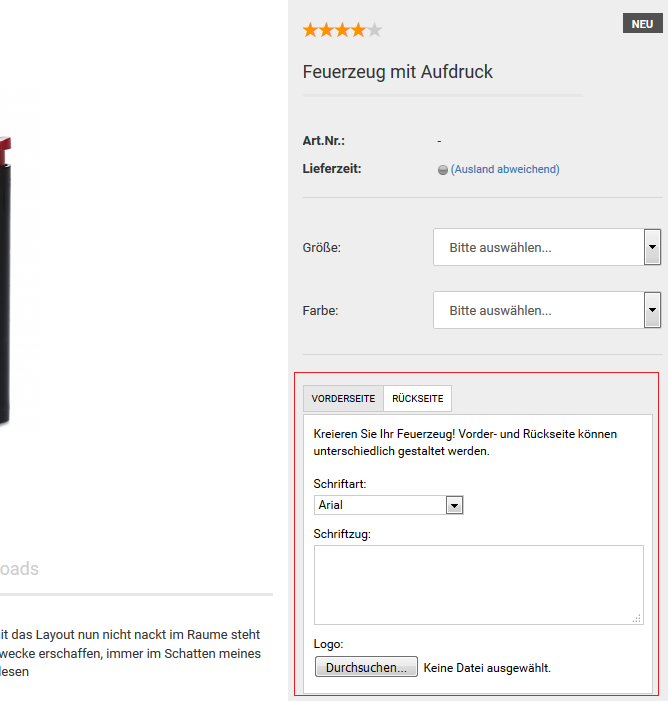

# GX-Customizer {#gx_customizer}

**Note:** Mit dem GX-Customizer bietest du deinen Kunden die Möglichkeit Artikel in deinem Shop zu personalisieren. Du kannst dabei aus einer Vielzahl an Formularelementen wählen, wie Eingabefelder, Datei-Uploadfelder und Listenauswahl-Felder.

-   **[Customizer-Set anlegen](8_5_1_Customizer_Set_anlegen.md)**  

-   **[Customizer-Set zuweisen](8_5_2_Customizer_Set_zuweisen.md)**  

-   **[GX-Customizer konfigurieren](8_5_3_GX_Customizer_konfigurieren.md)**  

**Parent topic:**[Artikel & Kategorien](8_Artikel_UND_Kategorien.md)

