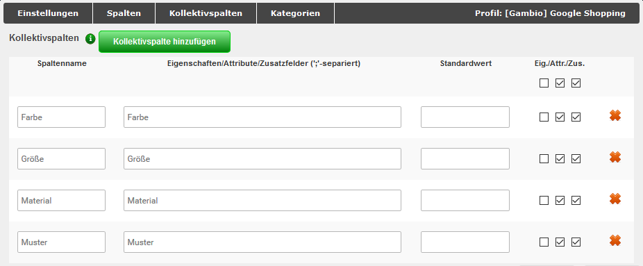

# Profil bearbeiten {#preis_portal_profil_bearbeiten}

Über einen Klick auf Profil bearbeiten können die Einstellungen zu dem jeweiligen Profil aufgerufen werden. Es öffnet sich ein Fenster, das standardmäßig mit dem ausgewählten Reiter Einstellungen angezeigt wird. Weitere Reiter sind Spalten, Kollektivspalten und Kategorien. Zudem wird in der oberen Leiste der Name des ausgewählten Profils angegeben.

**Note:** Je nach Profil können die änderbaren Einstellungen abweichen. Wenn ein Teil der Konfiguration nicht geändert werden kann, wird dieser ausgegraut dargestellt. Um alle Einstellungen anpassen zu können, empfehlen wir das gewünschte Profil zu kopieren und die Kopie zu bearbeiten.

## Einstellungen { .section}

Es stehen die folgenden Bereiche zur Verfügung:

|Feldname|Beschreibung|
|--------|------------|
|Profilname|der Name des Profils|
|Dateiname|der Name der Exportdatei|
|Trennzeichen|Spalten-Trennzeichen|
|Texttrenner|Texttrenner-Zeichen|
|Währung|zu exportierende Währung|
|Sprache|die zu verwendende Sprache|
|Anzahl zusätzlicher Bilder|wie viele zusätzliche Bilder sollen \(neben dem ersten bzw. Haupt-Artikelbild\) exportiert werden?|
|Kundengruppe|die Kundengruppe, dessen Preise verwendet werden sollen. Wähle Gast aus, wenn du für die gewünschte Kundengruppe nicht in allen Artikeln Kundengruppenpreise hinterlegt hast!|
|Kampagne|angelegte Kampagne, die verwendet werden soll|
|Versandkostenfrei ab|ab welchem Warenwert sollen deine Artikel versandkostenfrei versendet werden?|
|Mindestbestand|Gib hier ein, wie oft ein Artikel auf Lager sein muss, damit er beim Export berücksichtigt wird|
|Attribute|Attribute berücksichtigen \(werden als eigenständige Artikel exportiert\)|
|Eigenschaften|Eigenschaften berücksichtigen \(werden als eigenständige Artikel exportiert\)|
|Eigenschaftsbild anstelle des Artikelbildes verwenden:|Das Bild der jeweiligen Eigenschaften-Kombination wird anstelle des Haupt-Artikelbilds exportiert|
|Export-URL|Aus diesem Feld kann der Link zur Export-Datei herauskopiert werden|

**Note:** Das Feld Versandkostenfrei ab ist standardmäßig mit 0 vorbelegt. Wird hier keine Änderung vorgenommen, werden eingetragene **Versandkosten** im Artikel **nicht berücksichtigt**.

Darunter befindet sich die Checkbox Automatischer Export. Ist der Haken gesetzt, erscheinen die Optionen zum Einrichten des automatischen Exports über einen sogenannten Cronjob. Es können wahlweise die verschiedenen Wochentage an- bzw. abgewählt werden, für die eine Startzeit \(jeweils zur vollen Stunde\) aus dem Dropdown-Menü ausgewählt werden kann oder es kann ein Intervall von einer bis 12 Stunden gewählt werden. Ein so eingestellter automatischer Export wird durch ein Uhr-Symbol in der Spalte Cronjob angezeigt.

## Spalten { .section}

Die Anzeige für den Reiter Spalten ist in zwei Teile gegliedert. Der obere Bereich stellt die Spalten der Export-Datei in der Art eines Bücherregals dar, über die Scrollleiste können die "Bücher" hin und her geschoben werden. Mit einem Klick auf den "Buchrücken" kann die Spalte bearbeitet werden. Der obere Teil des "Buchrückens" ist mit einem Pfeilkreuz und einem x versehen. Über das Pfeilkreuz kann die Spalte mit Klicken und Halten der linken Maustaste verschoben werden. Mit einem Klick auf das x kann die Spalte gelöscht werden, dies muss über eine Abfrage bestätigt werden. Über Spalte hinzufügen wird eine neue Spalte am Ende der Tabelle angefügt.

Beim Bearbeiten und Anlegen von Spalten sind folgende Eingaben möglich:

-   Spaltenname
-   Spalteninhalt
-   Standardwert

Der Spalteninhalt entspricht einer Variable \(Platzhalter für Dateneintrag\) im Shop. Diese kann über das Dropdown-Menü Verfügbare Variablen festgelegt werden. Hier werden alle Möglichkeiten mit ihrer Beschreibung aufgelistet. Nach Auswahl des Eintrags kann der zugehörige Variablenname mit Klick auf Hinzufügen eingetragen werden. Bestätige die Änderung mit Klick auf OK, über Abbrechen werden die Änderungen verworfen.

**Note:** Im Bereich Preis-Portal sind andere Variablen auswählbar als beim regulären Export. Bei Bedarf kann jedoch eine Variable von dort kopiert und als Spalteninhalt für ein Export- Profil aus dem Preis-Portal eingefügt werden, um auch diese Inhalte zu exportieren.

Das untere Drittel dieses Fensters dient zur Vorschau der Export-Datei.

**Note:** Diese Ansicht wird standardmäßig leer angezeigt. Es müssen zunächst die Kategorien im Reiter Kategorien ausgewählt werden, bevor hier eine Vorschau erfolgt.

## Kollektivspalten { .section}

Kollektivspalten dienen der Selektierung von Werten aus verschiedenen Quellen in einer Spalte. Dabei können mehrere Eigenschafts-, Attributs- und/oder Zusatzfeldnamen angegeben werden, aus denen der entsprechende Wert ausgewählt wird.

-   Spaltenname: Der Spaltenname entspricht der Überschrift in der exportierten CSV-Datei.
-   Eigenschaften/Attribute/Zusatzfelder: Hier kannst du die Namen der Eigenschaften, Attribute und/oder Zusatzfelder, in Form einer ";"-separierten Liste, eintragen, aus denen der Wert gewählt werden soll \(z.B. Farbe;Lackfarbe;Wandfarbe\).
-   Standardwert: Dieser Wert wird als Spaltenwert verwendet, wenn kein passender Wert in den Eigenschaften, Attributen und Zusatzfeldern gefunden wurde.
-   Eig./Attr./Zus.: Mit diesen Checkboxen kannst du wählen, in welchen Quellen die Namen gesucht werden sollen. Wenn du beispielsweise keine Attribute nutzt, empfiehlt es sich, die entsprechende Checkbox zu deaktivieren. Dies dient der Steigerung der Performanz des Exports.

**Note:** Sollte es für die Selektierung des Spalteninhalts mehrere Treffer aus verschiedenen Quellen geben, so greift eine vorgegebene Priorisierung:

-   Eigenschaften \(höchste Priorität\)
-   Attribute
-   Zusatzfelder \(niedrigste Priorität\)

## Kategorien { .section}

Über Auswahl des Reiters Kategorien können die Kategorien für den Export ausgewählt bzw. eingeschränkt werden. Setze hierzu den Haken vor die Kategorien, dessen Artikel du exportieren möchtest. Über einen Klick auf das Ordner-Symbol können die Unterkategorien der jeweiligen Kategorie angezeigt werden.

Durch Setzen des Hakens Alle auswählen / Auswahl aufheben können wahlweise alle Kategorien gewählt bzw. vom Export ausgeschlossen werden.

Wenn du Änderungen in einem Reiter vorgenommen hast und in einen anderen Reiter wechselst, werden diese nicht übernommen. Vor dem Wechsel wirst du in einem Dialog gefragt, ob die gemachten Änderungen verworfen werden sollen. Klicke auf Verwerfen wenn die Änderungen nicht übernommen werden sollen, du wechselst anschließend in den ausgewählten Reiter. Mit einem Klick auf Abbrechen gelangst du wieder in den Reiter zurück.

Für jeden Reiter kannst du die Änderungen mit Klick auf Speichern sichern. Mit Klick auf Schließen wird die Bearbeitung des Profils abgebrochen. Bei ungespeicherten Änderungen findet erneut eine Abfrage zum Verwerfen der Änderungen statt.

**Parent topic:**[Preis-Portal](8_8_1c_Preis_Portal.md)

