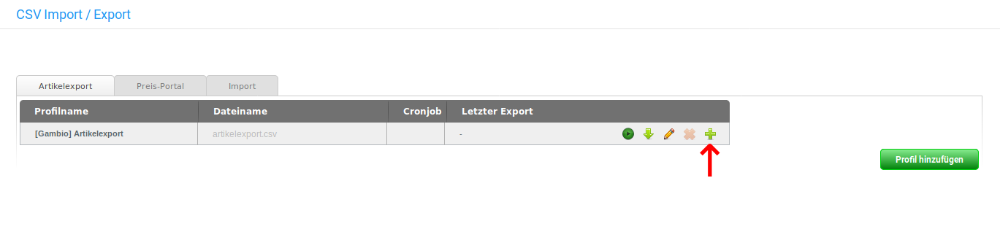
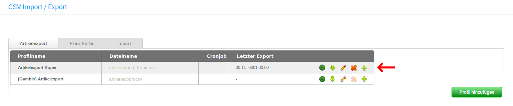
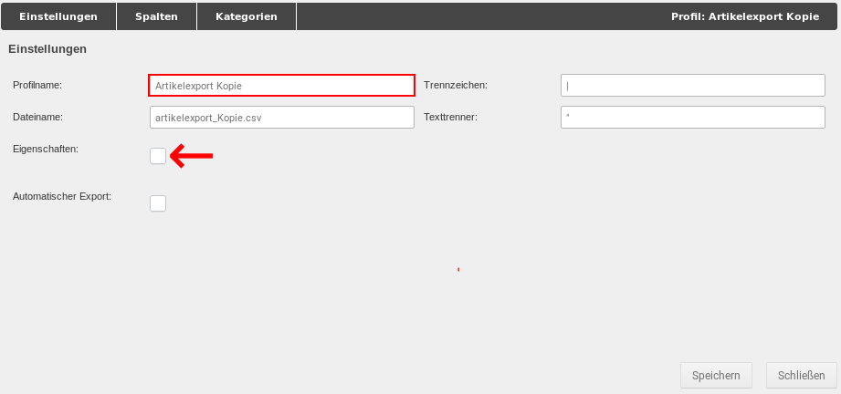
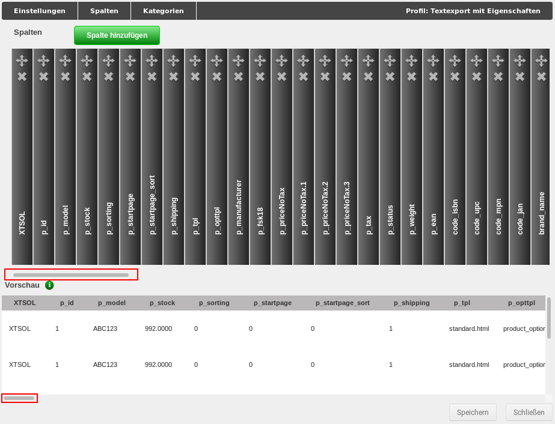
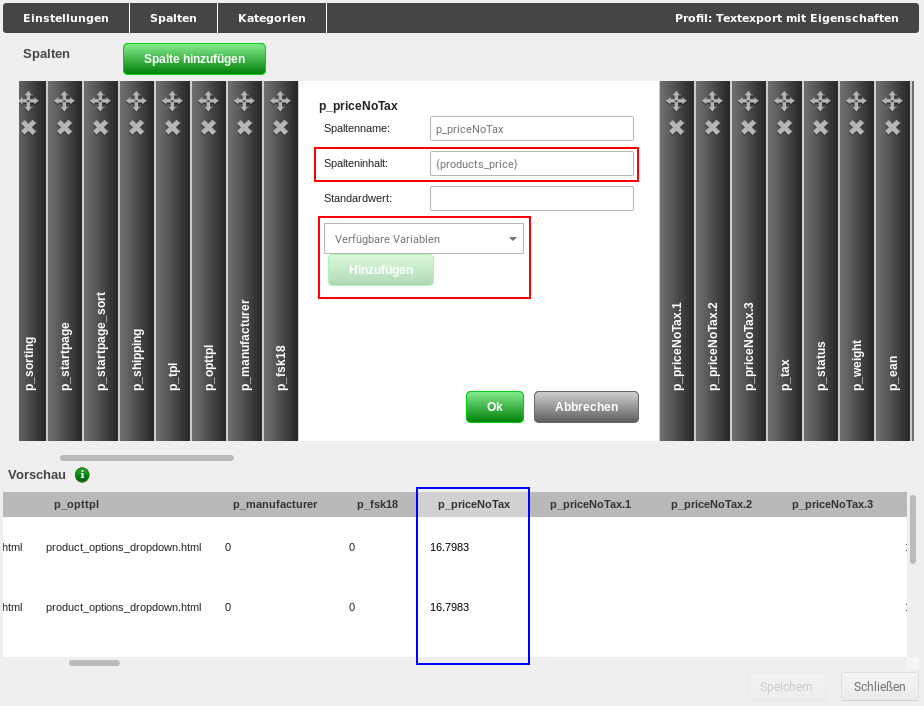
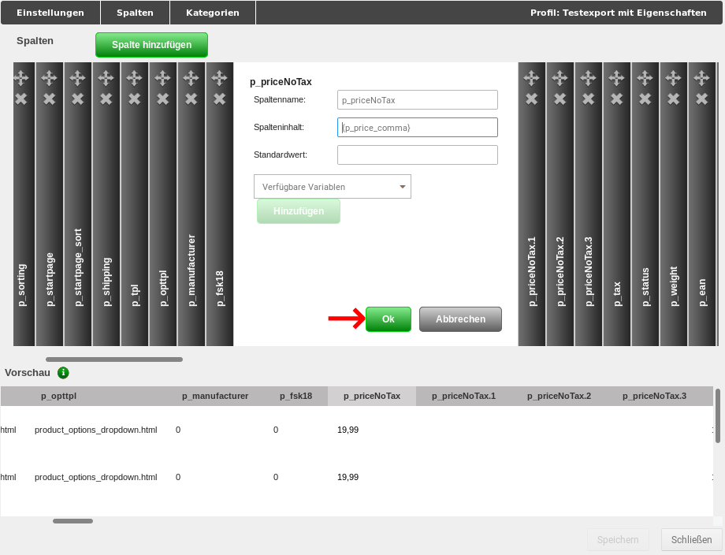
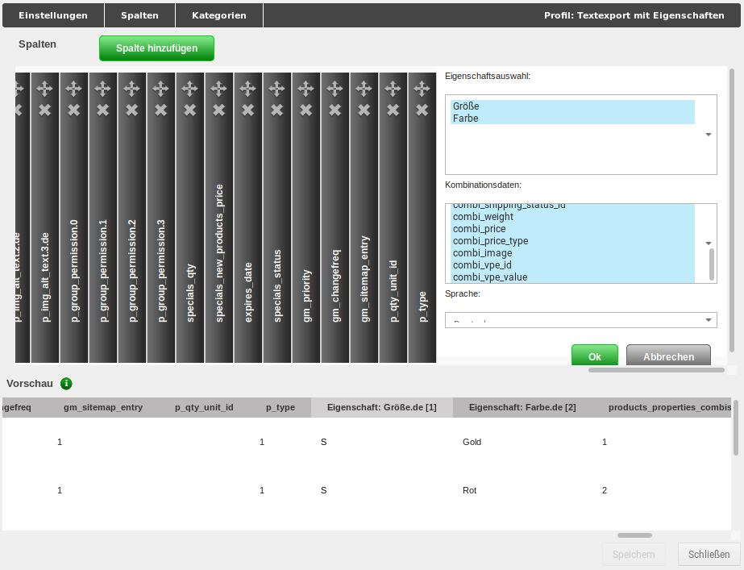
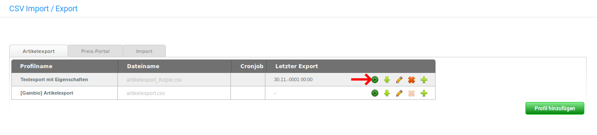

# Vorbereiten und Durchführen eines CSV-Exports {#csv_export_vorbereiten_und_durchfuehren}

In diesem Kapitel betrachten wir Schritt für Schritt wie ein Export vorbereitet und durchgeführt wird. Hierbei verwenden wir das Standard-Profil aus dem Reiter Artikelexport, die Schritte lassen sich jedoch auch ohne Weiteres auf den Bereich Preis-Portal übertragen.

Als Beispiel nehmen wir an, dass wir Artikel aus der Kategorie Testkategorie mit den zugeordneten Eigenschaften-Kombination exportieren und hierbei den exportierten Preis von Netto auf Brutto umstellen sowie dabei das Dezimal-Trennzeichen von Punkt auf Komma ändern möchten.

## Schritt 1 - Profil duplizieren { .section}

Es ist immer eine gute Idee, eine Kopie des Standardprofils zu verwenden, auch wenn zunächst keine Änderungen daran vorgenommen werden sollen. Da wir jedoch bestehende Spalten anpassen wollen, ist es eine Notwendigkeit.

Wir rufen also im Gambio Admin den Menüpunkt Import/Export \> Artikeldaten auf und gelangen direkt in den Abschnitt Artikelexport. Hier finden wir das Standardprofil. Über einen Klick auf das grüne Plus-Zeichen duplizieren wir das Profil.

Es wird mit einem neuen Namen in der Liste angelegt.

## Schritt 2 - Profil bearbeiten { .section}

Über einen Klick auf das Bleistift-Symbol kann das Export-Profil bearbeitet werden. Es öffnet sich die Maske Einstellungen, hier nehmen wir folgende Änderungen vor:

-   Umbenennen des Profilnamens: Artikelexport Kopie ist nicht gerade aussagekräftig. Um in absehbarer Zukunft nicht die Orientierung zu verlieren, tragen wir in das Feld Profilname einen treffenderen Namen ein.
-   Anhaken der Eigenschaften: Da wir mit diesem Profil auch Eigenschaften-Kombinationen exportieren möchten, muss hier der Haken gesetzt werden. Nur so stehen uns am Ende die notwendigen Einstellugen zur Verfügung.

Bevor wir den Reiter wechseln, klicken wir auf Speichern.

## Schritt 3 - Kategorien festlegen { .section}

Über den Reiter Kategorien legen wir fest, aus welchen Kategorien Artikel exportiert werden sollen.

 im Reiter
        Kategorien")

Da wir in unserem Beispiel Artikel aus der Testkategorie exportieren wollen, setzen wir den entsprechenden Haken.

Auch diesen Schritt bestätigen wir mit einem Klick auf Speichern.

## Schritt 4 - Spalte bearbeiten { .section}

Der Bereich Spalten hat eine zweigeteilte Ansicht. Oben sind die einzelnen Spalten mit ihren Namen wie Bücher in einem Regal aufgereiht. Über einen Klick auf den jeweiligen "Buchrücken" kann die zugehörige Spalte bearbeitet werden \(hierzu gleich mehr\).

Der Bereich darunter ist die Vorschau-Ansicht, in dem die ersten Einträge der Tabelle für jede Spalte dargestellt werden.

**Note:**

Wenn hier keine Einträge auftauchen, wurden wahrscheinlich noch keine Kategorien ausgewählt \(siehe Schritt 3\).

Mit den beiden horizontalen Scrollbalken \(siehe rote Markierungen in der Abbildung\) können beide Ansichten hin und her geschoben werden.

**Eine bestehende Spalte bearbeiten**

In Normalfall werden die Dezimalstellen bei Preisen und Gewichten mit einem Punkt getrennt. Wir wollen jedoch unsere Preise mit einem Komma statt einem Punkt als Dezimaltrenner exportieren. Zudem wollen wir keine Netto-Preise \(wie sie standardmäßig in der Datenbank gespeichert werden\) sondern Brutto-Preise exportieren.

**Note:**

Eine Auflistung der Spalten des Standardprofils mit ihrem Verwendungszweck findest du im nachfolgenden Kapitel Import dieses Handbuchs.

Zunächst suchen wir im oberen Bereich der Seite die passende Spalte p\_priceNoTax:

Mit einem Klick auf den passenden "Buchrücken" öffnet sich die zugehörige Eingabemaske:

Entscheidend sind für uns das Feld Spalteninhalt und das Dropdown Verfügbare Variablen. Variablen dienen als Platzhalter für den entsprechenden Inhalt in der Datenbank. Sie werden grundsätzlich mit geschweiften Klammern angegeben, in unserem Fall \{products\_price\}. Im unteren Bereich, der Vorschau-Ansicht, wird die zugehörige Spalte automatisch unter die Eingabemaske gerückt. Wir erkennen, dass es sich um den Netto-Preis mit einem Punkt als Dezimaltrenner handelt.

Um eine Variable zu ändern, müssen wir ihren Namen nicht händisch heraussuchen und eintragen. Stattdessen verwenden wir das Dropdown Verfügbare Variablen:

Hier suchen wir uns den passenden Eintrag heraus und klicken ihn an. Wenn man den Mauszeiger lange genug über den Eintrag hält, wird ein Tooltipp eingeblendet, der diesen genauer beschreibt.

Nachdem der Eintrag ausgewählt worden ist, kann er über die Schaltfläche Hinzufügen in das Feld Spalteninhalt eingetragen werden.

Beim Hinzufügen wird der alte Feldinhalt nicht ersetzt. Da nur der Brutto-Preis verbleiben soll, muss die alte Variable aus dem Feld Spalteninhalt gelöscht werden - dies kann natürlich auch vor dem Hinzufügen der neuen Variable erfolgen.

Nachdem die neue Variable alleine steht, wird der Brutto-Preis wie vorgesehen angezeigt. Die Änderung kann mit Klick auf OK bestätigt werden. Abschließend muss noch einmal auf Speichern geklickt werden.

**Die Eigenschaften-Spalte bearbeiten**

Wurde im Reiter Einstellungen der Haken für Eigenschaften gesetzt, wird eine eigene Spalte für das Bearbeiten der Eigenschaften im Export-Profil angezeigt. Sie befindet sich ganz am rechten Ende des "Bücherregals". Man muss also ganz nach rechts scrollen, damit sie angezeigt wird.

Die Eingabemaske besteht aus zwei sogenannten Multi-Select-Elementen - Eigenschaftenauswahl und Kombinationsdaten - und einem Dropdown für die beim Export zu verwendende Sprache. Es sollten grundsätzlich alle Eigenschaften und alle Kombinationsdaten ausgewählt werden. Klicke hierzu jeweils den ersten Eintrag eines Multi-Select-Elements an und klicke danach mit gedrückter Shift-Taste auf den letzten Eintrag:

Anschließend kann die Auswahl mit Ok bestätigt werden. Speichere alle Änderungen ab, bevor du den Dialog wieder schließt.

## Schritt 5 - Export durchführen { .section}

Der Export kann über einen Klick auf das erste Icon gestartet werden.

Anschließend steht die Exportdatei über den Link in der Spalte Dateiname zum Download zur Verfügung.

**Note:**

Wir empfehlen zum Bearbeiten von CSV-Dateien das Programm LibreOffice Calc. Im nachfolgenden Kapitel findest du einen Abschnitt, der die notwendigen Schritte zum Öffnen und Speichern von CSV-Dateien mit LibreOffice Calc beschreibt.

**Parent topic:**[Export](8_8_1_Export.md)

