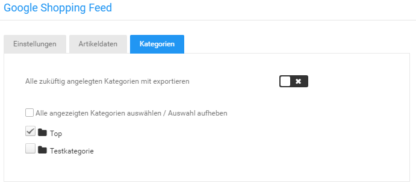

# Kategorien {#google_shopping_kategorien}

Über den Reiter Kategorien können die Kategorien ausgewählt werden, aus denen Artikel exportiert werden.

Setze den Haken für Alle angezeigten Kategorien auswählen / Auswahl aufheben um alle Kategorien gleichzeitig aus- bzw. abzuwählen.

Ist der Haken für Alle zuküftig angelegten Kategorien mit exportieren gesetzt, werden neu angelegte Kategorien automatisch für den Export hinzugefügt.

**Parent topic:**[Google Shopping](8_9_2_GoogleShopping.md)

