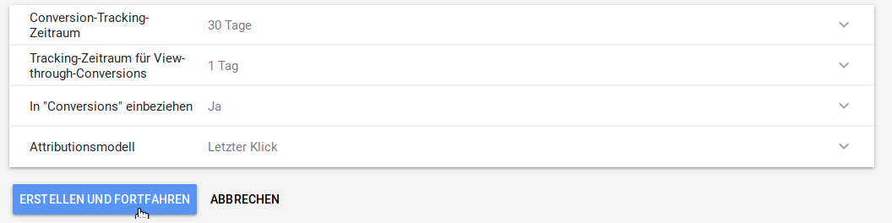

# Google Ads {#google_adwords}

Unter Google \> Google Ads können die Google Ads-Kampagnen ausgewertet werden. Über das Drodpown oben rechts kann der Zeitraum für die Auswertung festgelegt werden. Über einen Klick auf die Spaltenüberschrift kann die Auflistung nach der jeweiligen Spalte sortiert werden.

Es stehen die folgenden Spalten zur Verfügung:

-   Status
-   Kampagne
-   Budget \(pro Tag\)
-   Klicks
-   Impressions - AdWord wurde angezeigt, aber nicht angeklickt
-   CTR - Click Through Rate, Verhältnis von Impressions zu Klicks
-   CPC Ø - Costs per Click, durchschnittliche Kosten pro Klick
-   Kosten

## Conversion Tracking { .section}

Ohne weitere Konfiguration wird hier nur der Hinweis ausgegeben, dass in Google Ads noch eine Conversion-Aktion angelegt werden muss.

Logge dich hierzu unter https://ads.google.com/ in dein Goole Ads-Konto ein und wähle unter Tools den Menüpunkt Messung \> Conversions aus.

Füge über das Plus-Symbol oben links eine neue Aktion hinzu. In der Liste werden bereits in Analytics angelegte Aktionen aufgeführt.

Wähle als Art der Aktion den Eintrag Website aus. Der Name der Aktion kann frei vergeben werden. Bitte wähle Kauf/Verkauf als Kategorie aus.

Wähle unter Wert den Eintrag unterschiedliche Werte aus. Der Standardwert kann unverändert auf 1 gelassen werden, der Shop ersetzt diesen anhand der tatsächlich auftetenden Werte. Setze die Zählmethode auf Alle.

Klicke anschließend auf Erstellen und Fortfahren.

Der Shop übernimmt das Einfügen des Tags in den Websitecode. Klicke hier also auf Tag selbst einfügen.

Bestätige die nun folgende Anzeige mit einem Klick auf Fertig. Die angelegte Aktion wird nun in der Liste aufgeführt.

Unter dem Reiter Conversion Tracking findest du nun weitere Angaben und kannst das Conversion Tracking aktivieren.

**Parent topic:**[Google Services](8_9_GoogleServices.md)

