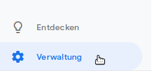
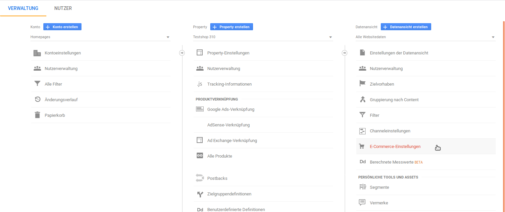

# Google Analytics {#google_analytics}

**Note:** Wurde Google Analytics bisher noch nicht verwendet, erfolgt die Aufforderung seitens Google, das E-Commerce-Tracking zu aktivieren. Diese Einstellung findest du in deinem Google Analytics-Konto unter dem Menüpunkt Verwaltung. Anschließend müssen Nutzerkonto und Property ausgewählt werden, dann kannst du in der dritten Spalte den Punkt E-Commerce-Einstellungen aktivieren und dort E-Commerce aktivieren auswählen.

Rufe zunächst dein Google Analytics-Konto unter https://analytics.google.com/ auf und gehe unten links auf Verwaltung.

Wähle in der dritten Spalte die E-Commerce-Einstellungen aus.

Aktiviere dort das E-Commerce-Tracking sowie die erweiterten Berichte, für letztere muss ein Label-Name vergeben werden. Bestätige die Einstellungen mit einem Klick auf Speichern, damit die Daten getrackt werden können.

Bitte beachte, dass diese Daten erst zeitverzögert bei Analytics zu sehen sind.

-   **[Erfasste Daten und Auswahl der Quelle](8_9_4a_ErfassteDatenUndAuswahlDerQuelle.md)**  

-   **[Konfiguration](8_9_4b_Konfiguration.md)**  

**Parent topic:**[Google Services](8_9_GoogleServices.md)

