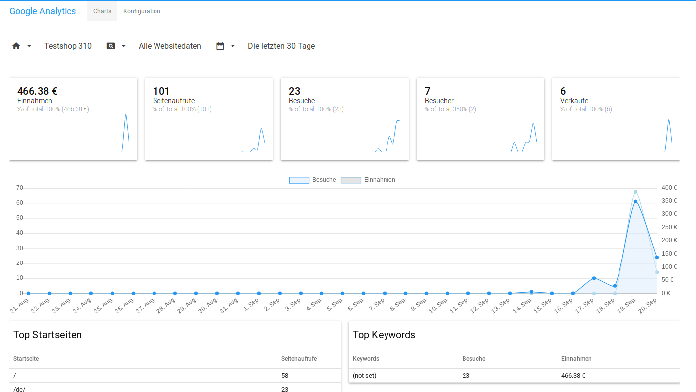

# Erfasste Daten und Auswahl der Quelle {#google_analytics_erfasste_daten_und_auswahl_der_quellen}

Hier werden alle Daten ausgegeben, die von Google Analytics getrackt wurden. In der oberen Menüleiste kann ausgewählt werden, welche Daten angezeigt werden sollen. Es ist die Auswahl nach Property \(Domain\), Art der Daten und Zeitraum möglich.

Die für die Property erfassen Werte werden in den Boxen ausgegeben.

**Parent topic:**[Google Analytics](8_9_4_GoogleAnalytics.md)

