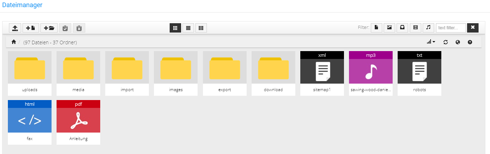
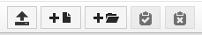

# Funktionsübersicht des Dateimanagers {#dateimanager_funktionsuebersicht_des_dateimanagers}

Das Fenster des Dateimanagers besteht aus einem zentralen Bereich, in dem Dateien und Verzeichnisse angezeigt werden, sowie zwei Leisten über die Einstellungen vorgenommen werden können.

Die Hauptfunktionen befinden sich am linken Ende der oberen Leiste, diese sind von links nach rechts:

-   Hochladen
-   Neue Datei
-   Neues Verzeichnis
-   Aus der Zwischenablange einfügen
-   Zwischenablage leeren

In der Mitte der oberen Leiste sind die Einstellungen für die Ansicht:

-   Box Ansicht
-   Listenansicht
-   Spaltenansicht

Am rechten Ende der oberen Leiste befinden sich die Filtereinstellungen. Wähle einen der Filter-Buttons aus um nur

-   Dateien
-   Bilder
-   Archive
-   Videos
-   Musik

anzeigen zu lassen bzw. verwende das Eingabefeld 'text filter' um nach einem Dateinamen zu filtern.

Über einen Klick auf das x \(Alle\) wird der Filter zurückgesetzt.

In der unteren Leiste befindet sich links die Angabe des aktuellen Pfads, über einen Klick auf eines der angegebenen Verzeichnisse kann dorthin gewechselt werden. Mit einem Klick auf das Haus gelangst du zum Hauptverzeichnis.

Rechts sind die Steuerungen

-   Sortiere
-   Aktualisieren
-   Sprache wechseln
-   über...

**Parent topic:**[Dateimanager](9_10_Dateimanager.md)

