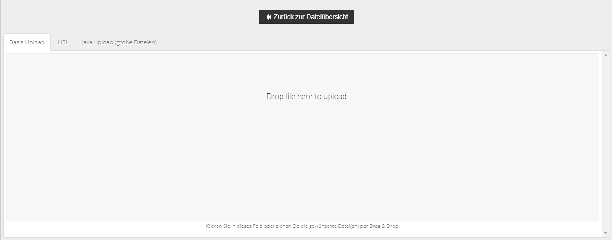
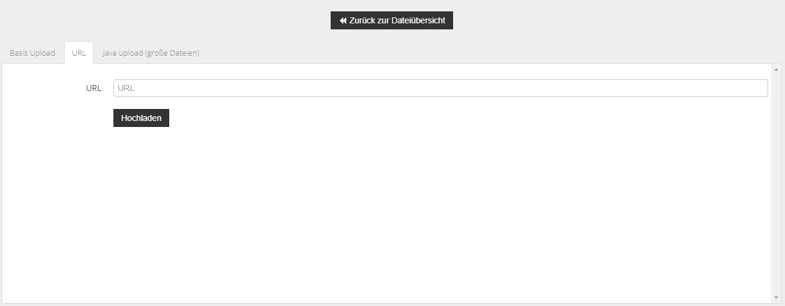
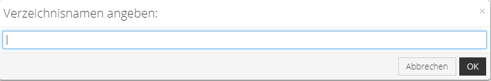
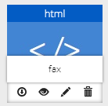
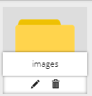

# Verwenden des Dateimanagers {#dateimanager_verwenden_des_dateimanagers}

Der Dateimanager kann wahlweise unter Toolbox \> Dateimanager bzw. in dem jeweiligen Bereich, in dem dieser eingebunden wird, aufgerufen werden. Klicke hierzu auf die Schaltfläche mit dem Datei-Upload-Symbol. Je nach Bereich, aus dem der Dateimanager heraus aufgerufen worden ist, wird das zugeorndete Verzeichnis auf dem FTP-Server angezeigt. Beim Aufruf über Toolbox \> Dateimanager wird das Hauptverzeichnis des Shops angezeigt.

**Note:** Der Dateimanager zeigt nur die Dateien und Verzeichnisse an, die für die Bearbeitung relevant sind. Quelldateien, welche die Funktion des Shops betreffen, sind hierüber nicht verfügbar.

## Hochladen einer Datei { .section}

Klicke auf Hochladen, es öffnet sich der Dialog zum Hochladen einer Datei, standardmäßig ist der Reiter Basis Upload geöffnet. Ziehe die gewünschte\(n\) Datei\(en\) in das hellgraue Feld, um diese hochzuladen.

Alternativ kann auch ein Link zu der gewünschten Datei angegeben werden, klicke hierzu auf den Reiter URL und füge den Link in das Feld URL ein. Klicke abschließend auf Hochladen.

Für große Dateien steht zudem ein alternativer Upload zur Verfügung, dieser setzt eine Java-Installation voraus. Über Zurück zur Dateiübersicht kannst du den Upload-Dialog wieder schließen.

## Anlegen einer textbasierten Datei { .section}

Klicke auf Neue Datei um eine Datei anzulegen. Lege den Namen im Feld Dateiname fest und wähle die gewünschte Endung im Dropdown rechts davon. Im darunterliegenden Textfeld kann der Inhalt festgelegt werden. Über Klick auf OKwird die Datei angelegt, über Abbrechen kannst du den Dialog ohne Anlegen einer Datei schließen.

## Anlegen eines Verzeichnisses { .section}

Über Klick auf Neues Verzeichnis kann ein neuer Ordner im aktuellen Verzeichnis angelegt werden. Gib den Namen des Ordners an und bestätige mit OK. Mit Klick auf Abbrechen verlässt du den Dialog, ohne eine Verzeichnis anzulegen.

## Aktionen bei Dateien { .section}

Um eine Aktion mit einer Datei auszuführen, bewege den Mauszeiger darüber. Der Dateiname bewegt sich nach oben und es werden der Reihe nach folgende Icons angezeigt:

-   Download
-   Vorschau
-   Umbenennen
-   Löschen

Ist ein Icon ausgegraut, kann die jeweilige Aktion nicht ausgeführt werden.

## Aktionen bei Verzeichnissen { .section}

Um eine Aktion mit einem Verzeichnis auszuführen, bewege den Mauszeiger darüber. Der Verzeichnisname bewegt sich nach oben und es werden der Reihe nach folgende Icons angezeigt:

-   Umbenennen
-   Löschen

**Parent topic:**[Dateimanager](9_10_Dateimanager.md)

