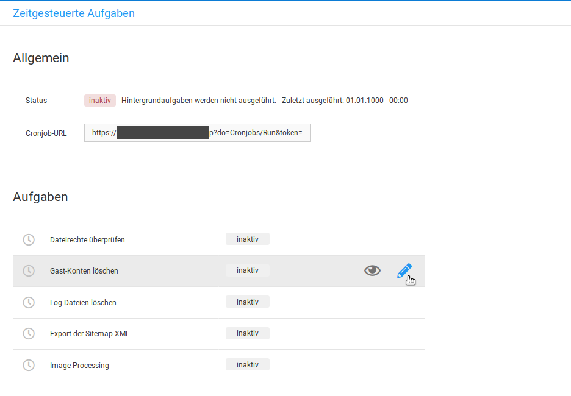
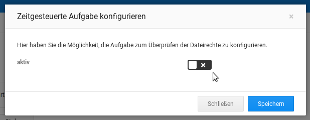

# Zeitgesteuerte Aufgaben {#zeitgesteuerte_aufgaben}

Über zeitgesteuerte Aufgaben lassen sich bestimmte Aktionen automatisch ausführen. Gehe hierzu im Gambio Admin unter Toolbox \> Zeitgesteuerte Aufgaben. Mögliche Aktionen sind:

-   Dateirechte überprüfen
-   Gast-Konten löschen
-   Log-Dateien löschen
-   Export der Sitemap XML
-   Image Processing

Um eine dieser Aktionen automatisch ausführen zu können, muss die gewünschte Aufgabe zuerst über das Stift-Symbol aufgerufen und bearbeitet werden. Es öffnet sich ein weiteres Fenster, in dem die Aufgabe aktiviert und gespeichert werden kann. Setze hierzu den Haken hinter aktiv und bestätige dies mit einem Klick auf Speichern.

Damit die eingestellten Aufgaben ausgeführt werden, muss bei deinem Hoster \(oder wahlweise einem anderen, hierauf spezialisierten Anbieter\) ein sogenannter Cronjob eingerichtet werden. Dieser ruft in einem bestimmten Intervall eine voreingestellte Internetadresse \(URL\) auf.

Kopiere für die Einrichtung den Inhalt des Felds Cronjob-URL und verwende ihn als Aufruf-URL für den Cronjob. Stelle zudem das Intervall auf eine Minute ein. Details und weitere Hilfestellung hierzu erhältst du bei deinem jeweiligen Hosting- oder Cronjob-Anbieter.

**Parent topic:**[Toolbox](9_Toolbox.md)

