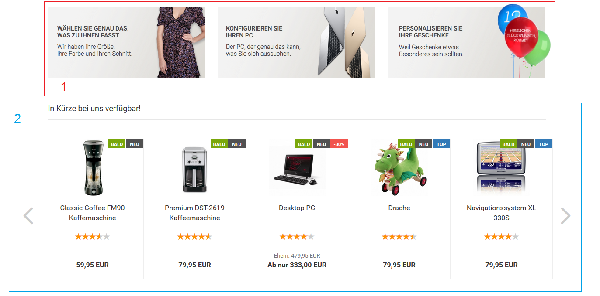

# Allgemein 

1.  Content
2.  Swiper

Die Startseite des Shops kann mit verschiendenen Contents und Artikelzusammenstellungen bestückt werden. Diese werden abwechselnd aufgeführt, wie in der Abbildung anhahnd des Contents Index \(ID 5\) und den Artikelankündigungen zu sehen ist. Letztere können als sogenannter Swiper angezeigt werden, bei dem über die Vor- und Zurück-Pfeile die Artikel durchgeschaltet werden können.

Die Reihenfolge der einzelnen Contens und Artikelzusammenstellzungen auf der Startseite ist wie folgt:

1.  Index \(ID 5\)
2.  Artikelankündigungen
3.  Freier Inhalt 1 \(ID 4321002\): Dieser Content wird nur angezeigt, wenn es Artikelankündigungen auf der Startseite gibt.
4.  Empfehlungen: Artikel, die als Empfehlung gekennzeichnet wurden
5.  Index \(Mitte\) \(ID 10\)
6.  Freier Inhalt 2 \(ID 4321003\): Dieser Content wird nur angezeigt, wenn es Sonderangebote auf der Startseite gibt.
7.  Sonderangebotsartikel
8.  Freier Inhalt 3 \(ID 4321004\): Dieser Content wird nur angezeigt, wenn es Neue Artikel auf der Startseite gibt.
9.  Neue Artikel
10. Index \(Unten\) \(ID 11\)

!!! Info "Hinweis
	 Contents bezeichnen Informationsseiten. Diese können unter Darstellung \> Content Manager bearbeitet oder neu angelegt werden \(siehe auch Kapitel Content Manager\).

