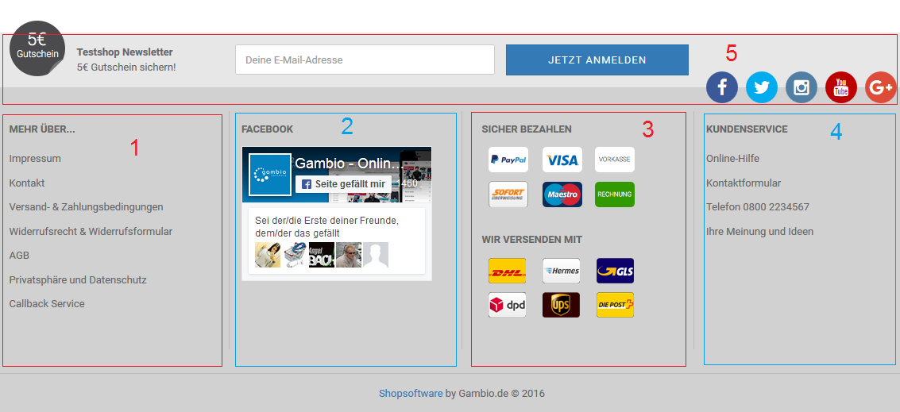

# Footer 

Der Footer ist in vier unabhängige Spalten und einem darüber angeordneten Bereich aufgeteilt:

1.  Spalte 1 Mehr über: Links zu allen Contents die im Content Manager im Bereich Infoseiten angelegt und sichtbar geschaltet sind
2.  Spalte 2: frei einrichtbar über den Content Footer 2. Spalte \(ID 4321005\)
3.  Spalte 3: frei einrichtbar über den Content Footer 3. Spalte \(ID 4321006\)
4.  Spalte 4: frei einrichtbar über den Content Footer 4. Spalte \(ID 4321007\)
5.  oberer Bereich: frei einrichtbar über den Content Footer \(ID 199\)

