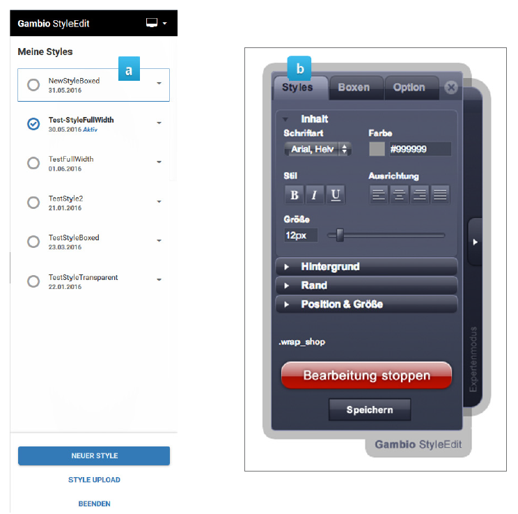

# StyleEdit v3 und StyleEdit 

Das Shopsystem verfügt in den Varianten GX2 \(ab 2.7.1.0\) und GX3 \(bis 3.3.3.0\) über zwei verschiedene Templates, das responsive Honeygrid und dessen Vorgänger EyeCandy. Für jedes Template wird ein eigenes Bearbeitungswerkzeug mitgeliefert, welches optional installiert werden kann, das sogenannte StyleEdit:

1.  StyleEdit v3
2.  StyleEdit \(v2\)

!!! Info "Hinweis
	 In aktuellen Shopversionen ist nur noch das Honeygrid-Template und das StyleEdit3 enthalten. Nähere Informationen zur Funktionsweise und Handhabung des StyleEdit3 findest du in Kapitel Honeygrid und StyleEdit v3.

