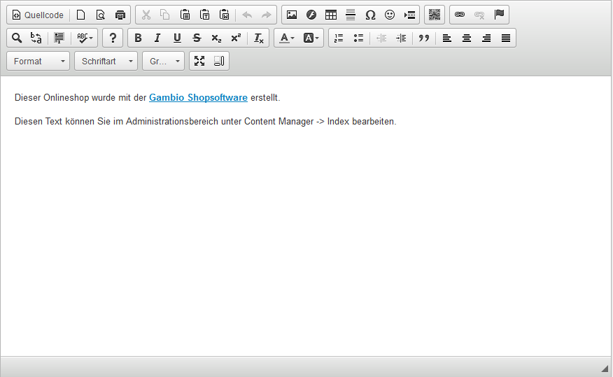

# CK-Editor 

Der CK-Editor ist ein sogenannter WYSIWYG \(What You See Is What You Get\)-Editor. Er bietet also eine Vorschaufunktion, die den Inhalt weitestmöglich so anzeigt, wir er auch im Shop selbst dargestellt wird. Er wird hauptsächlich für Artikel- und Kategoriebeschreibungen sowie Contents \(Informationsseiten\) verwendet.

Auf diese Weise ist es nicht notwendig den HTML-Code direkt einzugeben, der für die Strukturierung des Inhalts notwendig ist.

**Note:** Der CK-Editor ist eine Komponente eines externen Anbieters und wird daher nur in einfachen Grundzügen beschrieben. Eine ausführliche Dokumentation erhältst du unter http://ckeditor.com/

-   **[Funktionsübersicht](3_4_1_Funktionsuebersicht.md)**  

-   **[Bilder einbinden](3_4_2_Bilder_einbinden.md)**  

-   **[Link einfügen/editieren](3_4_3_Link_einfuegen_editieren.md)**  

