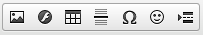
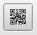
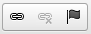
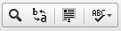
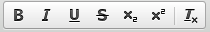
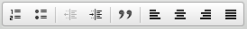

# Funktionsübersicht {#funktionuebersicht}

Die meisten Funktionen ähneln denen von herkömmlichen Textverarbeitungen, es gibt aber auch speziellere Leistungsmerkmale. Die einzelnen Buttons bedeuten der Reihe nach von links nach rechts sowie von oben nach unten:

-   Quellcode: schaltet zur Quellcode-Ansicht, um den HTML-Code anzuzeigen.
-   Neue Seite: löscht den Inhalt des Editor-Fensters
-   Vorschau: stellt den Inhalt in einem separaten Vorschau-Fenster dar
-   Drucken

-   Ausschneiden
-   Kopieren
-   Einfügen
-   Als Text einfügen: entfernt z.B. Links und Formatierungen
-   Aus MS-Word einfügen: entfernt Word-typischen Code, der Probleme verursachen kann
-   Rückgängig
-   Wiederherstellen

-   Bild: Einbinden eines Bildes, siehe Kapitel Bilder einbinden
-   Flash: Flash-Skript einbinden
-   Tabelle: Tabelle einbinden
-   Horizontale Linie einfügen: Trennlinie
-   Sonderzeichen einfügen/editieren
-   Smiley
-   Seitenumbruch einfügen

-   ZS Google QR-Code picture einfügen

-   Link einfügen/editieren: siehe Kapitel Link einfügen/editieren
-   Link entfernen
-   Anker einfügen/editieren

-   Suchen
-   Ersetzen
-   Alles auswählen
-   Rechtschreibprüfung während der Texteingabe

-   Über CKEditor

-   Fett
-   Kursiv
-   Unterstrichen
-   Durchgestrichen
-   Tiefgestellt
-   Hochgestellt
-   Formatierung entfernen

-   Textfarbe
-   Hintergrundfarbe

-   Nummerierte Liste
-   Liste
-   Einzug verringern
-   Einzug erhöhen
-   Zitatblock
-   Linksbündig
-   Zentriert
-   Rechtsbündig
-   Blocksatz

-   Format: Formatvorlage, z.B. Überschriften
-   Schriftart
-   Größe

-   Maximieren: Editorfenster maximieren
-   Blöcke anzeigen

