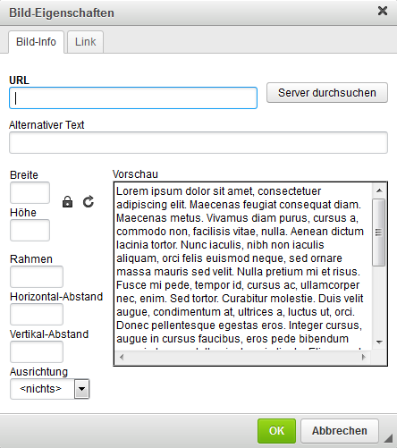
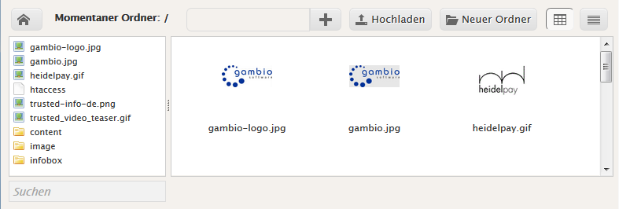
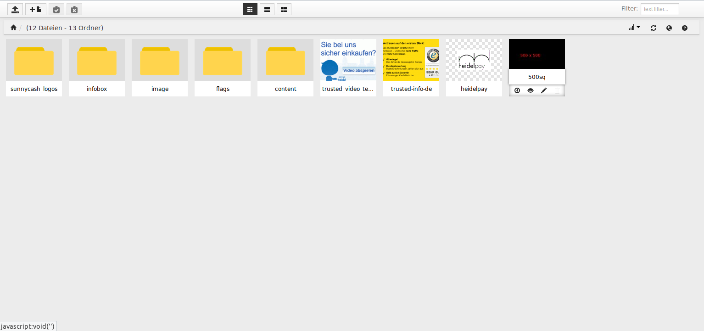
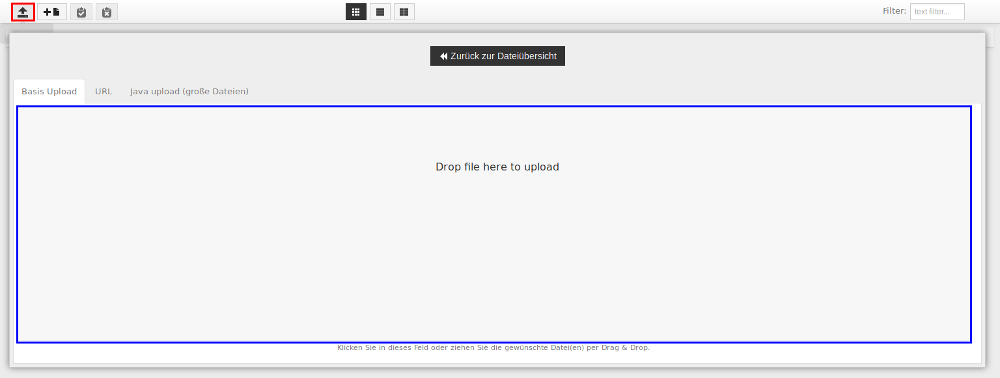
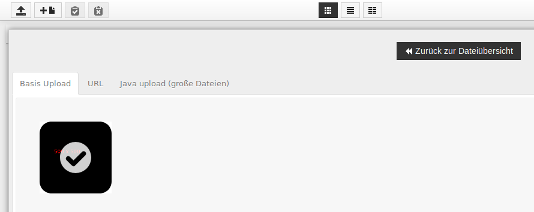

# Bilder einbinden 

Verwende die Schaltfläche mit den Pyramiden \(Bild\), um ein Bild einzubinden. Es öffnet sich das Fenster Bild-Eigenschaften. Klicke hier auf Server durchsuchen, du erhältst eine Übersicht des Bild-Verzeichnisses auf deinem Server. Je nach Einstellung im Gambio Admin wird entweder der FileManager oder der Responsive FileManager geladen.

## Auswahl des Bildes mit dem FileManager { .section}

Klicke in der oberen Leiste auf das Pluszeichen, um das Bild auf deinem Rechner auszuwählen. Der Dateiname wird nun neben der Schaltfläche angezeigt. Klicke nun rechts daneben auf Hochladen, um das ausgewählte Bild auf den Server hochzuladen.

Die Datei wird nun in der Liste aufgeführt und kann per Klick ausgewählt werden, klicke hierzu auf Auswählen, es wird nun im Fenster Bild-Eigenschaften in der Vorschau dargestellt. Bestätige die Bildauswahl mit Klick auf OK, nun ist die Grafik im CK-Editor eingebunden.

## Auswahl des Bildes mit dem Responsive FileManager { .section}

Befindet sich das Bild bereits auf dem Server, kann es direkt ausgewählt werden:

Um das Bild hochzuladen, klicke bitte auf die in der Abbildung rot umrandete Schaltfläche. Es öffnet sich der Dialog Basis Upload. Klicke nun in den in der Abbildung blau umrandeten Bereich, um den Dialog zur Auswahl der Datei auf deinem Rechner aufzurufen oder ziehe diese z.B. direkt aus dem Dateiordner deines Rechners in den betreffenden Bereich.

Ist die Bild-Datei hochgeladen, wird über der Vorschau ein Häkchen angezeigt.

Die Datei kann nun über einen Mausklick ausgewählt werden.

Soll das Bild mit einem Link versehen werden, so kann dieser direkt über die Bildeigenschaften platziert werden.

Hinterlege hierzu die Linkadresse im Feld URL. Über das Dropdown-Menü Zielseite kannst du z.B. festlegen, ob der Link in einem neuen Fenster bzw. neuem Tab geöffnet werden soll. MIt der Schaltfläche Server durchsuchen kann eine passende Datei ausgewählt werden, wenn sie im Unterordner images deines Shops liegt.

## Bilder responsiv machen { .section}

Das Honeygrid-Template ist dazu ausgelegt, sich an die Auflösung des jeweilgen Ausgabegeräts \(Desktop-Computer, Tablet, Smartphone\) anzupassen. Bilder werden jedoch standardmäßig mit einer festen Größe hinterlegt. Damit diese sich ebenfalls anpassen, müssen verschiedene Änderungen im Reiter Erweitert der Bildeigenschaften vorgenommen werden:

Das Feld Stil \(rot markiert\) enthält im Regelfall feste Größenangaben. Lösche den Inhalt des Felds komplett, um diese zu entfernen. Unter Formatvorlagenklassen \(blau markiert\) muss folgender Text platziert werden, damit das Bild als responsiv gekennzeichnet wird:

img-responsive

Bestätige die Änderung mit Klick auf OK und speichere den jeweiligen Bereich \(Artikel, Kategorie, Content\) ab, um diese im Shop zu verwenden.

**Note:**

**Bilder nebeneinander anzeigen**

Bilder, die die Formatvorlage img-responsive verwenden, werden im Shop in der Regel untereinander angeordnet. Damit responsive Bilder nebeneinander dargestellt werden, kann man auf das Grid-Layout von Bootstrap zurückgreifen, welches im Honeygrid-Template verwendet wird. Hierzu gibt es Beispiele auf den Seiten

https://getbootstrap.com/examples/grid/ \(english\) bzw. http://holdirbootstrap.de/examples/grid/ \(deutsch\)

Um einen solchen Beispielcode zu verwenden, rufe zu der betreffenden Seite den Quellcode auf \(üblicherweise kann dies über ein Menü des Browsers, das Öffnen des Kontext-Menüs über einen Rechtsklick auf die Seite oder eine Tastenkombination wie z.B. STRG + U erfolgen\) und kopiere den gewünschten Code.

Klicke auf die Schaltfläche Quellcode des CK-Editors, um den Code einzufügen. Klicke erneut auf Quellcode, um die Ansicht umzuschalten. Markiere nun den angezeigten Beispieltext und klicke anschließend auf die Schaltfläche Bild, um das Bild and der betreffenden Position des Rasters einzurichten.

