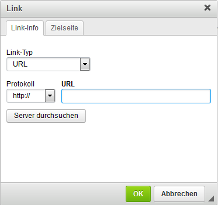

# Link einfügen/editieren 

Über die Schaltfläche Link einfügen/editieren kann ein Link gesetzt werden. Schreibe hierzu zunächst den Text, welchen du als Link verwenden möchtest. Markiere den Text anschließend und klicke auf den Button mit den Kettengliedern \(Link einfügen/editieren\). Als Link-Typ ist standardmäßig URL und als Protokoll http:// ausgewählt. Diese Einstellungen können im Normalfall beibehalten werden; wenn dein Shop jedoch vollständig SSL-verschlüsselt ist, sollte als Protokoll stattdessen https:// eingestellt werden.

Kopiere die Adresse, auf die du verlinken möchtest, in das Feld URL. Über den Reiter Zielseite kann optional ausgewählt werden, ob der Link z.B. in einem neuen Fenster geöffnet werden soll. Mit einem Klick auf OK wird der Link angelegt bzw. aktualisiert.

**Note:** Wenn du Dateien \(z.B. PDF-Dokumente\) verlinken möchtest, lade bitte die Datei über Server durchsuchen hoch, bzw. wähle sie aus. Gehe hierbei genau so vor, wie für das Hochladen eines Bildes \(siehe Kapitel Bilder einbinden\). In der Box Link wird nun der Pfad zur Datei angegeben. Wähle für Protkoll den Eintrag <andere\> aus, bevor du auf OK klickst.

Es ist auch möglich Bilder mit einem Link zu versehen. Klicke hierzu mit der linken Maustaste auf das Bild und danach auf den Button mit den Kettengliedern \(Link einfügen/editieren\). Alternativ kannst du auch über einen Rechtsklick auf das Bild die Bildeigenschaften aufrufen und die zugehörige URL direkt im Reiter Link hinterlegen.

