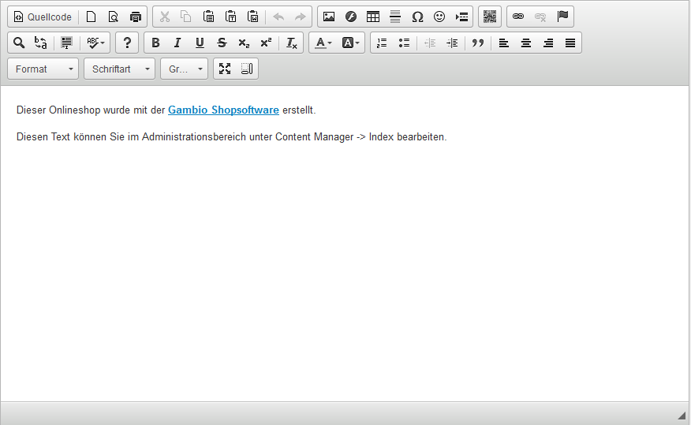
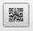
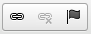
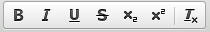
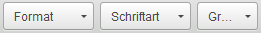
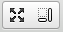
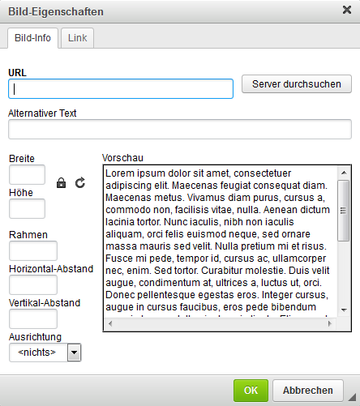
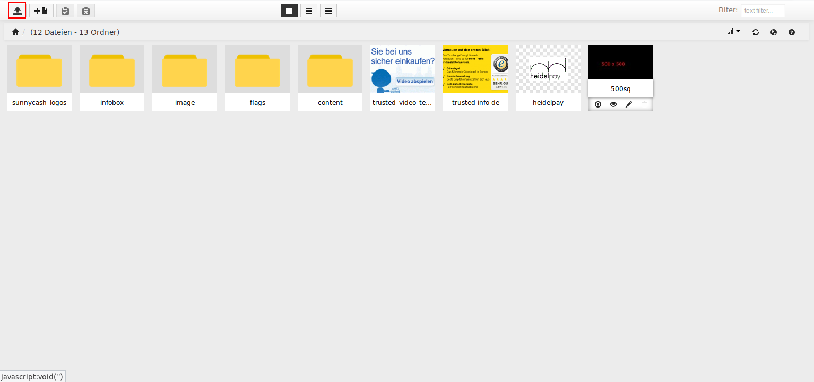
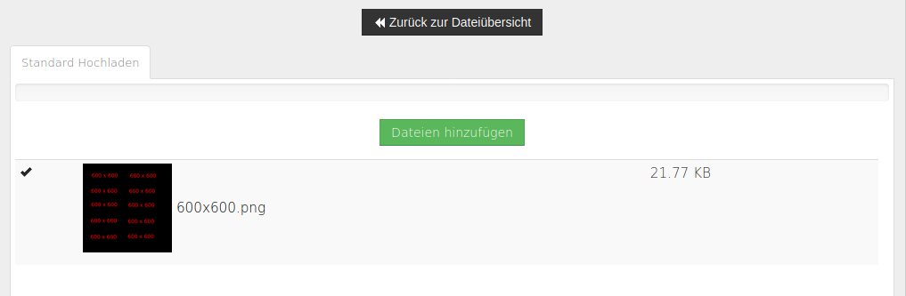
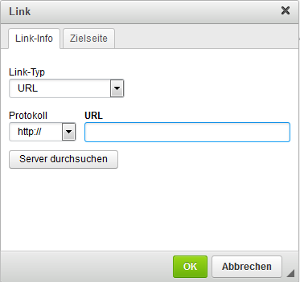

# CK-Editor

Der _**CK-Editor**_ ist ein sogenannter WYSIWYG \(What You See Is What You Get\)-Editor. Er bietet also eine Vorschaufunktion, die den Inhalt weitestmöglich so anzeigt, wir er auch im Shop selbst dargestellt wird. Er wird hauptsächlich für Artikel- und Kategoriebeschreibungen sowie Contents \(Informationsseiten\) verwendet.

Auf diese Weise ist es nicht notwendig den HTML-Code direkt einzugeben, der für die Strukturierung des Inhalts notwendig ist.

!!! note "Hinweis" 
	 Der _**CK-Editor**_ ist eine Komponente eines externen Anbieters und wird daher nur in einfachen Grundzügen beschrieben. Eine ausführliche Dokumentation erhältst du unter _**http://ckeditor.com/**_

## Funktionsübersicht

Die meisten Funktionen ähneln denen von herkömmlichen Textverarbeitungen, es gibt aber auch speziellere Leistungsmerkmale. Die einzelnen Buttons bedeuten der Reihe nach von links nach rechts sowie von oben nach unten:

-   Quellcode: schaltet zur Quellcode-Ansicht, um den HTML-Code anzuzeigen.
-   Neue Seite: löscht den Inhalt des Editor-Fensters
-   Vorschau: stellt den Inhalt in einem separaten Vorschau-Fenster dar
-   Drucken

-   Ausschneiden
-   Kopieren
-   Einfügen
-   Als Text einfügen: entfernt z.B. Links und Formatierungen
-   Aus MS-Word einfügen: entfernt Word-typischen Code, der Probleme verursachen kann
-   Rückgängig
-   Wiederherstellen

-   Bild: Einbinden eines Bildes, siehe Kapitel _**Bilder einbinden**_
-   Flash: Flash-Skript einbinden
-   Tabelle: Tabelle einbinden
-   Horizontale Linie einfügen: Trennlinie
-   Sonderzeichen einfügen/editieren
-   Smiley
-   Seitenumbruch einfügen

-   ZS Google QR-Code picture einfügen

-   Link einfügen/editieren: siehe Kapitel _**Link einfügen/editieren**_
-   Link entfernen
-   Anker einfügen/editieren

-   Suchen
-   Ersetzen
-   Alles auswählen
-   Rechtschreibprüfung während der Texteingabe

-   Über CKEditor

-   Fett
-   Kursiv
-   Unterstrichen
-   Durchgestrichen
-   Tiefgestellt
-   Hochgestellt
-   Formatierung entfernen

-   Textfarbe
-   Hintergrundfarbe

-   Nummerierte Liste
-   Liste
-   Einzug verringern
-   Einzug erhöhen
-   Zitatblock
-   Linksbündig
-   Zentriert
-   Rechtsbündig
-   Blocksatz

-   Format: Formatvorlage, z.B. Überschriften
-   Schriftart
-   Größe

-   Maximieren: Editorfenster maximieren
-   Blöcke anzeigen

## Bilder einbinden

Verwende die Schaltfläche mit den Pyramiden \(_**Bild**_\), um ein Bild einzubinden. Es öffnet sich das Fenster _**Bild-Eigenschaften**_. Klicke hier auf _**Server durchsuchen**_, du erhältst eine Übersicht des Bild-Verzeichnisses auf deinem Server. Je nach Einstellung im Gambio Admin wird entweder der _**FileManager**_ oder der _**Responsive FileManager**_ geladen.

### Auswahl des Bildes mit dem FileManager

Klicke in der oberen Leiste auf das Pluszeichen, um das Bild auf deinem Rechner auszuwählen. Der Dateiname wird nun neben der Schaltfläche angezeigt. Klicke nun rechts daneben auf _**Hochladen**_, um das ausgewählte Bild auf den Server hochzuladen.

Die Datei wird nun in der Liste aufgeführt und kann per Klick ausgewählt werden, klicke hierzu auf _**Auswählen**_, es wird nun im Fenster _**Bild-Eigenschaften**_ in der Vorschau dargestellt. Bestätige die Bildauswahl mit Klick auf _**OK**_, nun ist die Grafik im CK-Editor eingebunden.

### Auswahl des Bildes mit dem Responsive FileManager

Befindet sich das Bild bereits auf dem Server, kann es direkt ausgewählt werden:

Um das Bild hochzuladen, klicke bitte auf die in der Abbildung rot umrandete Schaltfläche.

Es öffnet sich der Dialog _**Standard Hochladen**_. Klicke nun auf die, in der Abbildung gezeigte, grüne Schaltfläche _**Dateien hinzufügen**_, um den Dialog zur Auswahl der Datei auf deinem Rechner aufzurufen oder ziehe diese z.B. direkt aus dem Dateiordner deines Rechners in den weißen Bereich.

Ist die Bild-Datei hochgeladen, wird neben der Vorschau ein Häkchen angezeigt.

Die Datei kann nun über einen Mausklick ausgewählt werden.

Soll das Bild mit einem Link versehen werden, so kann dieser direkt über die Bildeigenschaften platziert werden.

Hinterlege hierzu die Linkadresse im Feld _**URL**_. Über das Dropdown-Menü _**Zielseite**_ kannst du z.B. festlegen, ob der Link in einem neuen Fenster bzw. neuem Tab geöffnet werden soll. MIt der Schaltfläche _**Server durchsuchen**_ kann eine passende Datei ausgewählt werden, wenn sie im Unterordner _**images**_ deines Shops liegt.

### Bilder responsiv machen 

Das Honeygrid-Template ist dazu ausgelegt, sich an die Auflösung des jeweilgen Ausgabegeräts \(Desktop-Computer, Tablet, Smartphone\) anzupassen. Bilder werden jedoch standardmäßig mit einer festen Größe hinterlegt. Damit diese sich ebenfalls anpassen, müssen verschiedene Änderungen im Reiter _**Erweitert**_ der _**Bildeigenschaften**_ vorgenommen werden:

Das Feld _**Stil**_ \(rot markiert\) enthält im Regelfall feste Größenangaben. Lösche den Inhalt des Felds komplett, um diese zu entfernen. Unter _**Formatvorlagenklassen**_ \(blau markiert\) muss folgender Text platziert werden, damit das Bild als responsiv gekennzeichnet wird:

img-responsive

Bestätige die Änderung mit Klick auf _**OK**_ und speichere den jeweiligen Bereich \(Artikel, Kategorie, Content\) ab, um diese im Shop zu verwenden.

!!! note "Hinweis"

	 **Bilder nebeneinander anzeigen**

	 Bilder, die die Formatvorlage _**img-responsive**_ verwenden, werden im Shop in der Regel untereinander angeordnet. Damit responsive Bilder nebeneinander dargestellt werden, kann man auf das Grid-Layout von _**Bootstrap**_ zurückgreifen, welches im Honeygrid-Template verwendet wird. Hierzu gibt es Beispiele auf den Seiten

	 https://getbootstrap.com/examples/grid/ \(english\) bzw. http://holdirbootstrap.de/examples/grid/ \(deutsch\)

	 Um einen solchen Beispielcode zu verwenden, rufe zu der betreffenden Seite den Quellcode auf \(üblicherweise kann dies über ein Menü des Browsers, das Öffnen des Kontext-Menüs über einen Rechtsklick auf die Seite oder eine Tastenkombination wie z.B. _**STRG + U**_ erfolgen\) und kopiere den gewünschten Code.

	 Klicke auf die Schaltfläche _**Quellcode**_ des CK-Editors, um den Code einzufügen. Klicke erneut auf _**Quellcode**_, um die Ansicht umzuschalten. Markiere nun den angezeigten Beispieltext und klicke anschließend auf die Schaltfläche _**Bild**_, um das Bild and der betreffenden Position des Rasters einzurichten.

## Link einfügen/editieren

Über die Schaltfläche _**Link einfügen/editieren**_ kann ein Link gesetzt werden. Schreibe hierzu zunächst den Text, welchen du als Link verwenden möchtest. Markiere den Text anschließend und klicke auf den Button mit den Kettengliedern \(_**Link einfügen/editieren**_\). Als _**Link-Typ**_ ist standardmäßig _**URL**_ und als _**Protokoll**_ _**http://**_ ausgewählt. Diese Einstellungen können im Normalfall beibehalten werden; wenn dein Shop jedoch vollständig SSL-verschlüsselt ist, sollte als Protokoll stattdessen _**https://**_ eingestellt werden.

Kopiere die Adresse, auf die du verlinken möchtest, in das Feld _**URL**_. Über den Reiter _**Zielseite**_ kann optional ausgewählt werden, ob der Link z.B. in einem neuen Fenster geöffnet werden soll. Mit einem Klick auf _**OK**_ wird der Link angelegt bzw. aktualisiert.

!!! note "Hinweis" 
	 Wenn du Dateien \(z.B. PDF-Dokumente\) verlinken möchtest, lade bitte die Datei über _**Server durchsuchen**_ hoch, bzw. wähle sie aus. Gehe hierbei genau so vor, wie für das Hochladen eines Bildes \(siehe Kapitel _**Bilder einbinden**_\). In der Box _**Link**_ wird nun der Pfad zur Datei angegeben. Wähle für _**Protkoll**_ den Eintrag _**<andere\>**_ aus, bevor du auf _**OK**_ klickst.

Es ist auch möglich Bilder mit einem Link zu versehen. Klicke hierzu mit der linken Maustaste auf das Bild und danach auf den Button mit den Kettengliedern \(_**Link einfügen/editieren**_\). Alternativ kannst du auch über einen Rechtsklick auf das Bild die _**Bildeigenschaften**_ aufrufen und die zugehörige URL direkt im Reiter _**Link**_ hinterlegen.

