# Einstellungen 

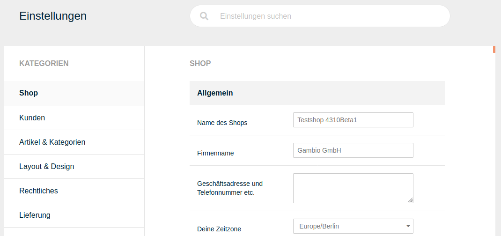

Ab Version 4.3 steht im Shop ein überarbeiteter Bereich mit den Grundeinstellungen zur Verfügung. Dieser ist in die Kategorien

-   Shop
-   Kunden
-   Artikel & Kategorien
-   Layout & Design
-   Rechtliches
-   Lieferung
-   Suchmaschinenoptimierung
-   Sprachen, Länder, Steuern
-   System

aufgeteilt. Zudem steht am oberen Ende der Seite eine Suchleiste zur Verfügung, mit der nach Einträgen gefiltert werden kann. Die Ansicht wird hierbei sofort bei der Eingabe angepasst und Übereinstimmungen hervorgehoben.

Am unteren Ende der Seite befindet sich der Speichern-Button. Dieser ist ausgegraut, solange keine Änderungen vorgenommen worden sind. Der Speichern-Button übernimmt geänderte Einstellungen aus allen Bereichen und Kategorien.

  

  

  

  

  

  

  

  

  

## E-Mail-Optionen 

An der Grundkonfiguration der E-Mail-Optionen muss bei Verwenden der E-Mail Transport- Methode mail keine Änderung vorgenommen werden.

#### Sendmail 

Die E-Mail Transport-Methode sendmail sollte nicht verwendet werden. Wenn du sendmail aus technischen Gründen verwenden musst, stelle sicher, dass der Pfad zu Sendmail korrekt konfiguriert ist. Wenn du sendmail verwendest, stelle außerdem sicher, dass unter Shop Einstellungen \> Mein Shop im Feld E-Mail von eine gültige E-Mail Adresse eingetragen ist.

#### SMTP-Einstellungen 

Wenn du die E-Mail Transport-Methode auf SMTP umstellst, beachte die Konfigurationsvariablen aus der Tabelle SMTP Konfigurationsvariablen.

|Feldname|Beschreibung|
|--------|------------|
|Adresse des SMTP Servers|Die Adresse des Servers für den E-Mail Versand|
|Adresse des SMTP Backup Servers|Falls der Server für den E-Mail Versand nicht erreichbar ist, werden E-Mails über den Backup Server verschickt|
|SMTP Port|Port für den E-Mail Versand \[25\]|
|SMTP Username|Benutzername für den E-Mail Versand|
|SMTP Passwort|Passwort für den E-Mail Versand|
|SMTP AUTH|Aktivieren, wenn der SMTP-Server AUTH voraussetzt \[nein\]|

!!! Info "Hinweis"
	 Wenn der Mailversand trotz korrekt vorgenommener Konfiguration im Shop nicht erfolgt, wende dich an deinen Hosting-Provider.

#### Erweiterte Einstellungen 

CAUTION:

Änderungen an den erweiterten Einstellungen können dazu führen, dass E-Mails fehlerhaft angezeigt oder gar nicht versendet werden.

|Feldname|Beschreibung|
|--------|------------|
|E-Mail Linefeeds|Art der Zeilenumbrüche, die in E-Mails verwendet werden sollen|
|HTML E-Mails senden|Versenden von E-Mails als MIME HTML oder Reintext|
|Überprüfen der E-Mail- Adressen über DNS|E-Mails von Kunden vor dem Senden automatischer Mails auf Erreichbarkeit prüfen|
|Senden von E-Mails|Automatischen Versand von E-Mails aktivieren \(beispielsweise Bestellbestätigungen\)|
|Maximale Anzahl E-Mails pro Versand|Schränkt die Anzahl der E-Mails ein, die gleichzeitig versendet werden können|

#### E-Mail Einstellungen 

Das Shopsystem versendet E-Mails von und an drei verschiedene shopinterne E-Mail Konten. In der Grundkonfiguration wird allen E-Mail Konten die bei Erstellung des Hauptadministrators während der Installationsroutine angegebene E-Mail Adresse hinterlegt.

Alle E-Mails werden im Namen des Shopbetreibers versandt. Den Namen des Shopbetreibers kannst du unter Shop Einstellungen \> Mein Shop im Feld Inhaber festlegen.

|Kontoname|Beschreibung|
|---------|------------|
|Kontakt|Vom E-Mail Konto Kontakt werden E-Mails von Kontaktformularen verschickt \(zum Beispiel Kundenkontakt, Artikel Weitermpfehlen\)|
|Technischer Support|Vom E-Mail Konto Technischer Support werden Kundenkonto bezogene E-Mails versendet \(zum Beispiel Kontoerstellungsmails, Passwortänderungen\)|
|Verrechnung|Vom E-Mail Konto Verrechnung werden E-Mails aus dem Verrechnungssystem verschickt \(zum Beispiel Bestellbestätigungen, Bestellstatus-Änderungen\)|

Jedem E-Mail Konto sind die folgenden Konfigurationsvariablen zugewiesen. Das Feld Weiterleitungsadressen ist im jeweiligen E-Mail Konto optional.

|Feldname|Beschreibung|
|--------|------------|
|E-Mail-Adresse|gib hier die Absenderadresse ein|
|E-Mail-Adresse, Name|gib hier den Absendernamen ein|
|Antwortadresse|gib hier eine gegebenenfalls abweichende Antwortadresse ein|
|Antwortadresse, Name|gib hier den Namen für die abweichende Anwortadresse ein|
|E-Mail Betreff|gib hier den Betreff für E-Mails von diesem Konto ein|
|Weiterleitungsadressen|gib hier kommagetrennt weitere E-Mail Adressen ein, an die ausgehende Nachrichten ebenfalls gesendet werden sollen; darf nicht die Adresse aus dem Feld E-Mail-Adresse enthalten|

!!! Info "Hinweis"
	 Bei manchen Server- und E-Mail-Konfigurationen kann der E-Mail Empfang beim Kunden fehlschlagen. Wenn deine Kunden keine Bestellbestätigungsmails erhalten, stelle sicher, dass die Option Absender der Bestellbestätigungsmail auf Betreiber E‑Mail steht.

## Performance 

Die Gzip-Kompression dient der Verbesserung der Ladezeiten und kann verwendet werden, um die Seitenaufbaugeschwindikeit zu optimieren. Um die GZip-Kompression zu verwenden, aktiviere unter Shop Einstellungen \> System Einstellungen \> Performance die Einstellung GZip Kompression einschalten.

Über das Eingabefeld Kompressions Level kann der Grad der Kompression festgelegt werden. Verwende hierzu einen Wert zwischen 1 \(Minimum\) und 9 \(Maximum\). Bitte beachte, dass ein hoher Kompressionsgrad zwar eine schnellere Seitenaufbaugeschwindigkeit bewirken kann, aber auch eine höhrer Serverauslastung bedeutet. Der Wert unter Kompressions Level sollte daher immer unter Berücksichtigung der Serverlast erfolgen und dementsprechend nicht zu hoch angesetzt werden.

Sollte GZip standardmäßig nicht auf dem Server verfügbar sein, kann die Option ob\_gzhandler bevorzugen gesetzt werden. Hierdurch erfolgt eine softwareseitige Umsetzung. Allerdings kann diese Funktion in einzelnen Fällen zu Problemen führen und ist daher standardmäßig nicht gesetzt.

Zusätzlich können über HTML Kompression einschalten unnötige Leerzeichen aus dem Code der Seiten entfernt werden, dies erschwert jedoch die Fehlerdiagnose.

Über die Einstellung Cache-freundliche Dateinamen können die Namen bestimmter Ressourcen \(JavaScript, CSS\) automatisch angepasst werden, damit diese nicht im Browsercache gespeichert, sondern bei jedem Laden der betreffenden Seite aktuell abgerufen werden.

Wird der Haken CSS inline im Head ausgeben gesetzt, wird der CSS-Code im Head-Bereich der Seite ausgegeben, anstatt die externe CSS-Datei zu verlinken.

## Rechtliches 

#### Link zur Datenschutzerklärung anzeigen 

|Feldname|Beschreibung|
|--------|------------|
|in der Registrierung|Datenschutzlink im Registrierungsformular anzeigen|
|im Callback Service|Datenschutzlink im Callback Service-Formular anzeigen|
|im Kontaktformular|Datenschutzlink im Kontaktformular anzeigen|
|im "Frage zum Produkt"-Modul|Datenschutzlink im Frage zum Produkt-Modul anzeigen|
|im "Woanders günstiger"-Modul|Datenschutzlink im Woanders günstiger-Modul anzeigen|
|im Artikelbewertungsformular|Datenschutzlink im Artikelbewertungsformular anzeigen|
|im Kundenbereich unter "Kontodaten bearbeiten"|Datenschutzlink im Kundenbereich unter Kontodaten bearbeiten anzeigen|
|im Kundenbereich unter "Adressbuch bearbeiten"|Datenschutzlink im Kundenbereich unter Adressbuch bearbeiten anzeigen|
|in der Newsletterregistrierung|Datenschutzlink in der Newsletterregistrierung anzeigen|
|im Bestellvorgang unter "Versandadresse bearbeiten"|Datenschutzlink im Bestellvorgang unter Versandadresse bearbeiten anzeigen|
|im Bestellvorgang unter "Rechnungsadresse bearbeiten"|Datenschutzlink im Bestellvorgang unter Rechnungsadresse bearbeiten anzeigen|
|im Widerrufs-Webformular|Datenschutzlink im Widerrufs-Webformular anzeigen|
|im Guthaben versenden Formular|Datenschutzlink im Guthaben versenden Formular anzeigen|
|IP-Speicherung anzeigen?|Datenschutzlink zusammen mit dem Hinweis zur IP-Speicherung anzeigen|

#### Datenschutzerklärung zustimmen 

|Feldname|Beschreibung|
|--------|------------|
|in der Registrierung|Die Datenschutzerklärung muss in der Registrierung durch den Kunden bestätigt werden.|
|im Callback Service|Die Datenschutzerklärung muss im Callback Service durch den Kunden bestätigt werden.|
|im Kontaktformular|Die Datenschutzerklärung muss im Kontaktformular durch den Kunden bestätigt werden.|
|im "Frage zum Produkt"-Modul|Die Datenschutzerklärung muss im Frage zum Produkt-Modul durch den Kunden bestätigt werden.|
|im "Woanders günstiger"-Modul|Die Datenschutzerklärung muss im Woanders günstiger-Modul durch den Kunden bestätigt werden.|
|im Artikelbewertungsformular|Die Datenschutzerklärung muss im Artikelbewertungsformular durch den Kunden bestätigt werden.|
|im Kundenbereich unter "Kontodaten bearbeiten"|Die Datenschutzerklärung muss im Kundenbereich unter Kontodaten bearbeiten durch den Kunden bestätigt werden.|
|im Kundenbereich unter "Adressbuch bearbeiten"|Die Datenschutzerklärung muss im Kundenbereich unter Adressbuch bearbeiten durch den Kunden bestätigt werden.|
|in der Newsletterregistrierung|Die Datenschutzerklärung muss in der Newsletterregistrierung durch den Kunden bestätigt werden.|
|im Bestellvorgang unter "Versandadresse bearbeiten"|Die Datenschutzerklärung muss im Bestellvorgang unter Versandadresse bearbeiten durch den Kunden bestätigt werden.|
|im Bestellvorgang unter "Rechnungsadresse bearbeiten"|Die Datenschutzerklärung muss im Bestellvorgang unter Rechnungsadresse bearbeiten durch den Kunden bestätigt werden.|
|im Widerrufs-Webformular|Die Datenschutzerklärung muss im Widerrufs-Webformular durch den Kunden bestätigt werden.|
|im Guthaben versenden Formular|Die Datenschutzerklärung muss im Guthaben versenden Formular durch den Kunden bestätigt werden.|

#### Geschäftsbedingungen 

|Feldname|Beschreibung|
|--------|------------|
|im Bestellvorgang anzeigen|Die Allgemeinen Geschäftbedingungen werden im Bestellvorgang angezeigt.|
|im Bestellvorgang bestätigen|Die Allgemeinen Geschäftsbedingungen müssen im Bestellvorgang bestätigt werden.|
|AGB als PDF an Bestellbestätigung anhängen|Die Allgemeinen Geschäftsbedingungen werden als Anhang der Bestellbestätigung verschickt.|

#### Widerruf 

|Feldname|Beschreibung|
|--------|------------|
|im Bestellvorgang anzeigen|Soll das Widerrufsrecht im Bestellvorgang angezeigt werden?|
|im Bestellvorgang bestätigen|Soll das Widerrufsrecht im Bestellvorgang vom Kunden bestätigt werden?|
|Webformular anbieten|Soll der Link zum Online-Widerrufsformular angezeigt werden?|
|PDF-Formular anbieten|Soll das Widerrufsformular als PDF-Datei zur Verfügung stehen?|
|Widerrufsrecht-Link innerhalb der Bestellinformationen unter Mein Konto anzeigen|Der Abschnitt Widerrufsformular wird in den einzelnen Bestellungen unter Ihr Konto angezeigt. Dieser beinhaltet die Verweise unter Webformular anbieten und PDF-Formular anbieten.|
|Datenschutzerklärung als PDF an Bestellbestätigung anhängen|Die Datenschutzerklärung wird der Bestellbestätigung als PDF-Anhang hinzugefügt.|
|Widerrufsformular als PDF an Bestellbestätigung anhängen|Das Widerrufsformular wird der Bestellbestätigung als PDF-Anhang hinzugefügt.|
|Downloadverzögerung bei Verzicht auf das Widerrufsrecht|Zeit, bis das Herunterladen eines Download-Artikels möglich ist, wenn auf das Widerrufsrecht verzichtet wurde.|
|Downloadverzögerung ohne Verzicht auf das Widerrufsrecht|Zeit, bis das Herunterladen eines Download-Artikels möglich ist, wenn nicht auf das Widerrufsrecht verzichtet wurde.|
|Verzicht auf Widerrufsrecht für Download-Artikel anzeigen|Auswahl zum Verzicht auf das Widerrufsrecht für Download-Artikel im Bestellvorgang anzeigen?|
|Verzicht auf Widerrufsrecht für Dienstleistungen anzeigen|Auswahl zum Verzicht auf das Widerrufsrecht für Dienstleistungen im Bestellvorgang anzeigen?|
|Verzicht auf Widerrufsrecht für Download-Artikel als Pflichtfeld|Muss bei Download-Artikeln zwangsweise auf das Widerrufsrecht verzichtet werden?|
|Verzicht auf Widerrufsrecht für Dienstleistungen als Pflichtfeld|Muss bei Dienstleistungen zwangsweise auf das Widerrufsrecht verzichtet werden?|

#### Datenweitergabe an Versanddienstleister 

!!! Info "Hinweis"
	

Dieser Bereich verwendet ein erweitertes Dropdown-Menü zur Auswahl von Einträgen.

Klappe das Dropdown wie gewohnt über das nach unten weisende Dreieck-Symbol aus. Bereits ausgewählte Einträge werden grau hinterlegt angezeigt.

Beim Hovern werden Einträge, die ausgewählt werden können, grün hinterlegt. Einträge die bereits ausgewählt sind und abgewählt werden können, werden rot hinterlegt.

Einrträge können auch durch Klick auf das x hinter dem Namen wieder entfernt werden.

|Feldname|Beschreibung|
|--------|------------|
|im Bestellvorgang anzeigen|Text zur Datenweitergabe an Versanddienstleister wird im Bestellvorgang angezeigt.|
|im Bestellvorgang bestätigen|Text zur Datenweitergabe an Versanddienstleister muss im Betellvorgang durch den Kunden bestätigt werden.|
|Anzeige für Versandart|Für welche Versandarten soll der Text zur Datenweitergabe angezeigt werden?|

#### Bestellabschluss 

|Feldname|Beschreibung|
|--------|------------|
|Datenschutzerklärung-Link anzeigen|Link zur Datenschutzerklärung wird auf der letzten Seite des Bestellvorgangs \(Bestätigen\) angezeigt.|
|AGB-Link anzeigen|Link zu den Allgemeinen Geschäftsbedigungen wird auf der letzten Seite des Bestellvorgangs \(Bestätigen\) angezeigt.|
|Widerrufsrecht-Link anzeigen|Link zur Widerrufsbelehrung wird auf der letzten Seite des Bestellvorgangs \(Bestätigen\) angezeigt.|

#### IP Adresse speichern 

|Feldname|Beschreibung|
|--------|------------|
|bei Login und Registrierung IP speichern|IP-Adresse bei Login und Registrierung IP speichern|
|im Bestellvorgang IP speichern|IP-Adresse im Bestellvorgang IP speichern|
|im Bestellvorgang IP-Logging bestätigen|im Bestellvorgang muss der Kunde das IP-Logging bestätigen|
|im Callback Service|IP-Adresse im Callback Service speichern|
|im Kontaktformular|IP-Adresse im Kontaktformular speichern|
|im "Frage zum Produkt"-Modul|IP-Adresse im Frage zum Produkt-Modul speichern|
|im "Woanders günstiger"-Modul|IP-Adresse im Woanders günstiger-Modul speichern|
|im Artikelbewertungsformular|IP-Adresse im Artikelbewertungsformular speichern|
|im Kundenbereich unter "Kontodaten bearbeiten"|IP-Adresse im Kundenbereich unter Kontodaten bearbeiten speichern|
|im Kundenbereich unter "Adressbuch bearbeiten"|IP-Adresse im Kundenbereich unter Adressbuch bearbeiten speichern|
|in der Newsletterregistrierung|IP-Adresse in der Newsletterregistrierung speichern|
|im Bestellvorgang unter "Versandadresse bearbeiten"|IP-Adressse im Bestellvorgang unter Versandadresse bearbeiten speichern|
|im Bestellvorgang unter "Rechnungsadresse bearbeiten"|IP-Adresse im Bestellvorgang unter Rechnungsadresse bearbeiten speichern|
|im Widerrufs-Webformular|IP-Adresse im Widerrufs-Webformular speichern|
|im Guthaben versenden Formular|IP-Adresse im Guthaben versenden Formular speichern|
|bei Bestätigung der Datenweitergabe an Transportunternehmen|IP-Adresse bei Bestätigung der Datenweitergabe an Transportunternehmen speichern|

#### Mehrwertsteueranzeige 

|Feldname|Beschreibung|
|--------|------------|
|Mehrwertsteuer-Anzeige|In der Grundkonfiguration wird auf allen Seiten die Mehrwertsteuer unterhalb des Artikelpreises angezeigt, von denen aus ein Artikel in den Warenkorb gelegt werden kann. Deaktiviere das Kontrollkästchen, wenn du die Anzeige abschalten möchtest.|
|Auch Mehrwertsteuer anzeigen, wenn diese gleich 0 ist|Setze den Haken, wenn du die Mehrwertsteuer ebenfalls anzeigen möchtest, wenn der Steuersatz 0% ist.|
|Kleinunternehmerreglung: "Kein Steuerausweis gem. Kleinuntern.-Reg. §19 UStG" statt der MwSt.-Angabe bei jedem Preis anzeigen lassen|Aktiviert die Anzeige zur Kleinunternehmerregelung in den Artikeln.|

#### Einwilligungsprotokoll exportieren 

|Feldname|Beschreibung|
|--------|------------|
|Erstellt eine CSV-Datei, die alle Kunden beinhaltet, die den Rechtstexten zugestimmt haben|Klicke auf aufrufen, um die CSV-Datei zu erstellen.|

#### Cookie Consent 

|Feldname|Beschreibung|
|--------|------------|
|Cookie Consent|Klicke auf aufrufen, um die Konfigurationsseite des Cookie Consent-Moduls anzuzeigen.|

## Paketdienste 

Über den Paketdienste ist es möglich Bestellungen im Shop mit dem Tracking des jeweiligen Versanddienstleisters zu verknüpfen.

  

  

## Image Processing 

Änderungen die an den Einstellungen unter Darstellung \> Bild-Optionen \> Bild-Optionen vorgenommen werden, wirken sich immer nur auf neu hochgeladene Bilder aus. Um den bestehenden Bild-Bestand anzupassen, muss unter Darstellung \> Bild-Optionen \> Image Processing die Stapelverarbeitung für Bildbearbeitung durchgeführt werden.

Öffne hierzu den Reiter Image Processing und klicke unten rechts auf Ausführen.

CAUTION:

Der Vorgang kann, je nach Anzahl der Artikel-Bilder im Shop, einige Zeit dauern. Er sollte auf keinen Fall vorzeitig unterbrochen werden!

Bei Bedarf kann unter Nummer des Startbildes bzw. Dateiname des Startbildes festgelegt werden, dass die Stapelverarbeitung einen Teil der Artikelbilder überspringt.

## System 

#### E-Mail Optionen 

|Feldname|Beschreibung|
|--------|------------|
|Senden von E-Mails|Automatischen Versand von E-Mails aktivieren \(beispielsweise Kundenkontoerstellung, Bestellbestätigungen\)|
|E-Mail Logo|Soll das E-Mail-Logo angezeigt werden?|
|E-Mail von|Die E-Mail-Adresse, die beim Versenden \(sendmail\) benutzt werden soll.|
|Absender der Bestellbestätigungsmail|Bei manchen Server- und E-Mail-Konfigurationen kann der E-Mail Empfang beim Kunden fehlschlagen. Wenn deine Kunden keine Bestellbestätigungsmails erhalten, stelle sicher, dass die Option auf Betreiber E‑Mail steht.|
|Pfad zu Sendmail|Pfad zum Sendmail Programm, standardmäßig: /usr/sbin/sendmail|
|E-Mail Transport-Methode|Definiert, ob der Server die PHP mail-Funktion, eine lokale Verbindung zum "Sendmail-Programm" benutzt oder ob er eine SMTP Verbindung über TCP/IP benötigt. Server die auf Windows oder MacOS laufen, sollten SMTP verwenden. "mail" ist Standard und sollte aktiviert sein, wenn E-Mails erfolgreich versendet werden.|
|E-Mail Linefeeds|Definiert die Zeichen, die benutzt werden sollen, um die Mail Header zu trennen.|
|HTML E-Mails senden|Versenden von E-Mails als MIME HTML oder Reintext|
|Überprüfen der E-Mail-Adressen über DNS|E-Mails von Kunden vor dem Senden automatischer Mails auf Erreichbarkeit prüfen|
|Maximale Anzahl E-Mails pro Versand|Schränkt die Anzahl der E-Mails ein, die gleichzeitig versendet werden können|
|E-Mail-Signatur|Diese Signatur wird in deinen E-Mail-Vorlagen anstelle der Variablen \{$EMAIL\_SIGNATURE\_HTML\} bzw. \{$EMAIL\_SIGNATURE\_TEXT\} eingesetzt.|
|SMTP Username|Benutzername für den E-Mail Versand über SMTP|
|SMTP Port|Port für den E-Mail Versand über SMTP \(Standard: 25\)|
|SMTP Passwort|Passwort für den E-Mail Versand über SMTP|
|Adresse des SMTP Servers|Die Adresse des Servers für den E-Mail Versand über SMTP|
|Adresse des SMTP Backup Servers|Falls der Server für den E-Mail Versand über SMTP nicht erreichbar ist, werden E-Mails über den Backup Server verschickt|
|SMTP Verschlüsselung|Wähle hier die Art der SMTP-Verschlüsselung aus|
|SMTP AUTH|Aktivieren, wenn der SMTP-Server AUTH voraussetzt|

#### E-Mail Kontaktadressen 

|Feldname|Beschreibung|
|--------|------------|
|Kontakt - E-Mail-Adresse|Gibt hier eine korrekte Absender-Adresse für das Versenden der E-Mails über das Kontaktformular ein.|
|Kontakt - Weiterleitungsadressen|Optional: gib hier weitere E-Mail-Adressen ein, an die die E-Mails des Kontaktformulars noch versendet werden sollen \(kommagetrennt, ohne Leerzeichen\).|
|Kontakt - E-Mail-Adresse, Name|Absender-Name für das Versenden der E-Mails über das Kontaktformular.|
|Kontakt - Antwortadresse|Gib hier eine E-Mailadresse ein, an die Kunden antworten können.|
|Kontakt - Antwortadresse, Name|Absendername für Antwortmails|

#### E-Mail Rechnungsadressen 

!!! Info "Hinweis"
	

Dieser Bereich betrifft das sogenannte Verrechnungsystem des Shops. Hierüber werden zum Beispiel Bestellbestätigungen oder Bestellstatus-Änderungen versendet.

|Feldname|Beschreibung|
|--------|------------|
|Verrechnung - E-Mail-Adresse|Gibt hier eine korrekte Absender-Adresse für das Versenden der E-Mails über das Verrechnungssytem ein.|
|Verrechnung - Weiterleitungsadressen|Optional: gib hier weitere E-Mail-Adressen ein, an die die E-Mails des Verrechnungssytem noch versendet werden sollen \(kommagetrennt, ohne Leerzeichen\).|
|Verrechnung - E-Mail-Adresse, Name|Absender-Name für das Versenden der E-Mails über das Verrechnungssystem.|
|Verrechnung - Antwortadresse|Gib hier eine E-Mailadresse ein, an die Kunden antworten können.|
|Verrechnung - Antwortadresse, Name|Absendername für Antwortmails|
|Verrechnung - E-Mail Betreff|Betreff für E-Mails des Verrechnungssytems|

#### E-Mail Supportadressen 

!!! Info "Hinweis"
	

Dieser Bereich betrifft das sogenannte Supportsystem des Shops. Hierüber werden zum Beispiel Kontoerstellungsmails oder Bestätigugnsmails für Passwortänderungen versendet.

|Feldname|Beschreibung|
|--------|------------|
|Technischer Support - E-Mail-Adresse|Gibt hier eine korrekte Absender-Adresse für das Versenden der E-Mails über das Supportsytem ein.|
|Technischer Support - Weiterleitungsadressen|Optional: gib hier weitere E-Mail-Adressen ein, an die die E-Mails des Supportsytem noch versendet werden sollen \(kommagetrennt, ohne Leerzeichen\).|
|Technischer Support - E-Mail-Adresse, Name|Absender-Name für das Versenden der E-Mails über das Supportsystem.|
|Technischer Support - Antwortadresse|Gib hier eine E-Mailadresse ein, an die Kunden antworten können.|
|Technischer Support - Antwortadresse, Name|Absendername für Antwortmails|
|Technischer Support - E-Mail Betreff|Betreff für E-Mails des Supportsytems|

#### Rechnung & Lieferschein 

|Feldname|Beschreibung|
|--------|------------|
|Rechnung / Lieferschein|Klicke auf aufrufen, um die Konfigurationsseite für Rechnungen und Lieferschein anzuzeigen.|

#### Bestell- und Kundennummer 

|Feldname|Beschreibung|
|--------|------------|
|Nummernkreise|Klicke auf aufrufen, um die Konfigurationsseite für Nummernkreise anzuzeigen.|

#### Passwortverschlüsselung 

|Feldname|Beschreibung|
|--------|------------|
|Standardverschlüsselung für Kundenpasswörter|Wähle password\_hash, um Passwörter maximal stark zu verschlüsseln \(empfohlen\). Wähle md5, sofern du externe Schnittstellen nutzt, die direkt über die Datenbank Passwörter abgleichen und keine password\_hash-verschlüsselten Passwörter unterstützen.|
|Kundenpasswörter beim nächsten Login nötigenfalls mit der aktuellen Standardverschlüsselung erneut verschlüsseln? \(empfohlen\)|Aktiviere diese Option, wenn du die Standardverschlüsselung wechseln möchtest und Kunden \(auch Admin-Konten!\) sich weiterhin mit ihren bisher gespeicherten Passwörtern einloggen können sollen. Andernfalls ist der Login nicht mehr möglich und ein neues Passwort muss über die Passwort vergessen-Funktion gesetzt werden.|

#### Anmeldeversuche 

|Feldname|Beschreibung|
|--------|------------|
|Versuche \(min. 2\)|Anzahl Versuche \(mindestens 2\), nach denen der Login gesperrt wird|
|Zeitraum \(Sek.\)|Zeitraum in Sekunden, in dem ein wiederholter Login-Versuch geloggt wird|
|Timeout \(Sek.\)|Zeit in Sekunden, bis ein erneutes Einloggen möglich ist|

#### Suchmaschinen 

|Feldname|Beschreibung|
|--------|------------|
|Anzahl Suchen loggen|Anzahl Suchvorgänge, nach denen die Suchfunktion gesperrt wird|
|Zeitraum \(Sek.\)|Zeitraum in Sekunden, in dem eine wiederholte Suchanfrage geloggt wird|
|Timeout \(Sek.\)|Zeit in Sekunden, bis eine erneute Suchanfrage abgeschickt werden kann|

#### Sicherheitsabfragen 

Über Sicherheitscodes soll verhindert werden, dass Eingabeformulare von automatischen Skripten, sogenannten Bots, verwendet werden. Zu diesem Zweck müssen die Nutzer ihre Anfrage über einen Sicherheitscode bzw. eine andere Bestätigung verifizieren.

|Feldname|Beschreibung|
|--------|------------|
|Art der Sicherheitsabfrage|-   Standard: wird shopseitig generiert; es wird ein Buchstaben- und Zahlencode in einem Bild aus Linien angezeigt, der vom Kunden eingegeben werden muss
-   reCAPTCHA v2: ist eine andere, sicherere Form der Sicherheitsabfrage und kann von Bots nicht so leicht überwunden werden, stellt also einen besseren Schutz gegen Spam dar.

!!! Info "Hinweis"
	

Damit du dich an reCaptcha v2 beteiligen kannst, musst du dich dafür anmelden. Dies kannst du unter https://developers.google.com/recaptcha/ tun. Public Key und Private Key erhältst du nach der Anmeldung für reCaptcha v2. Gebe diese dann im Sicherheitscenter im Shop ein. Den API-Key kannst du auch unter folgendem Link erhalten, wenn du dich schon für reCAPTCHA v2 angemeldet hast: https://www.google.com/recaptcha/admin/create Bitte beachte, dass dies keine Auswirkungen auf den Spam über das Widerrufsformular haben wird. Das Widerrufsformular darf keine Sicherheitsabfrage enthalten, somit wird auch das reCAPTCHA v2 dort nicht angezeigt.

|
|Public key|Public key für reCAPCHA v2|
|Private key|Private key für reCAPTCHA v2|

#### Sicherheitsabfragen anzeigen 

|Feldname|Beschreibung|
|--------|------------|
|Sicherheitscodeabfrage in "Woanders günstiger?"-Modul anzeigen?|Aktiviert die Sicherheitscodeabfrage unter Woanders günstiger|
|Sicherheitscodeabfrage in "Frage zum Produkt"-Modul anzeigen?|Aktiviert die Sicherheitscodeabfrage unter Frage zum Produkt|
|Sicherheitscodeabfrage in "Bewertungen"-Modul anzeigen?|Aktiviert die Sicherheitscodeabfrage für die Kundenrezensionen|
|Sicherheitscodeabfrage in "Callback Service"-Modul anzeigen?|Aktiviert die Sicherheitscodeabfrage unter Callback Service|
|Sicherheitscodeabfrage in Kontaktformular anzeigen?|Aktiviert die Sicherheitscodeabfrage im Kontaktformular|
|Sicherheitscodeabfrage in "Passwort vergessen?" anzeigen?|Aktiviert die Sicherheitscodeabfrage für die Passwort vergessen-Funktion|
|Sicherheitscodeabfrage im Newsletterformular anzeigen?|Aktiviert die Sicherheitscodeabfrage für die Newsletter-Anmeldung|
|Sicherheitsabfrage in Account-Erstellung anzeigen?|Aktiviert die Sicherheitscodeabfrage bei der Kundenanmeldung|

#### Wartungsmodus 

|Feldname|Beschreibung|
|--------|------------|
|Shop online / offline|Klicke auf aufrufen, um die Konfigurationsseite für die Shop online / offline-Seite anzuzeigen.|
|Offline schalten|Aktiviere diese Einstellung, um dem Shop eine sogenannte Offline-Seite vorzuschalten. Auf diese Weise ist es für Besucher und Kunden nicht möglich Inhalte des Shops zu sehen oder Bestellungen durchzuführen. Dies ist besonders dann nützlich wenn der Shop erstmalig eingerichtet oder umstrukturiert wird.Der Shop bleibt für Admininistratoren weiterhin aufrufbar.

CAUTION:

Bei Arbeiten am Shop sollte dieser unbedingt offline geschaltet werden. Geschieht dies nicht, werden dem Kunden z.B. unvollständige AGBs oder Testartikel angezeigt, die nicht lieferbar sind. Hier besteht potenziell die Gefahr einer Abmahnung, ein einfacher Hinweis wie Dieser Shop ist nur zu Testtzwecken online., kann u.U. nicht ausreichend sein.

CAUTION:

Es ist standardmäßig ein Inhalt für die Offline-Seite vorgegeben. Dieser enthält einen Link Login der auf die Admin-Login-Seite des Shops verweist. Auf diese Weise kannst du dich in deinen Shop einloggen, wenn dieser Offline gestellt ist. Sollte dieser Link auf deiner Seite nicht mehr angezeigt werden, kannst du diesen manuell aufrufen. Füge deiner Shopadresse hierzu einfach ein /login\_admin.php hinzu, sodass sie in der Adresszeile deines Browsers folgendermaßen aussieht: www.shop.de/login\_admin.php \(www.shop.de muss hier durch deine Shop-Adresse ersetzt werden\)

|

#### Gambio Admin 

|Feldname|Beschreibung|
|--------|------------|
|WYSIWYG-Editor aktivieren|Der WYSIWYG \(What You See Is What You Get\)-Editor ist ein Texteingabefeld mit eingebauter Vorschaufunktion. Seit der Shopversion 2.1 wird hierfür der sogeannte CK-Editor verwendet.|
|Anzahl Kunden pro Seite|Wie viele Kunden sollen in der Übersicht pro Seite im Gambio Admin angezeigt werden?|
|Anzahl Bestellungen pro Seite|Wie viele Bestellungen sollen in der Übersicht pro Seite im Gambio Admin angezeigt werden?|
|Anzahl Artikel pro Seite|Wie viele Artikel sollen in der Übersicht pro Seite im Gambio Admin angezeigt werden?|
|Menüeintrage ohne Übersetzung|Menüeinträge ohne Übersetzung im Gambio Admin anzeigen.|
|Favoritenbox immer ausgeklappt|Zeigt die Favoritenbox immer ausgeklappt an.|
|Page-Token System|Das Page-Token System ist ein zusätzliches Sicherheitssystem, das mit Hilfe von Zeitstempeln und zufallsgenerierten Hash-Werten arbeitet. Hieraus wird für jede Sitzung ein eindeutiger Kontrollwert, der sogenannte Token, errechnet. Dieser wird beim Aufruf von Seiten des Gambio Admins abgeglichen.|
|Artikelnavigator aktivieren?|Der Artikelnavigator ist eine zusätzliche Auswahl in der Artikel-Detailansicht, über die der Kunde innerhalb einer Kategorie von Artikel zu Artikel wechseln kann. So ist es nicht notwendig, die Kategorie erneut aufzurufen.|
|Verlinken/Kopieren aktivieren|Über diese Funktion ist es möglich, unter Artikel \> Artikel/Kategorien im Gambio Admin, einen Artikel in mehrere Kategorien zu kopieren bzw. zu verlinken. Hierzu müssen die Kategorien nach Klick auf die Schaltlfläche Kopieren lediglich angehakt werden. Diese Funktion ist standardmäßig aktiviert.|
|Brutto Preisangaben im Gambio Admin?|Artikelpreis werden entweder brutto \(Einstellung aktiviert\) oder netto \(Einstellung deaktiviert\) eingetragen.|
|Umrechnungsgenauigkeit für Dezimalstellen|Anzahl der Dezimalstellen, die intern gespeichert werden. Standardwert: 4|
|Standardzahlungsweise bei manuell angelegten Bestellungen|Wähle hier aus, welche Zahlungsweise bei manuell im Gambio Admin angelegten Bestellungen vorausgewählt werden soll.|

#### Shop Key 

|Feldname|Beschreibung|
|--------|------------|
|Shop-Key|Klicke auf aufrufen, um die Konfigurationsseite für den Shop-Key anzuzeigen.|

#### Sessions 

|Feldname|Beschreibung|
|--------|------------|
|Überprüfen des User Browsers|Wenn diese Option auf ✔ eingestellt ist, wird der Browser des Kunden daraufhin überprüft ob dieser einen korrekten Referer enthält. Sollte der Browser des Kunden nicht erkannt werden, kann das Einloggen für diesen unmöglich werden. Diese Option ist standardmäßig nicht gesetzt.|
|Überprüfen der IP-Adresse|Wenn diese Option gesetzt wurde, wird geprüft, ob sich die IP Adresse des Kunden zwischen den Seitenaufrufen geändert hat. Ist dies der Fall, wird die Session zwangsweise beendet und der Kunde ist nicht mehr eingeloggt. Dies kann sehr unerwartet auftreten, beispielsweise wenn die IP Adresse kundenseitig durch eine erneute Einwahl ins Internet geändert wurde. Diese Option sollte daher ebenfalls nicht gesetzt werden, um den Verlust der Session zu vermeiden.|
|Session erneuern|Diese Option erneuert die Session ID, wenn der Kunde sich während einer Session ausloggt und wieder einloggt. Da dies aber einige Server von sich aus vornehmen, ist diese Einstellung standardmäßig nicht gesetzt. Diese Option kann erst ab der PHP Version 4.1 genutzt werden, da bei älteren Varianten die Sitzung in Mitleidenschaft gezogen wird. Wenn die Sitzung erfolgreich erneuert wurde, bleiben Warenkorb und Login erhalten.|
|Spider Sessions vermeiden?|Hierdurch kann verhindert werden, dass Bots von Suchmaschinen eine Session im Shop erhalten. Mit einer Session könnten diese Bots Artikel in den Warenkorb legen und würden als normale Besucher gewertet. Die Einstellung ist standardmäßig gesetzt.|
|Session Gültigkeitsdauer|Legt die Dauer in Minuten fest, wie lange eine Session im Gambio Admin gültig ist. Nach Ablauf dieser festgelegten Zeit wird die Session entfernt und eine erneute Anmeldung ist erforderlich!|

#### Performance 

|Feldname|Beschreibung|
|--------|------------|
|HTTP Caching|Durch Aktivieren des HTTP Cachings lädt der Browser die JavaScripte des Shops nicht erneut vom Server herunter, wenn er diese bereits im Cache \(Zwischenspeicher\) hat.|
|GZip Kompression einschalten|Schalter die HTTP GZip Kompression ein, um die Seitenaufbaugeschwindigkeit zu optimieren.|
|Kompressionslevel|Wähle ein Kompressionslevel zwischen 1 \(Minimum\) und 9 \(Maximum\).|
|HTML Kompression einschalten|HTML Kompression entfernt unnötige Leerzeichen aus dem Code der Seiten, erschwert aber die Fehlerdiagnose.|
|Cache-freundliche Dateinamen|Über die Einstellung Cache-freundliche Dateinamen können die Namen bestimmter Ressourcen \(JavaScript, CSS\) automatisch angepasst werden, damit diese nicht im Browsercache gespeichert, sondern bei jedem Laden der betreffenden Seite aktuell abgerufen werden.|
|CSS inline im Head ausgeben|Wird der Haken gesetzt, wird der CSS-Code im Head-Bereich der Seite ausgegeben, anstatt die externe CSS-Datei zu verlinken.|

#### Logging 

|Feldname|Beschreibung|
|--------|------------|
|Logging aktivieren|Logging im gesamten Shop aktivieren / deaktivieren|
|Speichern der Berechnungszeit der Seite|Speichern der Zeit, die benötigt wird, um Scripte bis zur Ausgabe der Seite zu berechnen. Diese Funktion erzeugt jedoch ebenfalls eine gewisse Server-Last. Abhängig vom Server kann die Belastung durch die Speicherung der Berechnungszeit minimal bis erheblich sein. Wenn du einen langsamen Server verwendest, sollte diese Funktion nach Möglichkeit deaktiviert werden.|
|Speicherort der Logdatei der Berechnungszeit|Hier wird der absolute Verzeichnispfad mit dem Dateinamen der Logdatei eingetragen. Standardmäßig ist dieses Feld folgendermaßen belegt: /var/log/www/tep/page\_parse\_time.log|
|Berechnungszeit der Seiten anzeigen|Wenn das Speichern der Berechnungszeit für Seiten eingeschaltet ist, kann diese im Footer \(Seitenende\) angezeigt werden.|
|SQL-Logging im Frontend|Datenbankverändernde SQL-Befehle im Frontend werden geloggt. Dies wäre z.B. dann der Fall, wenn ein Kunde eine Bestellung durchführt.|
|SQL-Logging im Backend|Datenbankverändernde SQL-Befehle im Backend werden geloggt, wie es bei allen Änderungen an Artikeln, Contents, etc. der Fall ist.|
|Maximale Dateigröße|Maximale Dateigröße der SQL-Logging-Datei in MB. Wird das Limit überschritten, wird die Log-Datei unter neuem Namen im gz-Format komprimiert angelegt. Damit wird verhindert, dass die Log-Datei unnötig groß wird.|
|Speichern aller Datenbankabfragen|Speichern der einzelnen Datenbankabfragen in der Logdatei für Berechnungszeiten. Datenbankabfragen sind alle Abrufe von Daten, die im Shop stattfinden.|
|E-Mail-Fehlerberichte an|E-Mail-Adresse, an die Fehlerberichte gesendet werden sollen. Um keine Berichte zu senden, kann das Feld einfach leer gelassen werden. Zur Sendung von Fehlerberichten an den Gambio Support kann die Adresse debug@gambio-support.de eingetragen werden.|

## Drop-Shadow \(Schlagschatten\) 

Mit der Drop-Shadow-Funktion wird ein Schlagschatten nach unten rechts hinter das Artikelbild gelegt. Der Schatten wird nicht massiv als Rahmen dargestellt, sondern mit einer zusätzlichen Hintergrundfarbe in einem dynamischen Spektrum berechnet.

Der Parameter für die Drop-Shadow-Funktion besteht aus drei Teilen:

1.  Schattenbreite: Der erste Teil steht für die Breite des Schlagschattens. Die Breite wird ganzzahlig in Pixel angegeben.
2.  Schattenfarbe: Der zweite Teil steht für die Farbe des Schattens. Die Farbe wird in Hexadezimal-Codierung angegeben und kann frei gewählt werden.
3.  Hintergrundfarbe: Der dritte Teil steht für die Hintergrundfarbe, die für die Dynamik als Referenzwert verwendet wird. Die Farbe wird in Hexadezimal-Codierung angegeben und kann frei gewählt werden.

Beispiel: \(3,333333,FFFFFF\)

Trage den fertigen Parameter mit runden Klammern ohne Anführungszeichen in das Feld Drop-Shadow beim gewünschten Bildtyp ein.

## Konfiguration 

Dieses Kapitel beschreibt die Grundkonfiguration deines neuen Onlineshops.

  

  

  

  

  

  

  

  

  

  

  

  

  

  

  

  

  

  

  

## Kampagnen 

Kampagnen sind dafür gedacht, die Herkunft der Kunden zu identifizieren. Es ist möglich, die Artikellinks um eine ID zu ergänzen, bevor man diese in ein Portal wie z.B. idealo.de hochlädt. Kommen Kunden nun über dieses Portal in den Shop, enthalten die Bewegungen des Kunden die Referenznummer der Kampagne und der Shopbetreiber weiß, aus welcher Quelle welche Käufe generiert wurden.

Unter Shop Einstellungen \> Kampagnen können Kampagnen angelegt werden, klicke hierzu auf die Schaltfläche Einfügen. Es öffnet sich ein Fenster, in dem der Kampagnenname und die RefID eingegeben werden kann. Beide Werte können frei vergeben werden, bei der RefID ist jedoch darauf zu achten, dass diese nur Zahlen enthalten darf.

CAUTION:

Enthält die RefID auch Buchstaben, so wird diese zwar korrekt in den angepassten Artikellink integriert, allerdings können die Daten aus der Kampagne nicht im Kampagnen Report ausgegeben werden. Hits und Käufe werden nicht gezählt.

Unter Import/Export \> Artikeldaten können die Artikel für die verschiedenen Shoppingportale wie z.B. idealo.de oder billiger.de exportiert werden. In den Einstellungen des Exportes kann die gewünschte Kampagne ausgewählt werden.

In der Exportdatei werden die Produktlinks dann um die RefID ergänzt. Die Export-Datei wird dann in das gewünschte Shopping-Portal importiert, die Kunden kommen von diesem Portal dann über die angepassten Links in den Shop, was eine Rückverfolgung möglich macht.

Die Daten können unter Statistiken \> Kampagnen Report ausgewertet werden, weitere Informationen hierzu findest du im Kapitel Kampagnen Report.

## Bildgröße 

Im Shopsystem werden die Artikelbilder beim Hochladen automatisch an die verschiedenen Ausgangsgrößen angepasst. Für jedes Artikelbild werden dabei die Kopien aus der Tabelle Artikelbild-Varianten angelegt. Die tatsächliche Anzeigegröße hängt hierbei von den Einstellungen im StyleEdit ab. Jedoch kann eine Änderung der Ausgangsgrößen unter Darstellung \> Bild-Optionen erhebliche Auswirkungen auf Bildqualität und Ladezeit haben.

|Bildvariante \(Verzeichnisname\)|Beschreibung|
|--------------------------------|------------|
|Originalbild \(original\_ images\)|unverändertes Originalbild|
|Artikel-Popup Bild \(popup\_images\)|Großansicht für Flyover, Zoom-Funktion und Artikelbild- Lightbox|
|Artikel-Info Bild \(info\_ images\)|Artikelbild auf der Artikel-Detailseite, große Vorschaubilder \(abhängig von Einstellung unter Darstellung \> Template-Einstellungen\)|
|Artikel-Thumbnail \(thumbnail\_ images\)|Vorschaubild in Artikel-Listen, zum Beispiel auf der Startseite oder auf Kategorieseiten \(abhängig von Einstellung unter Darstellung \> Template-Einstellungen\)|
|Artikel-Galerie Bild \(gallery\_ images\)|kleines Vorschaubild auf der Artikel-Detailseite; die Bildgröße kann nicht verändert werden|

Ändere die Werte Breite und Höhe bei dem Bild, bei dem du die Ausgangsgröße anpassen möchtest. Die neue Breite und Höhe wird bei über die Artikel-Eingabemaske neu hochgeladenen Artikelbildern angewendet.

!!! Info "Hinweis"
	 **Ausgangsgröße ist nicht gleich angezeigte Bildgröße**. Im Honeygrid hängt die angezeigte Bildgröße von den Einstellungen im StyleEdit ab.

!!! Info "Hinweis"
	 Wenn die geänderte Ausgangsgröße auch bei bestehenden Artikelbildern übernommen werden soll, führe unter Darstellung \> Bild-Optionen \> Image Processing die Stapelverarbeitung für Bildbearbeitung aus. Beachte, dass die Ausgabeelemente im Shopbereich nicht automatisch an die neue Größe angepasst werden. Wenn du die Bildgröße der Thumbnails oder Info-Bilder änderst, passe anschließend im Bearbeitungsmodus die betroffenen Bereiche im Shop an.

## Kontaktinformationen 

Zu den formalen Inhalten des Widerrufsformulars gehören auch die Kontaktinformationen. Sie werden unter Shop Einstellungen \> Mein Shop eingetragen.

|Feldname|Beschreibung|
|--------|------------|
|Vorname|Der Vorname des Shop-Betreibers|
|Nachname|Der Nachname des Shop-Betreibers|
|Straßenname|Der Straßenname des Firmensitzes|
|Hausnummer|Die Hausnummer des Firmensitzes|
|Postleitzahl|Die Postleitzahl des Firmensitzes|
|Ort|Der Ort des Firmensitzes|
|Telefonnummer|Die Telefonnummer des Shop-Betreibers|
|Faxnummer|Die Faxnummer des Shop-Betreibers|

## Lieferzeiten kennzeichnen 

Die Angabe der Lieferzeit wurde um den Link Ausland abweichend erweitert. Dieser Link verweist auf die Seite Versand- & Zahlungsbedingungen und informiert deine Kunden darüber, dass die angegebenen Lieferzeiten nicht für den Versand ins Ausland gelten.

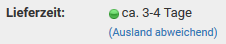

Die Anzeige dieses Links kann unter Shop Einstellungen \> Lieferstatus für jeden einzelnen Status aktiviert bzw. deaktiviert werden. Wähle hierzu den jeweiligen Status aus und klicke auf die Schaltfläche Bearbeiten.

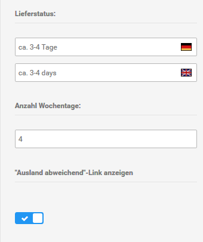

## E-Mail-Optionen 

CAUTION:

Änderungen an den Einstellungen unter Kunden \> E-Mails \> E-Mail-Optionen können dazu führen, dass keine E-Mails aus dem Shopsystem versendet werden können!

!!! Info "Hinweis"
	 Die E-Mail Transport-Methode wird in den meisten Fällen durch die Installationsroutine korrekt festgelegt. Sollte der E-Mail Versand fehlschlagen, stelle zunächst die Option bei Absender der Bestellbestätigungsmail von Betreiber E-Mail auf Kunden E-Mail. Wenn nach wie vor kein E-Mail Versand möglich ist, setze den Absender der Bestellbestätigungsmail wieder auf die Standard-Einstellung zurück, ändere die E-Mail Transport-Methode auf SMTP und trage die SMTP-Daten ein. Achte hierbei auch den korrekten SMTP Port und die Auswahl der richtigen SMTP Verschlüsselung sowie die Aktivierung der Einstellung SMTP AUTH, falls der Server eine Verschlüsselung erfordert.

  

  

## Bild-Effekte 

Das Shopsystem bietet verschiedene Funktionen an, mit denen du einen oder mehrere Effekte auf deine Artikelbilder anwenden kannst. Die Effekte werden auf den jeweiligen Bildtyp \(siehe Kapitel Bildgröße\) separat angewendet. Auf jeden Bildtyp kann ein Effekt, eine Kombination aus verschiedenen Effekten oder alle Effekte angewendet werden.

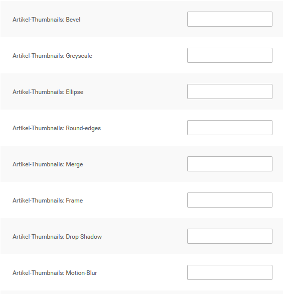

  

  

  

  

  

  

  

## Shop-Key 

!!! Info "Hinweis"
	

Dieser Bereich des Gambio Admins ist nur in selbstgehosteten Shops verfügbar.

Der Shop-Key wird für die Verknüpfung deines Gambio Shops mit dem Gambio Kundenportal verwendet. Den Shop‑Key erhältst du im Gambio Kundenportal.

Den Shop-Key kannst du im Administrationsbereich deines Shops unter Shop Einstellungen \> System Einstellungen \> Shop-Key in das Feld Shop-Key eingeben. Wenn du den Shop-Key eingegeben hast, klicke auf Speichern. Das Shopsystem übermittelt nun in regelmäßigen Abständen folgende Versionsinformationen zu deinem Shop an das Gambio Kundenportal:

-   die Internetadresse \(URL\) deines Shops
-   die aktuelle Shopversion
-   den Shop‑Key
-   die zum Zeitpunkt der Übermittlung aktive Sprache im Gambio Admin
-   wenn vorhanden, eine Liste mit vorherigen Shopversionen

Eine Liste mit den genauen Daten, die an das Gambio Kundenportal weitergegeben werden, kannst du im Gambio Admin deines Shops unter Shop Einstellungen \> System Einstellungen \> Shop‑Key über den Link Zweck und Art der übermittelten Daten einsehen.

## Allgemeines 

Im Reiter Allgemeines stehen folgende Einstellungen zur Verfügung:

|Feldname|Beschreibung|
|--------|------------|
|Max. Zeichen für Artikelnamen auf der Startseite|Vorgabe für die maximale Zeichenanzahl bei Artikelnamen auf der Startseite. Die tatsächliche Anzahl hängt auch von der Wort-Trennung und der Kachelgröße ab|
|Max. Zeichen für Artikelnamen in der Menübox "Bestellübersicht"|Länge der Artikelnamen die in der Box Bestellübersicht angezeigt werden, die Box wird nur angezeigt, wenn man mit einem Admin-Konto eingeloggt ist|
|ID in der MySQL-Tabelle "orders\_status" für den Bestellstatus der Stornierung. Diese ID sollte nur geändert werden, wenn die neue ID entsprechend bekannt ist oder diese noch nicht gesetzt worden ist. Im Standard sollte hier der Wert "99" stehen.|Der Bestellstatus storniert wird im Shop besonders behandelt, da zu einer Stornierung mehr als nur das Ändern des Bestellstatus' an sich gehört. In einzelnen Fällen kann es notwendig sein für den Status eine abweichende interne ID zu verwenden. Die ID kann über dieses Feld geändert werden.CAUTION:

Nimm hier nur Änderungen vor, wenn du dir über die Konsequenzen im Klaren bist!

|
|Kleinunternehmerreglung: "Kein Steuerausweis gem. Kleinuntern.-Reg. §19 UStG" statt der MwSt.- Angabe bei jedem Preis anzeigen lassen|ist der Haken gesetzt, wir statt inkl. Mwst. bzw. exkl. Mwst. der genannte Text angezeigt|
|UVP bei Sonderangebotspreisen anzeigen|ist der Haken gesetzt, wird bei Sonderangeboten der ursprüngliche Artikelpreis mit dem Zusatz UVP angezeigt|
|Normalpreis bei rabattierten Preisen anzeigen|ist der Haken gesetzt, wird bei einem Artikel mit Artikelrabatt zusätzlich der Normalpreis und die prozentuale Ersparnis angezeigt|
|Normalpreis bei reduzierten Kundengruppenund Staffelpreisen anzeigen|ist der Haken gesetzt, wird bei einem Artikel mit Kundengruppen- bzw. Staffelpreisen zusätzlich der Normalpreis angezeigt|
|Bei der Preisermittlung die Zusammenfassung von Artikelbeständen nicht unterbinden|Wenn der Haken gesetzt ist, wird beim mehrfachen Bestellen eines Artikels mit GX-Customizer die gesamte Bestellmenge für Staffelpreise berücksichtigt. Dies gilt auch, wenn der Kunde über das GX-Customizer-Set verschiedene Variationen des Artikels bestellt.|
|Technische Informationen meiner Shop-Installation an Gambio senden|Technische Informationen sind z.B.-   Versionsinformationen zu deinem Shop
-   installierte Module und Updates, aktive Sprachen, aktive Länder, usw.
-   Server-Informationen \(z.B. PHP- und mySQL-Versionen, Einstellungen, geladene Module\)

Die Informationen enthalten dabei keine personen- oder handelsbezogenen Daten. Das Senden der technischen Informationen kannst du im Gambio Admin unter Shop-Einstellungen jederzeit wieder deaktivieren.

|
|Art der Namensdarstellung bei zukünftigen Produktrezensionen|Wenn Kundenrezensionen zu einem Artikel angezeigt werden, wird hierbei auch der Name des Verfassers genannt. Über diese Einstellung kannst du festlegen, dass entweder der gesamte Name aufgeführt oder wahlweise der Vor- oder Nachname gekürzt wird. Folgende Werte können ausgewählt werden:-   Name nicht kürzen: es werden Vor- und Nachname angezeigt
-   Vorname kürzen: Es wird nur der erste Buchstaben des Vornamens und der Nachname angezeigt
-   Nachname kürzen: Es wird der Vorname und nur der erste Buchstabe des Nachnamens angezeigt

!!! Info "Hinweis"
	

Eine Änderung der Einstellung wirkt sich nur auf neue Kundenrezensionen aus. Bestehende Rezensionen bleiben in der Darstellung des Verfassers unverändert.

|
|Standardzahlungsweise bei manuell angelegten Bestellungen|Wähle hier aus, welche Zahlungsweise bei manuell im Gambio Admin angelegten Bestellungen vorausgewählt werden soll.|

## E-Mail Vorlagen 

Das Shopsystem versendet automatisierte E-Mails. Die Vorlagen kannst du unter Kunden \> E-Mails \> E-Mail Vorlagen anpassen.

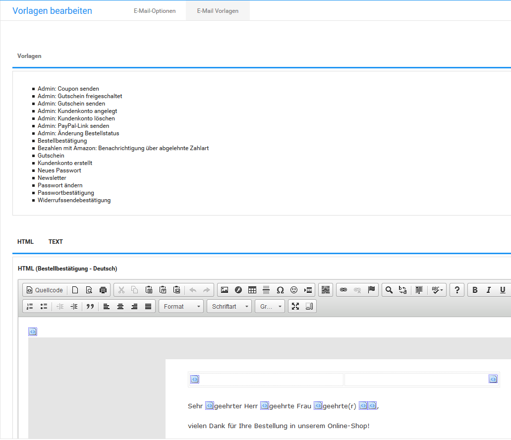

|Vorlagenname|Beschreibung|
|------------|------------|
|Passwort ändern|Wird dem Kunden nach Ändern des Passworts über den Shopbereich zugesandt|
|Kundenkonto erstellt|Wird dem Kunden nach erfolgreicher Kundenregistrierung zugesandt|
|Neues Passwort|Wird dem Kunden nach der Bestätigung über die Passwort vergessen-Funktion zugesandt|
|Newsletter|Wird dem Kunden nach Anmeldung am Newsletter zugesandt|
|Bestellbestätigung|Wird dem Kunden nach Bestellabschluss zugesandt|
|Passwortbestätigung|Wird dem Kunden zur Bestätigung der Passwort vergessen-Funktion zugesandt|
|Rechnungsversand|Wird dem Kunden beim Erstellen einer E-Mail Rechnung zugesandt|
|Gutschein|Wird verschickt, wenn ein Kunde einen Teil seines Guthabens an einen anderen Kunden verschickt|
|Widerrufssendebestätigung|Wird versendet, wenn der Kunde das Online-Widerrufsformular verschickt|
|Bezahlen über Amazon: Benachrichtigung über abgelehnte Zahlart|Wir verschickt, wenn die gewählte Zahlungsart von Amazon Payments abgelehnt wird|
|Admin: Änderung Bestellstatus|Wird dem Kunden nach Änderung des Bestellstatus im Administrationsbereich zugesandt, wenn das Kontrollkästchen Kunde benachrichtigen aktiviert wurde|
|Admin:Kundenkonto angelegt|Wird dem Kunden zugesandt, wenn ein Kundenkonto über den Administrationsbereich angelegt wurde|
|Admin: Gutschein freigeschaltet|Wird dem Kunden zugesandt, wenn die Gutschein-Warteliste verwendet wird und der Gutschein über den Administrationsbereich freigeschaltet wurde|
|Admin: Coupon senden|Wird dem Kunden zugesandt, wenn ein Kupon über Gutscheine \> Rabatt Kupons verschickt wird.|
|Admin: Gutschein senden|Wird dem Kunden zugesandt, wenn ein Gutschein über Gutscheine \> Gutschein E-Mail verschickt wird|
|Admin: Kundenkonto löschen|Wird dem Administrator zugesandt, wenn ein Kunde sein Kundenkonto über die Funktion im Shopbereich löschen möchte|
|Admin: PayPal-Link senden|Wird dem Kunden zugesandt, wenn der Administrator einen PayPal-Link generiert|

Passe die gewünschte E-Mail Vorlage über den CK-Editor an. Klicke auf Vorschau, das Vorschaufenster muss geöffnet sein, damit du die vorgenommenen Änderungen speichern kannst.

## Round-edges \(runde Ecken\) 

Mit der Round-edges-Funktion werden die Ecken des Artikelbildes abgerundet.

Der Parameter für die Round-edges-Funktion besteht aus drei Teilen:

1.  Ecken-Radius: Der erste Teil steht für die Größe des Radius, um den die Ecke abgerundet wird. Der Radius wird ganzzahlig in Pixel angegeben.
2.  Hintergrundfarbe: Der zweite Teil steht für die Hintergrundfarbe, die anstelle des Artikelbilds im Außenbereich des Radius angezeigt wird. Die Hintergrundfarbe wird in Hexadezimal-Codierung angegeben und kann frei gewählt werden.
3.  Weichzeichnungs-Breite: Der dritte Teil steht für die Weichzeichnungs-Breite der runden Ecke. Die Weichzeichnungs- Breite wird ganzzahlig in Pixel angegeben. Je höher der Wert, desto runder wirkt die Ecke. Bei einem Wert von 0 wirkt die runde Ecke je nach Radius kantig. Die Weichzeichnungs- Breite sollte die Größe des Radius nicht überschreiten.

Beispiel: \(5,FFFFFF,3\)

Trage den fertigen Parameter mit runden Klammern ohne Anführungszeichen in das Feld Round-edges beim gewünschten Bildtyp ein.

## Lager- und Bestandseinstellungen 

  

  

## Artikelbilder löschen 

Der Reiter Artikelbilder löschen ist im gleichnamigen Unterkapitel des Kapitels Bild-Optionen beschrieben.

## Ellipse 

Mit der Ellipse-Funktion wird ein Ausschnitt des Artikelbilds in Form einer Ellipse ausgeschnitten und anstatt des ganzen Bildes angezeigt.

Der Parameter für die Ellipse-Funktion besteht aus der Hintergrundfarbe für den Bildausschnitt. Die Farbe wird in Hexadezimal-Code angegeben.

Beispiel: \(FFFFFF\)

Trage den fertigen Parameter mit runden Klammern ohne Anführungszeichen in das Feld Ellipse beim gewünschten Bildtyp ein.

## Rechtliche Einstellungen 

CAUTION:

Bitte nimm Änderungen an den rechtlichen Einstellungen ausschließlich in Absprache mit deinem Rechtsberater vor. Unsachgemäße Änderungen an den Einstellungen bergen die Gefahr einer Abmahnung!

  

  

  

  

## Suchmaschinenoptimierung 

#### Kampagnen 

|Feldname|Beschreibung|
|--------|------------|
|Kampagnen|Klicke auf aufrufen, um die Konfigurationsseite für die Kampagnen anzuzeigen.|

#### SEO URLs 

|Feldname|Beschreibung|
|--------|------------|
|Suchmaschinenfreundliche URLs Pro für Artikeldetailseiten aktivieren|Artikel verwenden SEO Boost-URLs|
|Kurze Produkt-URLs|Artikel-URL wird ohne Kategoriepfad ausgegeben|
|Suchmaschinenfreundliche URLs Pro für Kategorieseiten aktivieren|Kategorien verwenden SEO Boost-URLs|
|Suchmaschinenfreundliche URLs Pro für Content-Manager-Seiten aktivieren|Content Manager-Seiten verwenden SEO Boost URLs|
|Sprachcode in URLs integrieren|Sprachcodes werden als Teil der URL angezeigt|
|index.php Suffix in zugehörigen URLs entfernen|Startseite wird ohne die Angabe index.php in der Adressezeile geladen|

#### Meta-Angaben 

|Feldname|Beschreibung|
|--------|------------|
|Meta-Angaben|Klicke auf aufrufen, um die Konfigurationsseite für Meta-Angaben anzuzeigen|
|Standard Meta-Titel Anzeige|legt fest, ob der Standard Meta-Titel vor oder nach dem Seitentitel \(Meta-Titel\) ausgegeben wird|
|Standard Meta-Titel verwenden?|wenn aktiviert, wird zusätzlich zum Seitentitel der Standard Meta-Titel ausgegeben|

#### Einstellungen für Suchmaschinenbots \(robots.txt\) 

|Feldname|Beschreibung|
|--------|------------|
|Robots.txt Datei|Klicke auf aufrufen, um die Konfigurationsseite für das Erzeugen der Robots-Datei anzuzeigen.|

#### Sitemap 

|Feldname|Beschreibung|
|--------|------------|
|Sitemap Generator|Klicke auf aufrufen, um die Konfigurationsseite zum Generieren der Sitemaps anzuzeigen|
|Standard

Die im Shop eingestellte Änderungsfrequenz stellt lediglich eine Vorgabe dar. Die tatsächliche Frequenz, mit der die Sitemap aktualisiert wird, hängt von der jeweiligen Suchmaschine ab.

|
|Standard-Priorität|Welche Priorität soll für Sitemap-Einträge standardmäßig gesetzt werden?|

#### Statische Seiten 

|Feldname|Beschreibung|
|--------|------------|
|Statische Seiten|Klicke auf aufrufen, um die Konfigurationsseite für statische Seiten anzuzeigen|

#### Tracking Codes 

|Feldname|Beschreibung|
|--------|------------|
|Tracking Codes|Klicke auf aufrufen, um die Konfigurationsseite für Tracking Codes anzuzeigen|

## Artikelbilder löschen 

Unter Shop Einstellungen \> Allgemeines \> Artikelbilder löschen besteht die Möglichkeit Artikelbilder bei Bedarf zu löschen. Es können die Originalbilder \(Verzeichnis /images/product\_images/original\_images\) sowie nicht benötigte Artikelbilder, die keinem Artikel mehr zugeordnet sind, entfernt werden.

Setze hierzu den Haken in das Kästchen hinter die gewünschte Funktion und klicke auf Löschen.

CAUTION:

Die Original-Bilder werden für den Bilderzoom verwendet. Werden diese gelöscht, steht die Vergrößerung nicht mehr in der bisherigen Auflösung zur Verfügung.

## Einstellungen für Kleinunternehmer 

Kleinunternehmer führen in Deutschland unter bestimmten Voraussetzungen keine Umsatzsteuer ab und müssen im Shop daher keine Umsatzsteuer ausweisen. Das Shopsystem bietet eine Funktion an, mit der der Artikelpreis regulär eingegeben, die enthaltene Steuer jedoch nicht ausgewiesen wird.

1.  Aktiviere unter Shop Einstellungen \> Allgemeines das Kontrollkästchen Kleinunternehmerreglung
2.  Installiere unter Module \> Zusammenfassung das Modul Kleinunternehmerregelung
3.  Deinstalliere unter Module \> Zusammenfassung das Modul MwSt.

Bei Artikelpreisen und zukünftigen Bestellungen wird anstatt der Umsatzsteuer ein Hinweis angezeigt, dass die Steuer aufgrund der Kleinunternehmerregelung nicht ausgewiesen wird.

!!! Info "Hinweis"
	 Wähle beim Einstellen von Artikeln auf der Artikel-Detailseite aus der Liste Steuersatz den regulären Steuersatz für deine Artikel aus. Wenn die Voraussetzungen nicht mehr erfüllt werden, müssen dadurch nicht alle Artikelpreise neu angelegt werden.

## Bestell- und Kundennummern 

Die kommenden, zu vergebenen Bestell- und Kundennummer werden in den Eingabefeldern Nächste Bestellnummer bzw. Nächste Kundennummer angezeigt. Dort können die Nummern auch geändert werden. Hierbei ist zu beachten, dass die neu vergebenen Nummern nicht unter dem angezeigten Minimum liegen dürfen. Zudem kann 1 nicht als Kundennummer vergeben werden, da diese Nummer für den Hauptadministrator vorgesehen ist.

CAUTION:

Das Unterschreiten des Minimum-Wertes sorgt für widersprüchliche Einträge in der Datenbank und führt so zu Fehlern im Shop.

Generell gilt, dass die Kundennummern nur heruntergesetzt werden können, wenn zuvor alle Kundenkonten gelöscht wurden.

## Such-Optionen 

Unter Shop Einstellungen \> Mein Shop kannst du auswählen, ob die Shopsuche in den Artikelbeschreibungen und in den Artikelattributen suchen soll.

-   Suche in Artikelbeschreibungen: Wird dieser Punkt deaktiviert, sucht der Shop nur noch in den Artikelnamen, Artikelnummern und EANs nach dem Suchbegriff
-   Suche in Artikelattributen/Artikeleigenschaften: Wird dies deaktiviert, werden die Informationen aus den Attributen und Eigenschaften nicht mehr bei der Suche berücksichtigt. Da die Suche in den Artikelattributen und Eigenschaften zu einer ungleich umfassenderen Suche führt, kann dies in Shops mit vielen Attributen bzw. Eigenschaften zu sehr langen Ladezeiten beim Ausführen der Suche führen. Die Deaktivierung kann daher die Performance des Shops verbessern.

## Allgemeines 

Die allgemeine rechtliche Konfiguration kannst du unter Shop Einstellungen \> Rechtliches vornehmen.

#### Datenschutzlink 

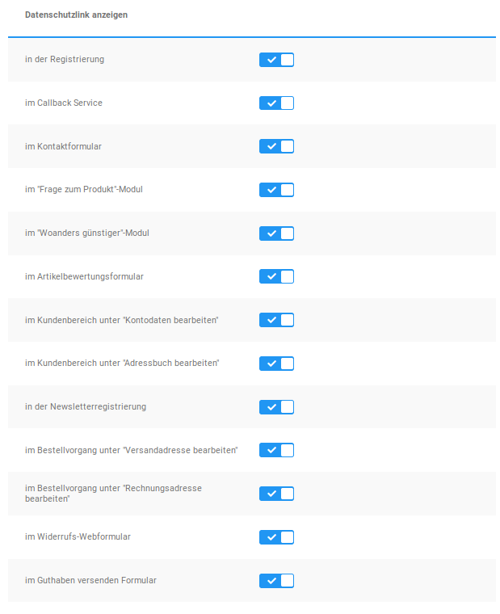

Ein Link zu den aktuellen Datenschutzbestimmungen wird in der Grundeinstellung auf jeder Seite eingebunden, auf der persönliche Daten des Kunden über ein Formular übertragen werden. Der Link zu den Datenschutzbestimmungen kann bei Bedarf für bestimmte Seiten deaktiviert werden. Deaktiviere dazu das Kontrollkästchen für die entsprechende Seite.

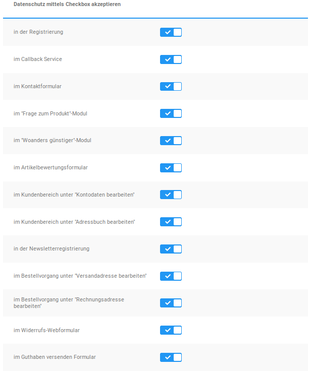

Zudem kann festgelegt werden, ob ein so angezeigter Link um eine Checkbox ergänzt wird. Der Kunde muss in diesem Fall bestätigen, dass dieser die Datenschutzbestimmungen zur Kenntnis genommen hat, bevor er fortfahren kann.

#### Allgemeine Geschäftsbedingungen 

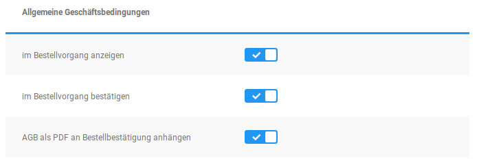

In der Grundkonfiguration werden die Allgemeinen Geschäftsbedinungen \(AGB\) im Bestellvorgang angezeigt und müssen bestätigt werden. Deaktiviere die Kontrollkästchen, wenn die AGB nicht angezeigt werden sollen. Zudem kann eingestellt werden, ob die AGB im PDF-Format als Anhang der Bestellbestätigung versendet werden sollen.

!!! Info "Hinweis"
	 Deaktiviere das Kontrollkästchen im Bestellvorgang bestätigen, wenn du die Anzeige der AGB im Bestellvorgang deaktivierst. Eine Bestellung ist sonst nicht möglich.

#### Widerrufsrecht 

In der Grundkonfiguration wird das Widerrufsrecht im Bestellvorgang angezeigt und muss bestätigt werden. Deaktiviere die Kontrollkästchen, wenn das Widerrufsrecht nicht angezeigt werden soll. Folgende Einstellungen sind möglich:

|Feldname|Beschreibung|
|--------|------------|
|im Bestellvorgang anzeigen|Soll das Widerrufsrecht im Bestellvorgang angezeigt werden?|
|im Bestellvorgang bestätigen|Soll das Widerrufsrecht im Bestellvorgang vom Kunden bestätigt werden?|
|Webformular anbieten|Soll der Link zum Online-Widerrufsformular angezeigt werden?|
|PDF-Formular anbieten|Soll das Widerrufsformular als PDF-Datei zur Verfügung stehen?|
|Widerrufsrecht-Link innerhalb der Bestellinformationen unter Mein Konto anzeigen|Der Abschnitt Widerrufsformular wird in den einzelnen Bestellungen unter Ihr Konto angezeigt. Dieser beinhaltet die Verweise unter Webformular anbieten und PDF-Formular anbieten.|
|Datenschutzerklärung als PDF an Bestellbestätigung anhängen|Die Datenschutzerklärung wird der Bestellbestätigung als PDF-Anhang hinzugefügt.|
|Widerrufsbelehrung als PDF an Bestellbestätigung anhängen|Die Widerrufsbelehrung wird der Bestellbestätigung als PDF-Anhang hinzugefügt.|
|Widerrufsformular als PDF an Bestellbestätigung anhängen|Das Widerrufsformular wird der Bestellbestätigung als PDF-Anhang hinzugefügt.|
|Downloadverzögerung bei Verzicht auf das Widerrufsrecht|Zeit, bis das Herunterladen eines Download-Artikels möglich ist, wenn auf das Widerrufsrecht verzichtet wurde.|
|Downloadverzögerung ohne Verzicht auf das Widerrufsrecht|Zeit, bis das Herunterladen eines Download-Artikels möglich ist, wenn nicht auf das Widerrufsrecht verzichtet wurde.|
|Verzicht auf Widerrufsrecht für Download-Artikel anzeigen|Auswahl zum Verzicht auf das Widerrufsrecht für Download-Artikel im Bestellvorgang anzeigen?|
|Verzicht auf Widerrufsrecht für Dienstleistungen anzeigen|Auswahl zum Verzicht auf das Widerrufsrecht für Dienstleistungen im Bestellvorgang anzeigen?|
|Verzicht auf Widerrufsrecht für Download-Artikel als Pflichtfeld|Muss bei Download-Artikeln zwangsweise auf das Widerrufsrecht verzichtet werden?|
|Verzicht auf Widerrufsrecht für Dienstleistungen als Pflichtfeld|Muss bei Dienstleistungen zwangsweise auf das Widerrufsrecht verzichtet werden?|

#### Datenweitergabe an Transportunternehmen 

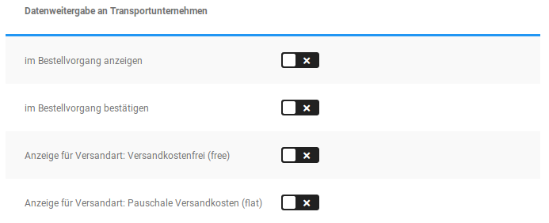

Durch das Setzen des Hakens im Bestellvorgang anzeigen wird dem Kunden im Bestellvorgang ein Text angezeigt, mit dem er der Weitergabe seiner Daten an das im Bestellvorgang ausgewählte Transportunternehmen seine Einwilligung erteilen kann. Der angezeigte Text kann bei Bedarf unter Darstellung \> Content Manager \> Elemente im Content Datenweitergabe an Transportunternehmen angepasst werden.

CAUTION:

Der Text im Content Datenweitergabe an Transportunternehmen enthält einen Codebaustein, über den der Name der ausgewählten Versandart in die Einwilligung eingesetzt wird. Beim Vornehmen von Änderungen sollte daher unbedingt darauf geachtet werden, dass dieser Code nicht versehentlich entfernt wird.

Wenn du den Haken im Bestellvorgang bestätigen setzt, wird die Einwilligung zu einem Pflichtfeld, sodass der Kunde seine Einwilligung erteilen muss, um den Bestellvorgang fortsetzen zu können.

Zudem wird für jede installierte Versandart ein Haken angezeigt. Setze den jeweiligen Haken, damit die Einwilligung bei Verwendung der entsprechenden Versandart angezeigt werden kann.

!!! Info "Hinweis"
	

Der Hinweis wird nur angezeigt, wenn sowohl die Haken für im Bestellvorgang anzeigen als auch die jeweilige\(n\) Versandart\(en\) gesetzt sind.

Die Einstellung im Bestellvorgang bestätigen greift nur, wenn die Einwilligung auch angezeigt wird.

#### Bestellbestätigungs-Seite 

Auf der Bestellbestätigungs-Seite werden in der Grundkonfiguration Links zu den aktuell gültigen Datenschutzerklärungen, den AGB und dem Widerrufsrecht angezeigt. Deaktiviere die Kontrollkästchen zu den Texten, die auf der Bestellbestätigung nicht angezeigt werden sollen.

#### IP-Logging 

Nähere Informationen zum IP-Logging erhältst du im Kapitel IP-Logging.

#### Mehrwertsteuer-Anzeige 

In der Grundkonfiguration wird auf allen Seiten die Mehrwertsteuer unterhalb des Artikelpreises angezeigt, von denen aus ein Artikel in den Warenkorb gelegt werden kann. Deaktiviere das Kontrollkästchen Mehrwertsteuer unter Artikelpreisen anzeigen, wenn du die Anzeige deaktivieren möchtest. Setze den Haken für Auch Mehrwertsteuer anzeigen, wenn diese gleich 0 sind wenn du die Mehrwertsteuer ebenfalls anzeigen möchtest, wenn der Steuersatz 0% ist.

#### Einwilligungsprotokoll exportieren 

Über Klick auf die Schaltfläche Exportieren wird eine Liste im CSV-Format erstellt, in der die Zustimmungen deiner Kunden zu den jeweiligen Rechtstexten des Shops aufgeführt werden.

## IP-Logging 

Unter Shop Einstellungen \> Rechtliches stehen dir im Abschnitt IP-Logging Funktionen für das Speichern der IP Adresse deines Kunden beim Einloggen und Registrieren sowie bei Bestellungen zur Verfügung.

Aktiviere das Kontrollkästchen bei Login und Registrierung IP speichern um die IP Adresse deines Kunden beim Anmelden und beim Anlegen eines Kundenkontos zu speichern.

Aktiviere das Kontrollkästchen im Bestellvorgang IP speichern um die IP Adresse beim Abschicken einer Bestellung zu speichern.

CAUTION:

Bevor du die Logging-Optionen aktivierst, erfrage möglicherweise nötige rechtliche Schritte bei deinem Rechtsberater.

## Grundkonfiguration 

Nehme nach der Installation des Shopsystems die erstmalige Konfiguration des Shops vor. Im Folgenden findest du Informationen zur Grundkonfiguration deines Shops.

  

  

## Artikelübersicht-Optionen 

Unter Shop Einstellungen \> Mein Shop hast du die Möglichkeit, die Anzeige des Hersteller- und Kategorie-Filters an- bzw. abzuschalten. Trage hierzu in das Eingabefeld Hersteller- und Kategorie-Filter anzeigen? eine 1 \(aktivieren\) bzw. eine 0 \(deaktivieren\) ein, um die Anzeige des Kategorie- bzw. Hersteller-Dropdowns in der Artikelübersicht zu steuern. Bestätige deine Eingabe mit einem Klick auf Speichern.

CAUTION:

Diese Auswahl wird nur dann angezeigt, wenn eine echte Auswahl aus verschiedenen Herstellern besteht. Das heißt, es müssen zum einen unter Artikel \> Hersteller verschiedene Hersteller angelegt worden sein und sich in der betreffenden Übersicht auch Artikel befinden, die verschiedenen Herstellern zugeordnet wurden. Gibt es nur Artikel eines Herstellers, erscheint diese Auswahl nicht.

## Motion-Blur \(Bewegungs-Effekt\) 

Mit der Motion-Blur-Funktion wird ein Ausschnitt des Artikelbilds nach unten rechts multipliziert. Durch die Wiederholung entsteht ein Bewegungs-Effekt.

Der Parameter für die Motion-Blur-Funktion besteht aus zwei Teilen:

1.  Anzahl Wiederholungen: Der erste Teil steht für die Anzahl Wiederholungen des unteren und rechten Bildbereichs. Die Anzahl wird ganzzahlig in Stück angegeben.
2.  Rahmenfarbe zwischen den Wiederholungen: Der zweite Teil steht für die Rahmenfarbe zwischen dem ursprünglichen Artikelbild und den jeweiligen Wiederholungen des unteren rechten Bildbereichs. Die Farbe wird in Hexadezimal-Codierung angegeben und kann frei gewählt werden.

Beispiel: \(4,FFFFFF\)

Trage den fertigen Parameter mit runden Klammern ohne Anführungszeichen in das Feld Motion-Blur beim gewünschten Bildtyp ein.

!!! Info "Hinweis"
	 Die Änderungen an den Bild-Effekten werden nur für über die Artikel-Eingabemaske neu hochgeladene Artikelbilder übernommen. Wenn die Änderungen auch auf bereits vorhandene Artikelbilder angewendet werden sollen, führe anschließend die Stapelverarbeitung für Bildbearbeitung unter Darstellung \> Bild-Optionen \> Image Processing aus.

## Sicherheitseinstellungen 

Das Shopsystem enthält Funktionen, die die Sicherheit deines Shops auf unterschiedliche Weise verbessern können. Beachte, dass diese Funktionen keine uneingeschränkte Garantie für die Sicherheit deines Shops gegen gezielte Hacker-Angriffe und Spam-Roboter bedeuten.

  

  

## Konfiguration des G-Protectors 

Die Grundeinstellungen des G-Protectors sind bereits mit dem Kopieren des zugehörigen Ordners in das Shopverzeichnis abgeschlossen. Darüber hinaus besteht die Möglichkeit IP-Adressen zu sperren.

Trage diese hierzu in die Datei ip\_blacklist.txt im Ordner GProtector des Shopverzeichnisses ein, auf die du z.B. mit Hilfe eines FTP-Clients zugreifen kannst. Setze dabei jede Adresse in eine eigene Zeile, abgesehen von den Adress-eigenen Punkten sind hierzu keine weiteren Trenn- oder Sonderzeichen erforderlich.

!!! Info "Hinweis"
	 192.168.1.1

127.0.0.1

Dies kann, neben einzelner Adressen, auch für Adressräume vorgenommen werden:

!!! Info "Hinweis"
	 172.16.

127.0.0.

!!! Info "Hinweis"
	 Die genannten Adressen und Adressräume dienen nur als Beispiel zur Darstellung des Formates, es ist weder notwendig, noch sinnvoll, diese speziellen Adressen zu blockieren.

## Nummernkreise 

Über Nummernkreise wird die automatische Vergabe von Bestell-, Kunden-, Rechnungs- und Lieferscheinnummern konfiguriert. Die entsprechenden Einstellungen findest du unter Shop Einstellungen \> Nummernkreise.

Um den Minimumwert für einen Nummernkreis anzeigen zu lassen, bewege den Mauszeiger in die zugehörige Zeile über das dann angezeigte Info-Symbol \(in der Abbildung rot markiert\).

  

  

## Rechnungs- und Lieferscheinnummer 

Hier kannst du die Nummernkreise für Rechnungs- und Lieferscheinnummer anpassen.

Die als nächstes zu vergebenen Rechnungs- und Lieferscheinnummer werden in den Eingabefeldern Nächste Rechnungsnummer bzw. Nächste Lieferscheinnummer angezeigt. Dort können die Nummern auch mit einem neuen Startwert belegt werden. Dieser darf allerdings nicht unterhalb des mit Minimum angegebenen Wertes liegen.

CAUTION:

Das Unterschreiten des Minimum-Wertes sorgt für widersprüchliche Einträge in der Datenbank und führt so zu Fehlern im Shop.

Zudem können in den Feldern Format Rechnungsnummer und Format Lieferscheinnummer der generelle Aufbau der Rechnungsnummer festgelegt werden. Dabei wird die fortlaufende Nummer mit dem Platzhalter \{INVOICE\_ID\} eingetragen.

!!! Info "Hinweis"
	 Wenn unter Format Rechnungsnummer folgendes eingetragen ist: R\_\{INVOICE\_ID\}\_2014 werden die Rechnungsnummern nach folgendem Muster vergeben:

R\_26\_2014, R\_27\_2014, R\_28\_2014, usw.

!!! Info "Hinweis"
	 Rechnungsnummern müssen grundsätzlich fortlaufend vergeben werden. Bei weiteren Fragen hierzu wende dich bitte an deinen Rechtsbeistand.

Beachte, dass diese beiden Nummern fortlaufend sind und jeweils erst bei der Erstellung bzw. dem Versand von Rechnung und Lieferschein generiert werden. Solltest du das Format nachträglich anpassen, so wird das neue Format auch erst in neu generierten Rechnungen und Lieferscheinen angewendet.

## Cookie Hinweis 

Der Cookie Hinweis kann unter Shop Einstellungen \> Rechtliches über den Reiter Cookie Hinweis konfiguriert werden. Der Hinweis erscheint beim ersten Aufruf des Shops und kann durch den Kunden bestätigt oder \(je nach Konfiguration\) geschlossen werden. Zur Bestätigung des Hinweises wird ein eigener Button angezeigt, dessen Beschriftung du frei festlegen kannst.

!!! Info "Hinweis"
	

Wenn eine andere Seite des Shops oder die Startseite nochmals geladen wird, erfolgt keine erneute Anzeige des Cookie Hinweises.

Um die Funktion und/oder Darstellung bei Bedarf zu testen, empfehlen wir den Browser-Cache und die Cookies zu löschen oder wahlweise ein privates Browser-Fenster zu verwenden. Auf diese Weise wird der Shop wie beim ersten Aufruf geladen.

Folgende Einstellungen können allgemein vorgenommen werden:

-   Status: setzen des Hakens \(✔\) zum Aktivieren des Cookie-Hinweises, entfernen \(✖\) zum Deaktvieren
-   Position: oben/unten, Cookie Hinweis wird wahlweise am oberen oder unteren Bildschirmrand angezeigt

    

-   Farbe: hierüber kann die Hintergrunfarbe des Hinweises eingestellt werden
-   Transparenz: Transparenz der Hintergrundfarbe in Prozent \(0 - 100\)
-   Schließen-Icon: ist der Haken gesetzt \(✔\) wird ein x-Symbol zum Schließen des Hinweises angezeigt
-   Button-Text-Farbe: Farbe für die Beschriftung der Schaltfläche
-   Button-Farbe: Hintergrundfarbe der Schaltfläche

Folgende Einstellungen sind sprachabhängig. Klicke eine der Landesflaggen an, um die Einstellungen für die jeweilige Sprache vorzunehmen.

-   Button-Text: Beschriftung des Buttons zur Bestätigung des Cookie Hinweises
-   Button-Link: Link der beim Anklicken des Buttons aufgerufen werden kann
-   Inhalt: Hier kann der Text für den Cookie Hinweis hinterlegt werden

!!! Info "Hinweis"
	 Eine Übersicht über die einzelnen Schaltflächen des Editor-Fensters findest du im Kapitel CK-Editor unter Funktionsübersicht

Bestätige alle gemachten Änderungen mit Klick auf Speichern.

## Bevel \(Button-Effekt\) 

Mit der Bevel-Funktion werden Artikelbilder erhaben dargestellt und wirken dadurch wie eine Schaltfläche.

Der Parameter für die Bevel-Funktion besteht aus drei Teilen:

1.  Kantenbreite: Der erste Teil steht für die Breite des Rahmens um das Artikelbild. Die Breite wird ganzzahlig in Pixeln angegeben.
2.  Rahmenfarbe oben links: Der zweite Teil steht für den hellen Rahmen an der oberen und linken Seite des Artikelbildes. Die Farbe wird in Hexadezimal-Codierung angegeben und kann frei gewählt werden.
3.  Rahmenfarbe unten rechts: Der dritte Teil steht für den dunklen Rahmen an der unteren und rechten Seite des Artikelbildes. Die Farbe wird in Hexadezimal-Codierung angegeben und kann frei gewählt werden.

Beispiel: \(8,FFCCCC,330000\)

Trage den fertigen Parameter mit runden Klammern ohne Anführungszeichen in das Feld Bevel beim gewünschten Bildtyp ein.

## Persönliche Daten 

#### Shopbetreiber-Anschrift 

Die Absenderadresse auf der Bestellbestätigung entspricht der unter Shop Einstellungen \> Mein Shop im Feld Adresse eingetragenen Adresse. Füge deine Geschäftsadresse in das Feld Adresse ein und speichere die Änderung. Bei zukünftigen Bestellungen wird diese Adresse im Kopfbereich ausgegeben.

Für die korrekte Berechnung der Umsatzsteuer und der Versandkosten mancher Versandarten muss der Standort deines Shops bekannt sein. Wähle unter Shop Einstellungen \> Mein Shop aus der Liste Land das Land aus, aus dem der Versand stattfindet. Wähle anschließend aus der Liste Region das Bundesland aus. Wenn du aus mehreren Ländern versendest, beachte bitte die Hinweise aus dem Kapitel Lokalisierung.

Trage deine E-Mail Adresse unter Shop Einstellungen \> Mein Shop im Feld E-Mail-Adresse ein. Zur weiteren Konfiguration des E-Mail Versands in deinem Shop beachte bitte auch das Kapitel E-Mail-Optionen.

Die Absenderadresse auf der PDF-Rechnung bei installiertem PdfCreator-Modul entspricht der Standard-Adresse des Hauptadministrators. Die Adresse des Hauptadministrators kannst du über das Adressbuch im Shopbereich ändern.

1.  Melde dich in deinem Onlineshop mit dem Administratorkonto an, das du während der Installationsroutine angelegt hast
2.  Wechsele nicht in den Administrationsbereich
3.  Klicke auf Ihr Konto im oberen rechten Menü
4.  Klicke auf Adressbuch bearbeiten im Hauptbereich des Shops
5.  Ändere die Standardadresse oder lege eine neue Adresse an; wenn du eine neue Adresse angibst, aktiviere das Kontrollkästchen Standardadresse
6.  Speichere die Standardadresse

Bei zukünftigen Rechnungen wird diese Adresse als Absenderadresse ausgegeben.

Für das Widerrufsformular stehen unter Shop Einstellungen \> Mein Shop separate Eingabefelder zur Verfügung:

|Feldname|Beschreibung|
|--------|------------|
|Vorname|Der Vorname des Shop-Betreibers|
|Nachname|Der Nachname des Shop-Betreibers|
|Straßenname|Der Straßenname des Firmensitzes|
|Hausnummer|Die Hausnummer des Firmensitzes|
|Postleitzahl|Die Postleitzahl des Firmensitzes|
|Ort|Der Ort des Firmensitzes|
|Telefonnummer|Die Telefonnummer des Shop-Betreibers|
|Faxnummer|Die Faxnummer des Shop-Betreibers|

#### Shopname 

Lege den Namen deines Shops unter Shop Einstellungen \> Mein Shop im Feld Name des Shops fest. Der Name deines Shops wird in automatisch erstellten E-Mails sowie abhängig von der im Kapitel Meta-Titel beschriebenen Einstellungen in der Titelleiste des Webbrowsers angezeigt.

## Lagerbestände anzeigen 

Über den Reiter Lagerbestände anzeigen stehen folgende Einstellungen zur Verfügung:

-   Lagerbestände in allen Kategorien zu jedem Artikel anzeigen \(Haken gesetzt\) / nicht anzeigen \(kein Haken\) lassen? Die Option ist unabhängig von der unteren.
-   Lagerbestände in allen Artikeln in der Artikeldetailansicht anzeigen \(Haken gesetzt\) / nicht anzeigen \(kein Haken\)? Die Option ist unabhängig von der oberen.

Setze bzw. entferne den jeweiligen Haken und klicke in der entsprechenden Zeile auf Anwenden um die Einstellung zu ändern.

## Allgemeines 

Unter Shop Einstellungen \> Allgemeines befinden sich hauptsächlich Detaileinstellungen zur Anzeige der Artikelnamen, Lagerbestände und Preisanzeige, aber auch andere Funtktionen, wie das Löschen überzähliger Artikelbilder oder Statistiken.

  

  

  

  

## Greyscale \(Graustufen\) 

Mit der Greyscale-Funktion werden Artikelbilder in Farbstufen eingefärbt. Dadurch ist eine Darstellung von Artikelbildern in Graustufen oder beispielsweise Sepiafärbung möglich.

Der Parameter für Graustufen besteht aus drei Teilen:

1.  Rotanteil: Der erste Teil steht für den Rotanteil der Einfärbung. Der Rotanteil wird als Ganzzahl von 0 bis 255 angegeben.
2.  Grünanteil: Der zweite Teil steht für den Grünanteil der Einfärbung. Der Grünanteil wird als Ganzzahl von 0 bis 255 angegeben.
3.  Blauanteil: Der dritte Teil steht für den Blauanteil der Einfärbung. Der Blauanteil wird als Ganzzahl von 0 bis 255 angegeben.

Beispiel: \(32,22,22\)

Trage den fertigen Parameter mit runden Klammern ohne Anführungszeichen in das Feld Greyscale beim gewünschten Bildtyp ein.

CAUTION:

Ein Parameter von \(0,0,0\) färbt dein Artikelbild vollständig schwarz, wohingegen ein Parameter von \(255,255,255\) dein Artikelbild vollständig weiß färbt.

## Artikel & Kategorien 

#### Produkte 

|Feldname|Beschreibung|
|--------|------------|
|Eigenschaft-Artikelnummer anhängen|Soll die Artikelnummer der Eigenschaften-Kombination \(Variante\) eines Aritkels an die Artikelnummer des Haupt-Artikels angehängt werden, anstatt diese zu ersetzen?|
|Max. Zeichen für Artikelnamen in der Menübox "Bestellübersicht"|Begrenzung des Artikelnamens in der Menübox "Bestellübersicht"|
|UVP bei Sonderangebotspreisen anzeigen|Ist der Haken gesetzt, wird bei Sonderangeboten der ursprüngliche Artikelpreis mit dem Zusatz UVP angezeigt. Der Zusatz kann bei Bedarf unter Toolbox \> Texte anpassen geändert werden.|
|Normalpreis bei rabattierten Preisen anzeigen|Ist der Haken gesetzt, wird bei einem Artikel mit Artikelrabatt zusätzlich der Normalpreis und die prozentuale Ersparnis angezeigt|
|Normalpreis bei reduzierten Kundengruppen- und Staffelpreisen anzeigen|Ist der Haken gesetzt, wird bei einem Artikel mit Kundengruppen- bzw. Staffelpreisen zusätzlich der Normalpreis angezeigt|
|Bei der Preisermittlung die Zusammenfassung von Artikelbeständen nicht unterbinden|Wenn der Haken gesetzt ist, wird beim mehrfachen Bestellen eines Artikels mit GX-Customizer die gesamte Bestellmenge für Staffelpreise berücksichtigt. Dies gilt auch, wenn der Kunde über das GX-Customizer-Set verschiedene Variationen des Artikels bestellt.|
|Bestseller|Maximale Anzahl an Bestsellern, die angezeigt werden sollen.|
|Neue Artikel Liste|Maximale Anzahl der neuen Artikel, die in der Liste angezeigt werden sollen.|
|Bestseller|Minimale Anzahl an Bestsellern, die angezeigt werden sollen.|

#### Suche 

|Feldname|Beschreibung|
|--------|------------|
|Suchvorschläge aktivieren|Die Suche im Header schlägt Suchbegriffe anhand der Eingabe vor.|
|Quick Search|Schnellsuche im Top-Menü wird verwendet|
|Suchverknüpfung|Sollen alle Suchbegriffe im Suchergebnis vorkommen \(und\) oder muss nur mindestens ein Suchbegriff vorkommen \(oder\)?|
|Suche in Artikelattributen/Artikeleigenschaften|Wird dies deaktiviert, werden die Informationen aus den Attributen und Eigenschaften nicht mehr bei der Suche berücksichtigt. Da die Suche in den Artikelattributen und Eigenschaften zu einer ungleich umfassenderen Suche führt, kann dies in Shops mit vielen Attributen bzw. Eigenschaften zu sehr langen Ladezeiten beim Ausführen der Suche führen. Die Deaktivierung kann daher die Performance des Shops verbessern.|
|Suche in Artikelbeschreibungen|Wird dieser Punkt deaktiviert, sucht der Shop nur noch in den Artikelnamen, Artikelnummern und EANs nach dem Suchbegriff|

#### GX Customizer 

|Feldname|Beschreibung|
|--------|------------|
|Set Position|Legt fest, wo genau auf der Artikel-Detailseite das Customizer-Set angezeigt wird.|
|Set-Breite ignorieren und in Artikeldetailansicht maximale Breite anzeigen?|Bei ✔ wird die Breiten-Einstellung des im Set festgelegten Bereichs nicht verwendet. Stattdessen wird der maximal verfügbare Platz in dem jeweiligen Teil der Artikel-Detailseite ausgenutzt. Bei ✖ ist die im Bereich eingestellte Breite die maximale Breite.|
|Kürzen von Texteingaben in Übersichten|Vom Kunden eingegebene Texte werden im Warenkorb, auf der Bestellbestätigungsseite vor Abschluss der Bestellung, im Gambio Admin in der Bestellungenübersicht und in der Bestelldetailansicht in der Artikelauflistung auf die angegebene Zeichenzahl gekürzt \(0 = kein Kürzen\). Der gesamte Text wird weiterhin im Set, in der Druckversion der Bestellbestätigung, in der Bestellbestätigungs-E-Mail, in der PDF-Rechnung und im PDF-Lieferschein angezeigt.|
|Leerzeichen bei der Berechnung der maximalen Zeichenanzahl in Texteingabefeldern ausschließen?|Wenn diese Einstellung aktiviert ist, werden Leerzeichen bei der Begrenzung der Zeichenanzahl nicht mitgezählt.|
|Tabs zum Wechseln der Bereiche in Artikeldetailseite anzeigen?|Ist der Haken gesetzt, kann das Customizer-Set als eigener Tab angezeigt werden \(siehe Set Position\)|
|Anzahl erlaubter Dateiuploads pro Besucher \(0 = keine Begrenzung\)|Begrenzt die Anzahl der Dateien, die über den GX-Customizer hochgeladen werden können.|
|Zeitraum in Minuten, für den die Begrenzung der Anzahl an Dateiuploads gilt|Wie lange gilt die oben festgelegte Begrenzung?|

#### Lagerverwaltung 

|Feldname|Beschreibung|
|--------|------------|
|Überprüfen des Artikelbestandes|Prüfen, ob die Artikel in angeforderter Menge auf Lager sind, um Bestellung ausführen zu können|
|Soll nach Ablegen eines Artikels in den Warenkorb der Warenkorb angezeigt werden?|bei ✔ wird der Warenkorb angezeigt, sobald ein Artikel hineingelegt wurde.|
|Artikel inaktiv setzen|Artikel auf inaktiv setzen, wenn diese nach einer Bestellung nicht mehr auf Lager sind|
|Attribut inaktiv setzen|Attributwerte/Attribut-Optionswerte ausblenden, wenn diese nicht mehr auf Lager sind|
|Attributlagerbestand anzeigen|Attributlagerbestand hinter jedem Attribut-Optionswert anzeigen|
|Überprüfen des Artikelattribut-Bestandes|Überprüfen, ob der Bestand von Artikelattributen in ausreichender Menge auf Lager ist, um Bestellung ausführen zu können|
|Überprüfen des Downloadartikel-Bestandes|Prüfen ob die Download-Artikel in der angeforderten Menge auf Lager sind, um eine Bestellung ausführen zu können.|
|Artikelmenge abziehen|Artikelmenge vom Artikelbestand abziehen, wenn der Artikel bestellt wurde|
|Einkaufen nicht vorrätiger Artikel erlauben|Erlauben zu bestellen, auch dann, wenn bestimmte Artikel laut Lagerbestand nicht verfügbar sind.|
|Kennzeichnung vergriffener Artikel|Kennzeichnung vergriffener Artikel, um dem Kunden kenntlich zu machen, welche Artikel nicht mehr verfügbar sind.|
|Meldung an den Shopbetreiber, dass ein Artikel nachbestellt werden muss|Stückzahl ab welcher diese E-Mail versendet werden soll.|
|Lagerbestand vor dem Warenkorb prüfen?|Überprüft den Lagerbestand bereits auf der Artikeldetailseite.|
|Maximale Bestellmenge je Artikel|Maximale Menge, die je Artikel bestellt werden kann.|

#### Downloadoptionen 

!!! Info "Hinweis"
	

Dieser Bereich verwendet ein erweitertes Dropdown-Menü zur Auswahl von Einträgen.

Klappe das Dropdown wie gewohnt über das nach unten weisende Dreieck-Symbol aus. Bereits ausgewählte Einträge werden grau hinterlegt angezeigt.

Beim Hovern werden Einträge, die ausgewählt werden können, grün hinterlegt. Einträge die bereits ausgewählt sind und abgewählt werden können, werden rot hinterlegt.

Einrträge können auch durch Klick auf das x hinter dem Namen wieder entfernt werden.

|Feldname|Beschreibung|
|--------|------------|
|Download von Artikeln erlauben|Hierdurch wird die Download-Artikel-Funktion aktiviert. Setze diese Einstellung, wenn du Download-Artikel anbieten möchtest.|
|Download durch Weiterleitung|Über diese Einstellung kann eine Browser-Umleitung für Artikeldownloads eingeschaltet werden. Diese Einstellung ist standardmäßig nicht gesetzt.CAUTION:

Bitte aktiviere diese Funktion nur, wenn du dir absolut sicher bist, dass sie benötigt wird. Anderenfalls kann das Herunterladen von Dateien durch diese Einstellung beeinträchtigt oder unmöglich gemacht werden.

Auf Nicht-Linux/Unix Systemen sollte diese Einstellung ausgeschaltet sein.

|
|Ausgeschlossene Zahlungsmodule|Nicht erlaubte Zahlungsweisen für Downloadartikel.|
|Download-Bestellstatus|Bestellstatus für die Downloads freigegeben sind.|

## Grundeinstellungen 

Im Administrationsbereich deines Shops werden unter Darstellung \> Bild-Optionen die Einstellungen für die automatische Bildberechnung der Artikelbilder vorgenommen.

|Feldname|Beschreibung|
|--------|------------|
|Bildgröße berechnen|wenn aktiviert \(Option Ja\) werden die Bildvarianten vom Shopsystem automatisch berechnet \[Ja\]|
|Bildqualität|die JPEG-Qualität der umgewandelten Bilder in Prozent \[100\]|

CAUTION:

Bei Verwenden der GDlib1-Bibliotheken für die Bildbearbeitung werden sämtliche Artikelbilder in schwarz-weiß abgelegt. Wenn du deine Artikelbilder in schwarz-weiß präsentieren möchtest, verwende die dafür vorgesehenen Funktionen für GDlib2. Die Option GDlib processing sollte nicht verändert werden.

## Lieferstatus 

Lieferstatus geben an, wie lange es voraussichtlich dauert, bis ein gegebener Artikel geliefert wird. Im Shop kann für jede dieser Zeitperioden ein eigener Lieferstatus festgelegt werden, z.B. 3-4 Tage, 1 Woche usw. Unter Shop Einstellungen \> Lieferstatus können diese Status eingesehen und geändert werden. Wenn ein Lieferstatus markiert wird, sodass er blau hinterlegt ist, wird in der Box auf der rechten Seite sowohl die deutsche als auch die englische Bezeichnung angezeigt. Dazu kommen die Anzahl der Wochentage und der obere Schwellenwert.

!!! Info "Hinweis"
	 Wenn der Lieferstatus markiert ist, wird in der Adresszeile des Browsers die eindeutige ID-Nummer des Lieferstatus‘ mit aufgeführt: http://www.deinshop.de/admin/shipping\_status.php?page=1&oID=1 Diese Nummer wird auch beim Artikel-Import und -Export verwendet. Wenn Lieferstatus bereits beim Import vergeben oder Artikel durch diesen aktualisiert werden sollen, kann so der Menüpunkt Shop Einstellungen \> Lieferstatus als Referenz verwendet werden.

Die Auswahl eines Lieferstatus‘ durch den Shop richtet sich nach dem Lagerstand des jeweiligen Artikels. Hierzu wird der obere Schwellenwert verwendet. Sobald der Lagerstand bis auf diesen Schwellenwert \(oder darunter\) herabsinkt, ist der Lieferstatus für den Artikel aktiv.

!!! Info "Hinweis"
	 Die Eingabe für den oberen Schwellenwert wird nur angezeigt wenn der Haken für Lieferstatus automatisch aktualisieren gesetzt ist. Dies kann über die Schalfläche Lieferstatus konfigurieren geändert werden. Der Lieferstatus wird nur bei einer Bestellung aktualisiert.

Um die Einstellungen für einen Lieferstatus anzupassen, wähle diesen aus und klicke auf Bearbeiten. Nun können die deutsche und englische Bezeichnung des Lieferstatus, die Anzahl der Wochentage und der obere Schwellenwert geändert werden. Zudem kann der standardmäßig verwendete Lieferstatus neu gesetzt und zu jedem Lieferstatus zugehörige Google-Shopping-Verfügbarkeit zugeordnet werden. Schlussendlich kann die zugeordnete Grafik \(siehe Spalte Lieferstatus in der Tabelle\) geändert werden, die den Lieferstatus farblich markiert. Mit Klick auf Speichern werden die Änderungen übernommen.

Über die Schaltfläche Lieferstatus einfügen kann ein neuer Lieferstatus angelegt werden. Die Einstellungsmöglichkeiten entsprechen hier dem Bearbeiten des Lieferstatus‘.

Über die Schaltfläche Lieferstatus konfigurieren gelangst du zur EinstellungLieferstatus automatisch aktualisieren. Hier sollte der Haken gesetzt werden, wenn der Lieferstatus nach einer Bestellung aktualisiert werden soll. Ist der Haken nicht gesetzt, findet keine Aktualisierung statt. Über die Einstellung Lieferstatusanzeige aktivieren kann die Anzeige des Lieferstatus' insgesamt an- bzw. abgeschaltet werden. Außerdem wird im Gambio Admin die Einstellung Lieferstatus, die beim Anlegen oder Bearbeiten eines Artikels angezeigt wird, ein- bzw. ausgeblendet.

Der Button Löschen dient zum Entfernen eines Lieferstatus. Nach Klick auf die Schaltfläche findet eine Sicherheitsabfrage statt. Klicke abermals auf Löschen, wenn du den Lieferstatus entfernen möchtest.

Die Angabe der Lieferzeit beinhaltet den Link Ausland abweichend. Die Anzeige dieses Links kann unter Shop Einstellungen \> Lieferstatus für jeden einzelnen Status aktiviert bzw. deaktiviert werden. Wähle hierzu den jeweiligen Status aus und klicke auf die Schaltfläche Bearbeiten.

## Sprachen, Länder, Steuern 

#### Steuerklassen 

|Feldname|Beschreibung|
|--------|------------|
|Steuerklassen|Klicke auf aufrufen, um die Konfigurationsseite für die Steuerklassen anzuzeigen|

#### Steuersätze 

|Feldname|Beschreibung|
|--------|------------|
|Steuersätze|Klicke auf aufrufen, um die Konfigurationsseite für die Steuersätze anzuzeigen|

#### Umsatzsteuer 

|Feldname|Beschreibung|
|--------|------------|
|USt-IdNr. des Shopbetreibers|Die USt-IdNr. des Shopbetreibers|
|USt

Die USt-IdNr. wird lediglich auf Plausibilität geprüft. Eine genauere Live-Überprüfung auf Plausibilität ist über die untenstehende Einstellung möglich.

|
|USt-IdNr. live überprüfen|Die USt-IdNr. live auf Plausibilität überprüfen?CAUTION:

Damit die Live-Prüfung durchgeführt werden kann, muss auf dem Server fsockopen oder curl zur Verfügung stehen.

|
|Kundengruppe nach USt-IdNr. Überprüfung anpassen?|Nach einer erfolgreichen Prüfung, wird der Kunde automatisch in eine voreingestellte Kundengruppe verschoben.|
|Eintragung falscher oder ungeprüfter Ust-Id Nummern sperren?|Durch Einschalten dieser Option werden nur geprüfte und richtige Ust-Id Nummern eingetragen.|
|Gäste verschieben wenn "Kundengruppe nach USt-IdNr. Überprüfung anpassen" aktiv ist|Sollen Gast-Konten ebenfalls nach einer erfolgreichen Prüfung in eine entsprechende Kundengruppe verschoben werden?|
|Netto-Preisanzeige anhand USt-IdNr. bestimmen|Für internationale EU-Kunden mit gültiger USt-IdNr. keine Steuer ausweisen? Die Kundengruppenkonfiguration wird übergangen.|
|Kundengruppe für USt-IdNr.-geprüfte Kunden \(Ausland\)|Kundengruppe, die ausländischen Kunden nach erfolgreicher Prüfung zugeordnet werden sollen.|
|Kundengruppe für USt-IdNr.-geprüfte Kunden \(Inland\)|Kundengruppe, die inländischen Kunden nach erfolgreicher Prüfung zugeordnet werden sollen.|

#### Steuerzonen 

|Feldname|Beschreibung|
|--------|------------|
|Steuerzonen|Klicke auf aufrufen, um die Konfigurationsseite für die Steuerzonen anzuzeigen|

#### Länder 

|Feldname|Beschreibung|
|--------|------------|
|Länder|Klicke auf aufrufen, um die Konfigurationsseite für die Länder anzuzeigen|

#### Währungen 

|Feldname|Beschreibung|
|--------|------------|
|Währungen|Klicke auf aufrufen, um die Konfigurationsseite für die Währungen anzuzeigen|

#### Bundesländer 

|Feldname|Beschreibung|
|--------|------------|
|Bundesländer|Klicke auf aufrufen, um die Konfigurationsseite für die Bundesländer anzuzeigen|

#### Sprachen 

|Feldname|Beschreibung|
|--------|------------|
|Sprachen|Klicke auf aufrufen, um die Konfigurationsseite für die Sprachen anzuzeigen|

## Bild-Optionen 

!!! Info "Hinweis"
	

Änderungen an den Bild-Optionen werden nur für neu hochgeladene Artikelbilder übernommen. Sollen Änderungen auch bei bereits vorhandenen Artikelbildern übernommen werden, muss anschließend unter Darstellung \> Bild-Optionen \> Image Processing die Stapelverarbeitung für Bildbearbeitung ausgeführt werden.

  

  

  

  

  

  

## Logging-Optionen 

!!! Info "Hinweis"
	

Dieser Bereich des Gambio Admins ist nur in selbstgehosteten Shops verfügbar.

Unter Shop Einstellungen \> System Einstellungen \> Logging-Optionen kann die Konfiguration zum Logging innerhalb des Shops vorgenommen werden.

CAUTION:

Änderungen in diesem Bereich können zur Folge haben, dass bestimmte Informationen im Fehlerfall nicht verzeichnet werden, welche zur Problembehebung notwendig sind.

Zudem können bestimmte Logging-Einstellungen zu Einbußen in der Geschwindigkeit des Shops führen. Zudem besteht die Möglichkeit, dass deinen Kunden technische Meldungen angezeigt werden, die diese als Fehler im Shop auffassen könnten.

#### Logging aktivieren 

Logging im gesamten Shop aktivieren / deaktivieren \[standardmäßig aktiviert\]

#### Speichern der Berechnungszeit der Seite 

Speichern der Zeit, die benötigt wird, um Scripte bis zur Ausgabe der Seite zu berechnen. Diese Funktion erzeugt jedoch ebenfalls eine gewisse Server-Last. Abhängig vom Server kann die Belastung durch die Speicherung der Berechnungszeit minimal bis erheblich sein. Wenn du einen langsamen Server verwendest, sollte diese Funktion nach Möglichkeit deaktiviert werden.

#### Speicherort der Logdatei der Berechnungszeit 

Hier wird der absolute Verzeichnispfad mit dem Dateinamen der Logdatei eingetragen. Standardmäßig ist dieses Feld folgendermaßen belegt: /var/log/www/tep/page\_parse\_time.log

#### Datumsformat 

Das Datumsformat für das Logging legt fest, wie die Datumswerte aufgeführt werden. Die Standardvorgabe lautet %d/%m/%Y %H:%M:%S was Tag/Monat/Jahr Stunde:Minute:Sekunde bedeutet.

#### Berechnungszeit der Seiten anzeigen 

Wenn das Speichern der Berechnungszeit für Seiten eingeschaltet ist, kann diese im Footer \(Seitenende\) angezeigt werden.

#### SQL-Logging im Frontend 

Datenbankverändernde SQL-Befehle im Frontend werden geloggt. Dies wäre z.B. dann der Fall, wenn ein Kunde eine Bestellung durchführt.

#### SQL-Logging im Backend 

Datenbankverändernde SQL-Befehle im Backend werden geloggt, wie es bei allen Änderungen an Artikeln, Contents, etc. der Fall ist.

#### Maximale Dateigröße 

Maximale Dateigröße der SQL-Logging-Datei in MB. Wird das Limit überschritten, wird die Log-Datei unter neuem Namen im gz-Format komprimiert angelegt. Damit wird verhindert, dass die Log-Datei unnötig groß wird.

#### Speichern aller Datenbankabfragen 

Speichern der einzelnen Datenbankabfragen in der Logdatei für Berechnungszeiten. Datenbankabfragen sind alle Abrufe von Daten, die im Shop stattfinden.

#### E-Mail-Fehlerberichte an 

E-Mail-Adresse, an die Fehlerberichte gesendet werden sollen. Um keine Berichte zu senden, kann das Feld einfach leer gelassen werden. Zur Sendung von Fehlerberichten an den Gambio Support kann die Adresse debug@gambio-support.de eingetragen werden.

#### Unterdrücken von Meldungen 

Die nachfolgenden Einstellungen dienen dazu, Meldungen eines bestimmten Typs zu unterdrücken.

CAUTION:

Die Einstellungen an dieser Stelle sollten nur geändert werden, wenn ein begründeter Anlass hierfür vorliegt. Wenn du dir nicht sicher bist, ob dies der Fall ist oder welche Bedeutung eine Art Meldung hat, raten wir dringend dazu die Einstellungen unverändert zu lassen.

Standardmäßig sind hier die Haken für

-   E\_NOTICE-Meldungen unterdrücken
-   E\_CORE\_ERROR-Meldungen unterdrücken
-   E\_CORE\_WARNING-Meldungen unterdrücken
-   E\_STRICT-Meldungen unterdrücken
-   E\_DEPRECATED-Meldungen unterdrücken

gesetzt.

#### Ausgabeoptionen 

Innerhalb der Ausgabeoptionen wird festgelegt, welche Art Meldung auf welche Weise ausgegeben wird. Hierzu zählt sowohl die Anzeige auf dem Bildschirm als auch das Schreiben der Meldung in die jeweilige .log beziehungsweise .html-Datei im Ordner logfiles des Shops oder der Versand als E-Mail.

Über das Dropdown Logging-Gruppe können die Einstellungen zu dem jeweiligen Bereich angezeigt werden. Durch Setzen bzw. Entfernen der jeweiligen Haken kann die Ausgabe aktiviert respektive deaktiviert werden. Die Checkboxen im blauen Bereich wirken sich jeweils auf alle Einträge der zugehörigen Zeile bzw. Spalte aus.

CAUTION:

Änderungen an dieser Stelle können dazu führen, dass wichtige Meldungen nicht mehr im Log verzeichnet werden.

## Verbraucherrechterichtlinie 

Mit Inkrafttreten der Verbraucherrechterichtlinie hat es im Shop zahlreiche Veränderungen gegeben. Dieser Teil des Handbuches zeigt dir in einer Schritt-Für-Schritt-Anleitung, wie sich die einzelnen Komponenten einstellen lassen.

CAUTION:

Das Vorhandensein der Bestandteile ist zur rechtlichen Absicherung deines Shops nicht ausreichend. Die Umsetzung der Verbraucherrechterichtlinie setzt u.a. das Vornehmen verschiedener Konfigurationen voraus. Dieses Kapitel bietet dir eine Übersicht über die Einstellungsmöglichkeiten.

  

  

  

  

  

  

## Download-Optionen 

Unter Shop Einstellungen \> Download-Optionen können die Grundeinstellungen für den Verkauf von Download-Artikeln vorgenommen werden. Es stehen der Reihe nach folgende Konfigurationsmöglichkeiten zur Verfügung:

#### Download von Artikeln erlauben 

Hierdurch wird die Download-Artikel-Funktion aktiviert. Setze diese Einstellung, wenn du Download-Artikel anbieten möchtest.

#### Download durch Weiterleitung 

Über diese Einstellung kann eine Browser-Umleitung für Artikeldownloads eingeschaltet werden. Diese Einstellung ist standardmäßig nicht gesetzt.

CAUTION:

Bitte aktiviere diese Funktion nur, wenn du dir absolut sicher bist, dass sie benötigt wird. Anderenfalls kann das Herunterladen von Dateien durch diese Einstellung beeinträchtigt oder unmöglich gemacht werden.

#### Download Zahlungsmodule 

Der Punkt Download Zahlungsmodule listet alle Zahlungsmodule auf, die für Bestellungen mit Download-Artikeln nicht verwendet werden sollen. Liste hier die Module mit Komma getrennt \(ohne Leerzeichen\) auf, indem du die internen Modulnamen einträgst. Die internen Modulnamen können unter Module \> Zahlungsweisen eingesehen werden, sie sind jeweils in Klammern hinter der Zahlungsweise aufgeführt.

Typische Zahlungsweisen für diesen Fall sind: banktransfer,cod,invoice,moneyorder

#### Download-Bestellstatus 

Setze hier bei den Bestellstatus einen Haken, für den du den Download freigeben möchtest.

## Wasserzeichen 

Du kannst deine Bilder durch ein Wasserzeichen über deinen Shopbildern schützen. Beachte, dass die nachfolgenden Änderungen ausschließlich auf neu hochgeladene Produktbilder angewendet werden. Lade eine Wasserzeichengrafik im GIF-Format über Darstellung \> Logo Manager \> Wasserzeichen hoch. Dein Wasserzeichen sollte idealerweise einen reinweißen Hintergrund haben. Die Position des Wasserzeichens kannst du über ein Parameterset in den Bildoptionen bestimmen.

Das Parameterset setzt sich aus fünf Teilen zusammen und wird am Beispiel \(overlay.gif,20,30,60,FFFFFF\) erklärt.

#### Teil 1: overlay.gif 

Der erste Parameter bezieht sich auf den Dateinamen und darf nicht verändert werden. Die hochgeladene GIF-Grafik wird automatisch in overlay.gif umbenannt.

#### Teil 2&3: 20,30 

Der zweite und dritte Parameter beschreibt gemeinsam die Position des Wasserzeichens \(x,y\) über dem Produktbild.

#### Teil 4: 60 

Der vierte Parameter entspricht der Durchsichtigkeit des Wasserzeichens auf dem Bild. Ein Wert von 100 macht das Wasserzeichen über dem Produktbild vollständig sichtbar, ein Wert von 0 macht das Wasserzeichen kaum sichtbar.

#### Teil 5: FFFFFF 

Der fünfte Parameter beschreibt die Farbe im Wasserzeichen, die als Hintergrund betrachtet und vollständig durchsichtig sein soll. Wir empfehlen, diesen Wert auf FFFFFF \(100% weiß\) zu belassen und die Hintergrundfarbe der hochzuladenden GIF-Grafik entsprechend anzulegen.

Trage diese Parameter unter Darstellung \> Bild-Optionen kommagetrennt in einfachen Klammern bei den Einstellungen ein:

-   Merge\(zusammenführen\)
-   Artikel-Thumbnails:Merge \(für die Thumbnails in der Kategorieübersicht\)
-   Artikel-Info Bilder:Merge \(für die kleinen Artikel-Info-Bilder in der Artikeldetailseite\)
-   Artikel-Popup Bilder:Merge \(für die großen Artikel-Bilder in der Artikeldetailseite\)

## Shop 

#### Allgemein 

|Feldname|Beschreibung|
|--------|------------|
|Name des Shops|Name des Shops, wird als Titel angezeigt|
|Firmenname|Name deiner Firma|
|Geschäftsadresse und Telefonnummer etc.|Geschäftsadresse, wird z.B. im Briefkopf der Bestellbestätigung verwendet|
|Deine Zeitzone|Zeitzone des Firmensitzes|

#### Shopbetreiber 

|Feldname|Beschreibung|
|--------|------------|
|Inhaber|Name des Shopbetreibers|
|Vorname|Vorname des Shopbetreibers|
|Nachname|Nachname des Shopbetreibers|
|Straßenname|Straßenname des Firmensitzes|
|Hausnummer|Hausnummer des Firmensitzes|
|Postleitzahl|Postleitzahl des Firmensitzes|
|Ort|Ort des Firmensitzes|
|Land|Land aus dem der Versand erfolgt|
|Region|Region des Landes, aus dem der Versand erfolgt|
|E-Mail-Adresse|E-Mail-Adresse des Shopbetreibers|
|Telefonnummer|Telefonnummer des Shopbetreibers|
|Faxnummer|Faxnummer des Shopbetreibers|

## Einbinden der Rechtstexte 

Zuallererst sollten die Rechtstexte zum Widerrufsrecht hinterlegt werden. Dies geschieht unter Darstellung \> Content Manager \> Elemente, hier stehen mehrere Contents zur Verfügung, über die die Widerrufstexte verwaltet werden. Hierzu zählen die Inhalte Widerrufsrecht 1 bis Widerrufsrecht 4 \(ID 3889896 bis 3889899\). Auf diese Contents kann der Widerrufstext, je nach thematischer Abgrenzung, verteilt werden. Er wird dann grafisch unterteilt in separaten Textboxen im Bestellvorgang angezeigt. Es ist nicht notwendig alle Contents zu verwenden, aber der Text muss in mindestens einem dieser Contents hinterlegt werden. Zusammenfassend für die Widerrufstexte steht der Content Widerrufsrecht & Muster-Widerrufsformular \(ID 3889895\) im Bereich Seiten des Content Managers, unter dem die einzelnen Widerrufstexte kombiniert werden und der ebenfalls eine Download-Möglichkeit für das Widerrufsformular beinhaltet.

CAUTION:

Der Content Widerrufsrecht & Muster vorgesehen sind!

Um deine Texte für das Widerrufsrecht zu hinterlegen, klicke bitte bei einem der Contents Widerrufsrecht 1 bis Widerrufsrecht 4 \(ID 3889896 bis 3889899\) auf Bearbeiten. Nun kann die jeweilige Widerrufsbelehrung in das Textfeld eingefügt werden. Wenn du die Texte über einen externen Anbieter, wie z.B. Janolaw, beziehst, kann die zugehörige Datei über Datei wählen eingebunden werden, nachdem die Elementart auf Skriptdatei umgestellt worden ist. Abschließend setze bitte den Haken bei sichtbar. Nur wenn der Content sichtbar geschaltet ist, wird er auch angezeigt und verwendet.

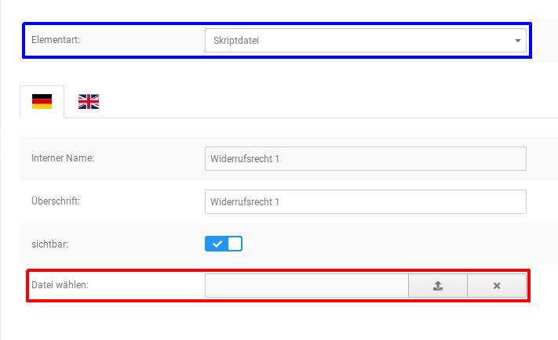

Die Widerrufstexte können im Shop auch als PDF-Datei heruntergeladen werden. Im Normalfall werden diese Dateien im Shop aus den jeweiligen Inhalten der einzelnen Contents \(3889896 bis 3889899\) erzeugt. Alternativ kann jedoch auch eine separate Datei zu diesem Zweck hinterlegt werden. Diese Datei muss nicht zwingend im PDF-Format vorliegen. Beim Bearbeiten des Contents Widerrufsrecht & Muster-Widerrufsformular \(ID 3889895\) kann diese über Als Download in den Shop hochgeladen werden. Eine Datei, die hier eingestellt wurde, wird anstelle der automatisch generierten PDF zum Download bereitgestellt.

!!! Info "Hinweis"
	 Im Gegensatz zu Texten kann für eine zu hinterlegende PDF-Datei auch der Content Widerrufsrecht & Muster-Widerrufsformular \(Gruppe 3889895\) verwendet werden. Dieser Content verfügt auch über eine zusätzliche Einstellungsoption für das Muster-Widerrufsformular.

Der Shop enthält ein Muster-Widerrufsformular im PDF-Format. Allerdings besteht auch die Möglichkeit, diese Datei durch ein eigenes Formular zu ersetzen. Diese Einstellung kann unter Darstellung \> Content Manager im Content Widerrufsrecht & Muster-Widerrufsformular \(ID 3889895\) vorgenommen werden.

!!! Info "Hinweis"
	 Weitere Informationen zum Hochladen von Dateien findest du im Kapitel Verwenden des Dateimanagers.

Lade die Datei, wie bereits beschrieben, über Muster-Widerrufsformular in den Shop hoch.

## Versand-Optionen 

Unter Module \> Versandarten \> Versand-Optionen findest du folgende Einstellungsmöglichkeiten:

#### Versandland & Postleitzahl des Versandstandortes: 

Hinterlege hier das Land und die Postleitzahl, von denen aus versendet wird.

#### Maximalgewicht, das als Paket versendet werden kann: 

Gib das maximal pro Paket mögliche Gewicht ein. Die Eingabe erfolgt in Kilogramm, als Trennzeichen wird ein Punkt verwendet. Die Eingaben 31,5kg oder 31,5 sind also nicht korrekt, die Angabe des Maximalgewichtes muss in diesem Beispiel als 31.5 erfolgen.

CAUTION:

In diesem Feld muss immer eine Eingabe erfolgen, da es sonst zu Fehlermeldungen kommen kann. Es ist jedoch möglich, das Gewicht auf fiktive Werte wie z.B. 999999 zu setzen.

#### Paketleergewicht: 

Wenn du das Gewicht der Verpackung in den Versandkosten berücksichtigen möchtest, kannst du hier einen fixen Wert eingeben, zum Beispiel 0.4, wenn die Verpackung immer mit 400g berücksichtigt werden soll. Dies ist optional.

#### Gewichtszuwachs in %: 

Diese Eingabe ist ebenfalls optional und wird nur berücksichtigt, wenn das Paketleergewicht nicht ausgefüllt wurde. Du hast also die Möglichkeit, entweder das Paketleergewicht mit einem fixen Gewicht anzugeben oder einen Gewichtszuwachs, der einen bestimmten Prozentsatz des Artikelgewichtes beträgt. Gehst du bei der Berechnung der Versandkosten also davon aus, dass das Gewicht der Verpackung immer ca. 10% des Gesamtgewichtes ausmachen wird, so gib hier eine 10 ein.

#### Versandkostenanzeige in Artikelinfos & Warenkorb: 

Diese beiden Punkte stellen sicher, dass die Links zu den Versandkosten-Informationen in Artikel und Warenkorb eingeblendet werden. Beachte, dass die Anzeige im Warenkorb nur möglich ist, wenn die Anzeige der Links auch für die Artikelinfos aktiviert wurde.

#### Versandgewicht im Warenkorb anzeigen: 

Wenn du möchtest, kannst du auch das Versandgewicht im Warenkorb anzeigen lassen, wenn du diese Option aktivierst.

## Sicherheitscenter 

Unter Shop Einstellungen \> System Einstellungen \> Sicherheitscenter stehen dir Funktionen zum Spamschutz sowie allgemeine Sicherheitseinstellungen zur Verfügung. Die Einstellungen sind nach der Installation des Shopsystems bereits ideal konfiguriert. Passe die Einstellungen nur an, wenn du vermehrten Missbrauch der betroffenen Bereiche feststellst.

!!! Info "Hinweis"
	 Beachte, dass diese Funktionen keinen vollständigen Schutz für den jeweiligen Anwendungsbereich garantieren können!

#### Passwortverschlüsselung 

In diesem Bereich kann festgelegt werden, mit welchem Verfahren Passwörter verschlüsselt werden sollen. Passwörter werden grundsätzlich im Shop nicht im Klartext gespeichert, sondern in Form eines sogenannten Hash-Werts.

-   Standardverschlüsselung für Kundenpasswörter: wähle password\_hash, um Passwörter maximal stark zu verschlüsseln \(empfohlen\). Wähle md5, sofern du externe Schnittstellen nutzt, die direkt über die Datenbank Passwörter abgleichen und keine password\_hash-verschlüsselten Passwörter unterstützen.
-   Kundenpasswörter beim nächsten Login nötigenfalls mit der aktuellen Standardverschlüsselung erneut verschlüsseln? \(empfohlen\): aktiviere diese Option, wenn du die Standardverschlüsselung wechseln möchtest und Kunden \(auch Admin-Konten!\) sich weiterhin mit ihren bisher gespeicherten Passwörtern einloggen können sollen. Andernfalls ist der Login nicht mehr möglich und ein neues Passwort muss über die Passwort vergessen-Funktion gesetzt werden.

#### Login-Tracker 

Der Login-Tracker schützt Kundenkonten davor, durch Passwort-Erraten übernommen zu werden.

-   Versuche: Anzahl Versuche \(mindestens 2\), nach denen der Login gesperrt wird
-   Zeitraum: Zeitraum in Sekunden, in dem ein wiederholter Login-Versuch geloggt wird
-   Timeout: Zeit in Sekunden, bis ein erneutes Einloggen möglich ist

#### Such-Tracker 

Der Such-Tracker schützt deinen Shop vor Überlastung durch bösartige Skripte, die die Suchfunktion gezielt mehrfach aufrufen.

-   Anzahl Suchen loggen: Anzahl Suchvorgänge, nach denen die Suchfunktion gesperrt wird
-   Zeitraum: Zeitraum in Sekunden, in dem eine wiederholte Suchanfrage geloggt wird
-   Timeout: Zeit in Sekunden, bis eine erneute Suchanfrage abgeschickt werden kann

#### Art der Sicherheitsabfrage 

Über Sicherheitscodes soll verhindert werden, dass Eingabeformulare von automatischen Skripten, sogenannten Bots, verwendet werden. Zu diesem Zweck müssen die Nutzer ihre Anfrage über einen Sicherheitscode bzw. eine andere Bestätigung verifizieren. Die Art der Sicherheitscodeabfrage legt fest, welche Art Abfrage verwendet werden soll. Es stehen folgende Wahlmöglichkeiten zur Verfügung:

-   Standard: wird shopseitig generiert; es wird ein Buchstaben- und Zahlencode in einem Bild aus Linien angezeigt, der vom Kunden eingegeben werden muss
-   reCAPTCHA v2: ist eine andere, sicherere Form der Sicherheitsabfrage und kann von Bots nicht so leicht überwunden werden, stellt also einen besseren Schutz gegen Spam dar.

Damit du dich an reCaptcha v2 beteiligen kannst, musst du dich dafür anmelden. Dies kannst du unter https://developers.google.com/recaptcha/ tun. Public Key und Private Key erhältst du nach der Anmeldung für reCaptcha v2. Gebe diese dann im Sicherheitscenter im Shop ein. Den API-Key kannst du auch unter folgendem Link erhalten, wenn du dich schon für reCAPTCHA v2 angemeldet hast: https://www.google.com/recaptcha/admin/create Bitte beachte, dass dies keine Auswirkungen auf den Spam über das Widerrufsformular haben wird. Das Widerrufsformular darf keine Sicherheitsabfrage enthalten, somit wird auch das reCAPTCHA v2 dort nicht angezeigt.

#### Sicherheitscodeabfragen 

Auf Shopseiten mit automatisch generierten Kontaktformularen kann zum Schutz vor Skripten, die Kontaktformulare gezielt mehrfach abschicken, ein Sicherheitscode abgefragt werden. Aktiviere das Kontrollkästchen zu den jeweiligen Seiten, auf denen der Sicherheitscode abgefragt werden soll. In der Grundkonfiguration wird auf allen automatisch generierten Kontaktformularen ein Sicherheitscode abgefragt.

## Frame \(Rahmen\) 

Mit der Frame-Funktion wird um das Artikelbild ein 3D-Rahmen gezeichnet.

Der Parameter für die Frame-Funktion besteht aus vier Teilen:

1.  Rahmenfarbe außen oben und links sowie innen unten und rechts: Der erste Teil steht für die Farbe der hellen Rahmenteile. Die Farbe wird in Hexadezimal- Codierung angegeben und kann frei gewählt werden.
2.  Rahmenfarbe außen unten und rechts sowie innen oben und links: Der zweite Teil steht für die Farbe der dunklen Rahmenteile. Die Farbe wird in Hexadezimal- Codierung angegeben und kann frei gewählt werden.
3.  Rahmenbreite: Der dritte Teil steht für die Breite des mittleren Rahmens. Die Breite wird ganzzahlig in Pixel angegeben.
4.  Rahmenfarbe des mittleren Rahmens: Der vierte Teil steht für die Farbe des mittleren Rahmens. Die Farbe wird in Hexadezimal- Codierung angegeben und kann frei gewählt werden.

Beispiel: \(FFFFFF,000000,3,EEEEEE\)

Trage den fertigen Parameter mit runden Klammern ohne Anführungszeichen in das Feld Frame beim gewünschten Bildtyp ein.

## Layout & Design 

#### Layout & Design 

|Feldname|Beschreibung|
|--------|------------|
|Shop Logo|Schaltet die Anzeige des Shop-Logos an oder ab.|
|Automatische Silbentrennung aktivieren|Artikelnamen orthografisch trennen|
|Artikel-Ribbons aktivieren|Artikel-Ribbons in der Artikelübersicht anzeigen|

#### Lightbox anzeigen 

|Feldname|Beschreibung|
|--------|------------|
|im Bestellvorgang|Bestellvorgang als Lightbox anzeigen|
|im Warenkorb|Warenkorb als Lightbox anzeigen|
|im Anmeldevorgang|Anmeldevorgang als Lightbox anzeigen|

!!! Info "Hinweis"
	

Die Anzeige als Lightbox steht ggf. nicht in allen Templates oder Themes zur Verfügung.

#### Logo Manager 

|Feldname|Beschreibung|
|--------|------------|
|Logo-Manager|Klicke auf aufrufen, um zum Logo Manager zu wechseln|

#### Startseite 

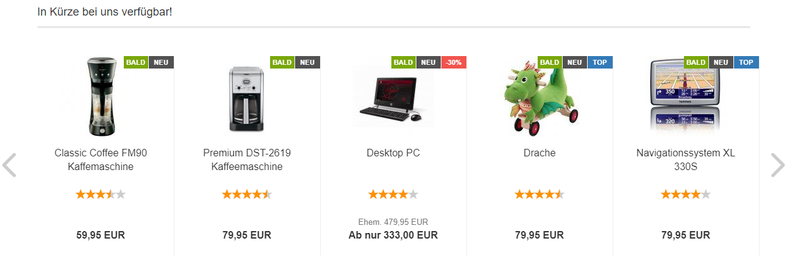

|Feldname|Beschreibung|
|--------|------------|
|In Kürze verfügbare Produkte in Swiper anzeigen|Artikelankündigungen werden im Swiper auf der Startseite angezeigt.|
|Empfehlungen in Swiper anzeigen|Empfehlungen werden im Swiper auf der Startseite angezeigt.|
|Angebote in Swiper anzeigen|Sonderangebote werden im Swiper auf der Startseite angezeigt.|
|Neue Produkte in Swiper anzeigen|Neue Artikel werden im Swiper auf der Startseite angezeigt.|
|Zeitraum \(Tage\) für neue Artikel|Zeitraum in Tagen, wie lange ein Artikel als neu gilt|
|Sonderangebote|Maximale Anzahl an Sonderangeboten, die angezeigt werden sollen.|
|Artikelankündigungen|Maximale Anzahl an angekündigten Artikeln, die auf der Startseite angezeigt werden sollen.|
|Auswahlpool der neuen Artikel|Aus wie vielen neuen Artikeln sollen die zufällig angezeigten neuen Artikel in der Box und auf der Startseite ausgewählt werden?|
|Auswahlpool der Sonderangebote|Aus wie vielen Sonderangeboten sollen die zufällig angezeigten Sonderangebote in der Box und auf der Startseite ausgewählt werden?|
|Max. Zeichen für Artikelnamen auf der Startseite|Vorgabe für die maximale Zeichenanzahl bei Artikelnamen auf der Startseite. Die tatsächliche Anzahl hängt auch von der Wort-Trennung und der Kachelgröße ab.|
|Anzahl der Angebote auf der Startseite|Anzahl der Sonderangebote, die auf der Startseite angezeigt werden.|
|Anzahl der neuen Artikel auf der Startseite|Anzahl der neuen Artikel, die auf der Startseite angezeigt werden.|
|Anzahl der empfohlenen Artikel auf der Startseite|Anzahl der Empfehlungen, die auf der Startseite angezeigt werden.|
|Reihenfolge für Artikelankündigungen|Sollen Artikelankündigungen in aufsteigender oder absteigender Reihenfolge angezeigt werden?|
|Artikelankündigungen sortieren nach|Sollen Artikelankündigungen nach Erscheinungsdatum oder Artikelname sortiert werden?|
|Zeichenanzahl nach der die Artikelnamen im "Flyover" gekürzt werden.|Längenbegrenzung des Artikelnames im Flyover.|
|Zeichenanzahl nach der der Artikelkurztext im "Flyover" gekürzt wird.|Längenbegrenzung der Kurzbeschreibung im Flyover.|

#### Artikeldetailseite 

|Feldname|Beschreibung|
|--------|------------|
|Hersteller-Bilder anzeigen|Anzeige des Hersteller-Bilds auf der Artikeldetailseite|
|Zusatzfelder auf Detailseite aktivieren|Die Inhalte der Zusatzfelder werden auf der Detailseite angezeigt|
|Bilderzoom aktivieren|Aktivieren der Lupenfunktion für das Artikelbild|
|Merkzettel aktivieren|Aktivieren des Merkzettels auf der Artikeldetaiseite|
|"Frage zum Produkt"-Modul aktivieren?|Der Link Frage zu Produkt wird auf der Artikel-Detailseite unterhalb des Warenkorb-Buttons angezeigt|
|Facebook "Gefällt mir"-Button auf Detailseite aktivieren|Aktivieren des Gefällt Mir-Buttons auf der Artikeldetailseite|
|WhatsApp-Teilen-Button auf Detailseite aktivieren|Aktivieren des WhatsApp teilen-Buttons auf der Artikeldetailseite|
|Tweet-Button \(Twitter\) auf Detailseite aktivieren|Aktivieren des Tweet-Buttons auf der Artikeldetailseite|
|Pinterest-Button auf Detailseite aktivieren|Aktivieren des Pinterest-Buttons auf der Artikeldetailseite|
|Bildergalerie als Lightbox einbinden|Die Bildergalerie wird als Lightbox angezeigt|
|Bildergalerie aktivieren|Aktiviert die Bildergalerie auf der Artikeldetailseite \(standardmäßig aktiviert\).|
|"Datenblatt drucken"

Die Funktion Datenblatt drucken steht ggf. nicht in allen Templates oder Themes zur Verfügung.

|
|Artikelnummer anzeigen|Anzeige der Artikelnummer auf der Artikeldetailseite aktivieren|
|Ebenfalls gekauft|maximale Anzahl der ebenfalls gekauften Artikel, die in der Artikeldetailansicht angezeigt werden sollen|
|Zeitraum \(Tage\) für ebenfalls gekaufte Artikel|Zeitraum in Tagen, wie alt die Bestellung des ebenfalls gekauften Artikels sein darf.|
|Reverse Cross Marketing|maximale Anzahl der Reverse Cross Marketing Artikel, die in der Box Dieses Produkt ist z.B. kompatibel zu in der Artikeldetailansicht angezeigt werden sollen|
|Ebenfalls gekauft|Minimum Anzahl der ebenfalls gekauften Artikel, die bei der Artikelansicht angezeigt werden sollen.|
|Kunden E-Mail-Adresse als Absender des "Frage zum Produkt"-Modul verwenden|Setzt die E-Mail-Adresse des Kunden als Absender ein, anstelle des in den E-Mail-Optionen eingestellten Absenders.|
|Reverse Cross

Das Reverse Cross-Marketing kann bei einer größeren Anzahl von Artikeln die Auslastung deines Server erhöhen. Bitte prüfe nach der Aktivierung, ob sich der Shop beim Aufruf der Artikel spürbar verlangsamt hat. Ist dies der Fall, sollte das Reverse Cross-Marketing nach Möglichkeit nicht verwendet werden.

|

#### Artikelübersicht 

|Feldname|Beschreibung|
|--------|------------|
|Lagerbestand anzeigen \(z. B. Suchergebnisse, Hersteller-Artikel\)|Lagerbestand in der Artikelübersicht anzeigen|
|Artikelattribute anzeigen \(z. B. Suchergebnisse, Hersteller-Artikel\)|Attribute in der Artikelübersicht anzeigen|
|Staffelpreise anzeigen \(z. B. Suchergebnisse, Hersteller-Artikel\)|Staffelpreise in der Artikelübersicht anzeigen|
|Mengeneingabefeld anzeigen \(z. B. Suchergebnisse, Hersteller-Artikel\)|Mengeneingabefeld in der Artikelübersicht anzeigen|
|Gekachelte Artikelauflistung \(z. B. Suchergebnisse, Hersteller-Artikel\)|Wenn aktiviert, werden Artikel in der Artikelübersicht gekachelt angezeigt, sonst in Listenform|
|Hersteller-Bilder anzeigen|Hersteller-Bilder in der Artikelübersicht anzeigen|
|Artikelnummer anzeigen|Anzeige der Artikelnummer in der Artikelübersicht aktivieren|
|Länge des Herstellernamens|Maximale Länge von Herstellernamen in der Hersteller-Box|
|Hersteller-Liste Schwellenwert|Wenn die Anzahl der Hersteller in der Hersteller-Box diesen Schwellenwert übersteigt, wird ein Dropdown anstatt einer Liste angezeigt.|
|Seiten blättern - Einzelseiten|Anzahl der Einzelseiten, für die im Seitennavigationsmenü ein Link angezeigt werden soll.|
|Artikelanzahl in Kategorie / auf Suchergebnisseite|Anzahl der Artikel, die auf Kategorie-Seiten oder auf der Suchergebnisseite angezeigt werden|
|Hersteller-Liste|Wenn der Wert auf 1 gesetzt wird, wird die Hersteller-Box als Drop-Down-Liste angezeigt. Andernfalls als Liste \(Wert auf 0\).|
|Hersteller- und Kategorie-Filter anzeigen?|Anzeige des Kategorie- bzw. Hersteller-Dropdowns in der Artikelübersicht.|

#### Kategorien 

|Feldname|Beschreibung|
|--------|------------|
|Artikelanzahl hinter Kategorienamen?|bei ✔wird hinter den Kategorienamen im Kategoriemenü die Anzahl der enthaltenen Artikel angezeigt|
|Horizontale Kategorie-Navigation im Header anzeigen|Kategorie-Anzeige im Top-Menü wird verwendet|
|Horizontale Kategorie-Navigation Kategorien bis zu folgender Tiefe darstellen|Unterkategorien bis zu dieser Ebene werden im horizontalen Kategoriemenü angezeigt|
|Vertikale Kategorie-Navigation in der Sidebar anzeigen|Kategorie-Anzeige in der linken Spalte wird verwendet|
|In vertikaler Navigation nur Unterkategorien der aktuellen Kategorie anzeigen|Im linken Kategoriemenü nur die Unterkategorien der geöffneten Kategorie anzeigen|
|Klick auf Kategorie in vertikaler Navigation klappt Unterkategorien auf statt hineinzugehen|Im linken Kategoriemenü können die Unterkategorien aufgeklappt werden|
|Kategorietiefe bis zu der die vertikale Navigation immer aufgeklappt angezeigt wird|Wie viele Ebenen des linken Kategoriemenüs sollen standardmäßig aufgeklappt sein?|
|Maximale Kategorietiefe bis zu der die vertikale Navigation aufgeklappt werden kann|Bis zu dieser Tiefe lassen sich Kategorien aufklappen|
|Vertikale Kategorie-Navigation in der Sidebar anzeigen \(ohne Untermenüs\)|Kategorie-Anzeige in der linken Spalte wird verwendet|
|Kategorie Icon|Aktiviert das Kategorie

Die Funktion steht ggf. nicht in allen Templates oder Themes zur Verfügung.

|
|Ebene\(n\) in der Kategorieführung anzeigen|Legt fest, welche Ebenen in der Kategorieführung angezeigt werden sollen.!!! Info "Hinweis"
	

Die Funktion steht ggf. nicht in allen Templates oder Themes zur Verfügung.

|
|Anzahl an Kategorien pro Zeile|Anzahl an Kategorien, die pro Zeile in den Übersichten angezeigt werden sollen|

#### Topmenü 

|Feldname|Beschreibung|
|--------|------------|
|Währungsauswahl im Top-Menü aktivieren|Währungsauwahl im Top-Menü wird verwendet|
|Wohnort im Top-Menü aktivieren|Wohnortauswahl im Top-Menü wird verwendet|

#### Warenkorb 

|Feldname|Beschreibung|
|--------|------------|
|Artikelnummer im Warenkorb/Merkzettel anzeigen|Anzeige der Artikelnummer in Warenkorb/Merkzettel aktivieren|
|"Weiter einkaufen"-Button immer anzeigen|An- und Abschalten des Buttons Weiter einkaufen im Warenkorb|
|Artikelanzahl statt Artikelstückzahl im kleinen Warenkorb anzeigen|Anzahl der verschiedenen Artikel im Warenkorb anstatt der Gesamtzahl an Artikeln anzeigen|

#### Bewertungen 

|Feldname|Beschreibung|
|--------|------------|
|Produktbewertungen aktivieren|Kundenrezensionen aktivieren|
|Art der Namensdarstellung bei zukünftigen Produktrezensionen|Wenn Kundenrezensionen zu einem Artikel angezeigt werden, wird hierbei auch der Name des Verfassers genannt. Über diese Einstellung kannst du festlegen, dass entweder der gesamte Name aufgeführt oder wahlweise der Vor- oder Nachname gekürzt wird. Folgende Werte können ausgewählt werden: -   Name nicht kürzen: es werden Vor- und Nachname angezeigt
-   Vorname kürzen: Es wird nur der erste Buchstaben des Vornamens und der Nachname angezeigt
-   Nachname kürzen: Es wird der Vorname und nur der erste Buchstabe des Nachnamens angezeigt

!!! Info "Hinweis"
	

Eine Änderung der Einstellung wirkt sich nur auf neue Kundenrezensionen aus. Bestehende Rezensionen bleiben in der Darstellung des Verfassers unverändert.

|
|Produktbewertungen in der Produktliste und in der gekachelten Artikelauflistung anzeigen?|Bewertungssterne in Artikelübersichten anzeigen|
|Produktbewertungen im Tab anzeigen|Kundenrezensionen werden in einem Artikeltab und nicht mehr unterhalb der Artikelbeschreibung angezeigt|
|Bewertungen in Artikeldetailansicht|Anzahl der angezeigten Bewertungen in der Artikeldetailansicht|
|Bewertungen|Mindestlänge der Texteingabe bei Bewertungen|
|Neue Bewertungen|Maximale Anzahl an neuen Bewertungen, die pro Seite angezeigt werden sollen|
|Auswahlpool der Bewertungen|Aus wie vielen Bewertungen sollen die zufällig angezeigten Bewertungen in der Box ausgewählt werden?|

#### Bildoptionen 

Im Shopsystem werden die Artikelbilder beim Hochladen automatisch an die verschiedenen Ausgangsgrößen angepasst. Für jedes Artikelbild werden dabei Kopien angelegt, die für ihre Verwendung skaliert sind. Die tatsächliche Anzeigegröße hängt hierbei von den Einstellungen im StyleEdit ab. Jedoch kann eine Änderung der Ausgangsgrößen erhebliche Auswirkungen auf Bildqualität und Ladezeit haben.

!!! Info "Hinweis"
	

Ausgangsgröße ist nicht gleich angezeigte Bildgröße. In Honeygrid und Malibu hängt die angezeigte Bildgröße von den Einstellungen im StyleEdit ab. Die Größen-Einstellungen in diesem Bereich wirken sich primär auf die Qualiät der Ausgangsbilder aus.

|Feldname|Beschreibung|
|--------|------------|
|Kleine Artikelbilder in Übersichten und Swipern verwenden|Verwendung der kleineren Thumbnails anstelle der Info-Bilder|
|Bildgröße berechnen|wenn aktiviert werden die Bildvarianten vom Shopsystem automatisch berechnet|
|Bildqualität|die JPEG-Qualität der umgewandelten Bilder in Prozent|
|Breite der Artikel-Thumbnails|Breite der Vorschaubild in Artikel-Listen, wenn Kleine Artikelbilder in Übersichten und Swipern verwenden aktiviert ist.|
|Höhe der Artikel-Thumbnails|Höhe der Vorschaubild in Artikel-Listen, wenn Kleine Artikelbilder in Übersichten und Swipern verwenden aktiviert ist.|
|Breite der Artikel-Info Bilder|Breite des Artikelbilds auf der Artikel-Detailseite und großer Vorschaubilder, wenn Kleine Artikelbilder in Übersichten und Swipern verwenden nicht aktiviert ist.|
|Höhe der Artikel-Info Bilder|Höhe des Artikelbilds auf der Artikel-Detailseite und großer Vorschaubilder, wenn Kleine Artikelbilder in Übersichten und Swipern verwenden nicht aktiviert ist.|
|Breite der Artikel-Popup Bilder|Breite der Bilder in Großansicht für Flyover, Zoom-Funktion und Artikelbild-Lightbox|
|Höhe der Artikel-Popup Bilder|Höhe der Bilder in Großansicht für Flyover, Zoom-Funktion und Artikelbild-Lightbox|

#### Bildeffekte 

|Feldname|Beschreibung|
|--------|------------|
|Artikel-Thumbnails: Kantenschräge|Kantenschräge des Bildes, ein Schatten verleiht dem Bild eine Kante. Standard-Wert: \(8,FFCCCC,330000\) Verwendung: \(Breite der Kante, Hex-Wert der hellen Farbe, Hex-Wert der dunklen Farbe\)|
|Artikel-Thumbnails: Schwarz/Weiß|Schwarz/Weiß, ersetzt die Rot-, Grün-, Blauanteile mit angegebenem Grauton \(0-255 = schwarz bis weiß\). Standard-Wert: \(32,22,22\) Verwendung: \(Dezimal-Wert Rotanteil, Dezimalwert Grünanteil, Dezimalwert Blauanteil\)|
|Artikel-Thumbnails: Ellipse|Ellipse, Bild erhält eine Ellipse als Rahmen. Standard-Wert: \(FFFFFF\) Verwendung: \(Hex-Wert Hintergrundfarbe\)|
|Artikel-Thumbnails: Eckenrundung|Eckenrundung, Ecken des Bildes werden abgerundet. Standard-Wert: \(5,FFFFFF,3\) Verwendung: \(Kanten-Radius, Hex-Wert Hintergrundfarbe, Breite Anti-Alias\)|
|Artikel-Thumbnails: Wasserzeichen|Wasserzeichen, setzt eine Wasserzeichen-Grafik in die Bilder. Standard-Wert: \(overlay.gif,10,-50,60,FF0000\) Verwendung: \(Bilddatei des Wasserzeichens, x-Wert der Start-Koordinate, Y-Wert der Startkoordinate, Transparenz, Hex-Wert der Wasserzeichen-Farbe\)|
|Artikel-Thumbnails: Rahmen|Rahmen, setzt einen Rahmen um das Bild. Standard-Wert: \(FFFFFF,000000,3,EEEEEE\) Verwendung: \(Hex-Wert helle Farbe, Hex-Wert dunkle Farbe, Breite des mittleren Teils,Hex-Wert der Rahmenfarbe \[optional, wird standardmäßig als Mittelwert der hellen und dunklen Farbe gebildet\]\)|
|Artikel-Thumbnails: Schatten|Schatten, wirft einen Schatten. Standard-Wert: \(3,333333,FFFFFF\) Verwendung: \(Breite des Schattens, Hex-Wert der Schatten-Farbe, Hex-Wert der Hintergrund-Farbe\)|
|Artikel-Thumbnails: Überlappungseffekt|Überlappungseffekt, überlappt das gleiche Bild mehrmals übereinander. Standard-Wert: \(4,FFFFFF\) Verwendung: \(Anzahl der Linien/Überlappungen, Hex-Wert der Hintergrundfarbe\)|
|Artikel-Info Bilder: Kantenschräge|Kantenschräge des Bildes, ein Schatten verleiht dem Bild eine Kante. Standard-Wert: \(8,FFCCCC,330000\) Verwendung: \(Breite der Kante, Hex-Wert der hellen Farbe, Hex-Wert der dunklen Farbe\)|
|Artikel-Info Bilder: Schwarz/Weiß|Schwarz/Weiß, ersetzt die Rot-, Grün-, Blauanteile mit angegebenem Grauton \(0-255 = schwarz bis weiß\). Standard-Wert: \(32,22,22\) Verwendung: \(Dezimal-Wert Rotanteil, Dezimalwert Grünanteil, Dezimalwert Blauanteil\)|
|Artikel-Info Bilder: Ellipse|Ellipse, Bild erhält eine Ellipse als Rahmen. Standard-Wert: \(FFFFFF\) Verwendung: \(Hex-Wert Hintergrundfarbe\)|
|Artikel-Info Bilder: Eckenrundung|Eckenrundung, Ecken des Bildes werden abgerundet. Standard-Wert: \(5,FFFFFF,3\) Verwendung: \(Kanten-Radius, Hex-Wert Hintergrundfarbe, Breite Anti-Alias\)|
|Artikel-Info Bilder: Wasserzeichen|Wasserzeichen, setzt eine Wasserzeichen-Grafik in die Bilder. Standard-Wert: \(overlay.gif,10,-50,60,FF0000\) Verwendung: \(Bilddatei des Wasserzeichens, x-Wert der Start-Koordinate, Y-Wert der Startkoordinate, Transparenz, Hex-Wert der Wasserzeichen-Farbe\)|
|Artikel-Info Bilder: Rahmen|Rahmen, setzt einen Rahmen um das Bild. Standard-Wert: \(FFFFFF,000000,3,EEEEEE\) Verwendung: \(Hex-Wert helle Farbe, Hex-Wert dunkle Farbe, Breite des mittleren Teils,Hex-Wert der Rahmenfarbe \[optional, wird standardmäßig als Mittelwert der hellen und dunklen Farbe gebildet\]\)|
|Artikel-Info Bilder: Schatten|Überlappungseffekt, überlappt das gleiche Bild mehrmals übereinander. Standard-Wert: \(4,FFFFFF\) Verwendung: \(Anzahl der Linien/Überlappungen, Hex-Wert der Hintergrundfarbe\)|
|Artikel-Info Bilder: Überlappungseffekt|Überlappungseffekt, überlappt das gleiche Bild mehrmals übereinander. Standard-Wert: \(4,FFFFFF\) Verwendung: \(Anzahl der Linien/Überlappungen, Hex-Wert der Hintergrundfarbe\)|
|Artikel-Popup Bilder: Kantenschräge|Kantenschräge des Bildes, ein Schatten verleiht dem Bild eine Kante. Standard-Wert: \(8,FFCCCC,330000\) Verwendung: \(Breite der Kante, Hex-Wert der hellen Farbe, Hex-Wert der dunklen Farbe\)|
|Artikel-Popup Bilder: Schwarz/Weiß|Schwarz/Weiß, ersetzt die Rot-, Grün-, Blauanteile mit angegebenem Grauton \(0-255 = schwarz bis weiß\). Standard-Wert: \(32,22,22\) Verwendung: \(Dezimal-Wert Rotanteil, Dezimalwert Grünanteil, Dezimalwert Blauanteil\)|
|Artikel-Popup Bilder: Ellipse|Ellipse, Bild erhält eine Ellipse als Rahmen. Standard-Wert: \(FFFFFF\) Verwendung: \(Hex-Wert Hintergrundfarbe\)|
|Artikel-Popup Bilder: Eckenrundung|Eckenrundung, Ecken des Bildes werden abgerundet. Standard-Wert: \(5,FFFFFF,3\) Verwendung: \(Kanten-Radius, Hex-Wert Hintergrundfarbe, Breite Anti-Alias\)|
|Artikel-Popup Bilder: Wasserzeichen|Wasserzeichen, setzt eine Wasserzeichen-Grafik in die Bilder. Standard-Wert: \(overlay.gif,10,-50,60,FF0000\) Verwendung: \(Bilddatei des Wasserzeichens, x-Wert der Start-Koordinate, Y-Wert der Startkoordinate, Transparenz, Hex-Wert der Wasserzeichen-Farbe\)|
|Artikel-Popup Bilder: Rahmen|Rahmen, setzt einen Rahmen um das Bild. Standard-Wert: \(FFFFFF,000000,3,EEEEEE\) Verwendung: \(Hex-Wert helle Farbe, Hex-Wert dunkle Farbe, Breite des mittleren Teils,Hex-Wert der Rahmenfarbe \[optional, wird standardmäßig als Mittelwert der hellen und dunklen Farbe gebildet\]\)|
|Artikel-Popup Bilder: Schatten|Überlappungseffekt, überlappt das gleiche Bild mehrmals übereinander. Standard-Wert: \(4,FFFFFF\) Verwendung: \(Anzahl der Linien/Überlappungen, Hex-Wert der Hintergrundfarbe\)|
|Artikel-Popup Bilder: Überlappungseffekt|Überlappungseffekt, überlappt das gleiche Bild mehrmals übereinander. Standard-Wert: \(4,FFFFFF\) Verwendung: \(Anzahl der Linien/Überlappungen, Hex-Wert der Hintergrundfarbe\)|

## Artikeltyp festlegen 

Nach der Verbraucherrechterichtlinie wird bei im Shop vorhandenen Artikeln nach Standard- Artikeln \(materiellen Produkten\), Download-Artikeln und Dienstleistungen unterschieden. Diese Klassifizierung ist shopseitig notwendig, um bei Downloads und Dienstleistungen ggf. auf das Widerrufsrecht verzichten zu können. Zudem besteht die Möglichkeit, den genannten Verzicht als Pflichteingabe im Bestellprozess festzulegen.

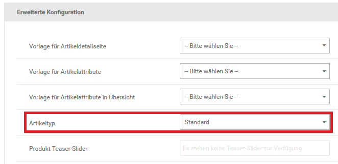

Um die Einstellung in deinen Artikeln vorzunehmen, bearbeite diese unter Artikel \> Artikel/Kategorien. Alternativ kann auch die Schaltfläche Produkt bearbeiten in der Artikeldetailansicht verwendet werden.

Die Klassifizierung erfolgt über das Dropdown-Menü Artikeltyp. Hier kann zwischen Standard, Download und Dienstleistung gewählt werden. Die Voreinstellung beim Anlegen eines neuen Artikels ist Standard.

Die genannte Einstellung ist auch Bestandteil von Importen und Exporten unter Artikel \> CSV Import/Export bzw. Import/Export \> Artikeldaten\(alt\). Hier wird das Feld product\_type für die entsprechende Angabe verwendet, für die einzelnen Auswahlmöglichkeiten \(Deutsch/Englisch\) stehen folgende Zahlenwerte:

|Wert|Bedeutung|
|----|---------|
|1|Standard/Default|
|2|Download/Download|
|3|Dienstleistung/Service|

Unter Import/Export \> Artikeldaten trägt die Spalte die Bezeichnung p\_type.

## Einstellungen zur Darstellung 

An mehreren Stellen unter dem Menüpunkt Shop Einstellungen kannst du allgemeine Einstellungen zu Darstellungsoptionen deines Shops vornehmen. Einstellungen zum Aussehen deines Shops nimmst du mit dem Zusatzmodul StyleEdit vor. Nähere Informationen zu StyleEdit erhältst du im Kapitel Darstellung.

Die Tabelle Darstellungsoptionen unter Shop Einstellungen \> Mein Shop bietet eine Übersicht über die Konfigurationsfelder, die unter Shop Einstellungen \> Mein Shop bezüglich der Darstellung bearbeitet werden.

|Feldname|Beschreibung|
|--------|------------|
|Reihenfolge für Artikelankündigungen|die Reihenfolge, in der angekündigte Artikel angezeigt werden \[aufsteigend\]|
|Artikelankündigungen sortieren nach|wonach die Artikelankündigungen sortiert werden sollen \[Erscheinungsdatum\]|
|Soll nach Ablegen eines Artikels in den Warenkorb der Warenkorb angezeigt werden?|bei ✔ wird der Warenkorb angezeigt, sobald ein Artikel hineingelegt wurde \[✔\]|
|Artikelanzahl hinter Kategorienamen?|bei ✔wird hinter den Kategorienamen im Kategoriemenü die Anzahl der enthaltenen Artikel angezeigt \[✖\]|
|Eigenschaft-Artikelnummer anhängen|bei ✔ wird Artikeln mit Eigenschaften die Artikelnummer der Kombination angehängt, bei ✖ wird die Artikelnummer des Artikels ersetzt \[✔\]|
|Artikelnummer im Warenkorb/ Merkzettel anzeigen|bei ✔ wird im Warenkorb und auf dem Merkzettel die Artikelnummer angezeigt \[✖\]|

Die Tabelle Darstellungsoptionen unter Shop Einstellungen \> Maximum Werte bietet eine Übersicht über die Konfigurationsfelder, die unter Shop Einstellungen \> Maximum Werte bezüglich der Darstellung bearbeitet werden.

|Feldname|Beschreibung|
|--------|------------|
|Artikelanzahl in Kategorie / auf Suchergebnisseite|Anzahl der Artikel, die auf Kategorie-Seiten oder auf der Suchergebnisseite angezeigt werden \[8\]|
|Seiten blättern - Einzelseiten|Anzahl der Einzelseiten, für die im Seitennavigationsmenü ein Link angezeigt werden soll \[4\]|
|Sonderangebote|maximale Anzahl an Sonderangeboten, die angezeigt werden sollen \[8\]|
|Artikelankündigungen|maximale Anzahl an angekündigten Artikeln, die auf der Startseite angezeigt werden sollen \[0\]|
|Hersteller-Liste Schwellenwert|Hersteller-Box: Wenn die Anzahl der Hersteller diesen Schwellenwert übersteigt, wird anstatt der üblichen Liste eine Drop-Down-Liste angezeigt. \[1\]|
|Hersteller-Liste|Hersteller-Box: Wenn der Wert auf „1“ gesetzt wird, wird die Hersteller-Box als Drop-Down-Liste angezeigt. Andernfalls als Liste \(Wert auf „0“\)|
|Länge des Herstellernamens|Hersteller-Box: maximale Länge von Herstellernamen in der Hersteller-Box \[15\]|
|Neue Bewertungen|maximale Anzahl an neuen Bewertungen, die pro Seite angezeigt werden sollen \[6\]|
|Auswahlpool der Bewertungen|Aus wie vielen Bewertungen sollen die zufällig angezeigten Bewertungen in der Box ausgewählt werden? \[10\]|
|Auswahlpool der neuen Artikel|Aus wie vielen neuen Artikeln sollen die zufällig angezeigten neuen Artikel in der Box und auf der Startseite ausgewählt werden? \[30\]|
|Auswahlpool der Sonderangebote|Aus wie vielen Sonderangeboten sollen die zufällig angezeigten Sonderangebote in der Box und auf der Startseite ausgewählt werden? \[10\]|
|Anzahl an Kategorien pro Zeile|Anzahl an Kategorien, die pro Zeile in den Übersichten angezeigt werden sollen \[2\]|
|Neue Artikel Liste|maximale Anzahl neuer Artikel, die in der Liste angezeigt werden sollen \[10\]|
|Bestseller|maximale Anzahl an Bestsellern, die angezeigt werden sollen \[5\]|
|Ebenfalls gekauft|maximale Anzahl der ebenfalls gekauften Artikel, die in der Artikeldetailansicht angezeigt werden sollen \[4\]|
|Bestellübersichts-Box|maximale Anzahl an Artikeln, die in der persönlichen Bestellübersichts-Box des Kunden angezeigt werden sollen \[6\]|
|Bestellübersicht|maximale Anzahl an Bestellungen, die in der Übersicht im Kundenbereich des Shops angezeigt werden sollen \[5\]|
|Bewertungen in Artikeldetailansicht|Anzahl der angezeigten Bewertungen in der Artikeldetailansicht \[5\]|

!!! Info "Hinweis"
	 Die Einstellung Anzahl an Kategorien pro Zeile wirkt sich nur im EyeCandy aus. Für das Honeygrid wird die Einstellung hierzu im StyleEdit vorgenommen.

## Kunden 

#### Kunden 

|Feldname|Beschreibung|
|--------|------------|
|Vorgabe für Kontoart|Welche Kontoart soll im Anmeldevorgang vorausgewählt sein \(Gastkonto: kein Haken für das Anlegen eines Kundenkontos gesetzt, Kundenkonto: Haken für das Anlegen eines Kundenkontos gesetzt\)|
|Löschen von Gastkonten|Soll das Gastkonto nach erfolgreicher Bestellung gelöscht werden?|
|Adressbucheinträge|Maximal erlaubte Anzahl an Adressbucheinträgen|
|Bestellübersicht|Maximale Anzahl an Bestellungen, die in der Übersicht unter Ihr Konto angezeigt werden sollen.|
|Standardwert für Gewerbetreibender-Status|Standardwert für den Gewerbetreibender-Status bei der Kundenanmeldung, greift auch, wenn die Einstellung nicht angezeigt wird.|
|Bestellübersichts-Box|Maximale Anzahl an Artikeln, die in der persönlichen Bestellübersichts-Box des Kunden angezeigt werden sollen|
|Kundengruppencheck|Aktiviert den Kundengruppencheck zur Zugangsbeschränkung von Inhalten nach Kundengruppe. Weitere Informationen findest du im Kapitel Kundengruppencheck.|
|Kundengruppe für Neukunden|Kundengruppe, der ein Kunde nach der Anmeldung zugeordnet wird.|
|Art der Kontoerstellung|Welche Art Konto soll bei der Anmeldung erstellt werden können?-   bei der Kontoerstellung Kundenkonto können ausschließlich registrierte Kunden in deinem Shop bestellen
-   bei der Kontoerstellung Gastkonto können keine Kundenkonten für Stammkunden angelegt werden
-   bei der Kontoerstellung beides können Kunden sich in deinem Shop registrieren oder ohne Kundenkonto bestellen

|

#### Kundendaten 

|Feldname|Beschreibung|
|--------|------------|
|Anrede als Pflichtfeld|Legt fest, ob die Anrede bei der Kundenanmeldung zwingend ausgefüllt werden muss.|
|Addresszusatzfeld anzeigen|Soll das Adresszusatzfeld bei der Kundenanmeldung angezeigt werden?|
|Gewerbetreibender-Status|Abfrage des Gewerbetreibender-Status bei der Kundenanmeldung|
|Firma|Abfrage für Firma und Umsatzsteuer-ID bei der Kundennameldung|
|Geburtsdatum|Abfrage des Geburtsdatum bei der Kundenanmeldung|
|Faxnummer|Abfrage der Faxnummer bei der Kundenanmeldung|
|Anrede|Abfrage der Anrede bei der Kundenanmeldung|
|Vor- & Nachname optional|Soll die Angabe von Vor- und Nachname bei der Kundenanmeldung optional sein, wenn ein Firmenname angegeben wird?|
|Straße und Hausnummer trennen|Sollen für Straße und Hausnummer zwei getrennte Eingabefelder bei der Kundenanmeldung verwendet werden?CAUTION:

Externe Module \(Zahlungsmodule, ERP, Warenwirtschaften etc.\) müssen Straße und Hausnummer getrennt verarbeiten können. Wenn du dir nicht sicher bist, lasse diese Option deaktiviert.

|
|Bundesland|Abfrage des Bundeslandes bei der Kundenanmeldung|
|Stadtteil|Abfrage des Stadtteils bei der Kundenanmeldung|
|Telefonnummer|Abfrage der Telefonnummer bei der Kundenanmeldung|

#### Mindestlänge für Kundenfelder 

Über die Mindstlänge können Felder als Plfichtfelder festgelegt werden. Ist für die Mindestlänge ein Wert größer als 0 eingetragen, ist das betreffende Feld ein Pflichtfeld.

!!! Info "Hinweis"
	

Die Firma kann standardmäßig nicht als Pflichtangabe gesetzt werden. Eine Prüfung der Mindestlänge findet nur dann statt, wenn eine Eingabe in diesem Feld erfolgt.

|Feldname|Beschreibung|
|--------|------------|
|Stadt|Mindestlänge des Städtenamens|
|Firma|Mindestlänge des Firmennamens|
|Geburtsdatum|Mindestlänge des Geburtsdatums|
|E-Mail-Adresse|Mindestlänge der E-Mail-Adresse|
|Vorname|Mindestlänge des Vornamens|
|Hausnummer|Mindestlänge der Hausnummer|
|Nachname|Mindestlänge des Nachnamens|
|Passwort|Mindestlänge des Passworts|
|Postleitzahl|Mindestlänge der Postleitzahl|
|Bundesland|Mindestlänge des Bundeslandes|
|Straße|Mindestlänge der Straßenanschrift|
|Telefonnummer|Mindestlänge der Telefonnummer|

## Statistiken löschen 

Über den Reiter Statistiken löschen können bei Bedarf die shopeigenen Statistiken geleert werden. Dies kann z.B. dann sinnvoll sein, wenn auf Basis einer bestehenden Shopdatenbank ein neuer Shop erstellt worden ist.

Setze die Haken für die gewünschte\(n\) Statisik\(en\) und bestätige mit Klick auf den Button Löschen.

## Sessions 

Unter Shop Einstellungen \> System Einstellungen \> Sessions werden die Einstellungen vorgenommen die Auswirkungen auf die Funktionen der jeweiligen Session haben, wie z.B. das Einloggen, den Warenkorb und Merkzettel.

CAUTION:

Änderungen in diesem Bereich können die Funktionsfähigkeit des Shops unter Umständen beeinflussen.

Bitte führe hier nur Änderungen durch, wenn du dir über die möglichen Folgen im Klaren bist und du dir sicher bist, dass diese Funktion vom Server unterstützt wird!

#### Überprüfen der SSL Session ID 

Wenn diese Option auf ✔ gesetzt wurde, wird die Session ID bei SSL Verbindungen über HTTPS daraufhin geprüft, ob diese mit der Session ID ohne SSL identisch ist.

Dies kann zur Folge haben, dass ein Einloggen nicht mehr möglich ist, sollten die Session IDs voneinander abweichen. Diese Option sollte daher nicht gesetzt werden.

#### Überprüfen des User Browsers 

Wenn diese Option auf ✔ eingestellt ist, wird der Browser des Kunden daraufhin überprüft ob dieser einen korrekten Referer enthält. Sollte der Browser des Kunden nicht erkannt werden, kann das Einloggen für diesen unmöglich werden. Diese Option ist standardmäßig nicht gesetzt.

#### Überprüfen der IP-Adresse 

Wenn diese Option gesetzt wurde, wird geprüft, ob sich die IP Adresse des Kunden zwischen den Seitenaufrufen geändert hat. Ist dies der Fall, wird die Session zwangsweise beendet und der Kunde ist nicht mehr eingeloggt. Dies kann sehr unerwartet auftreten, beispielsweise wenn die IP Adresse kundenseitig durch eine erneute Einwahl ins Internet geändert wurde.

Diese Option sollte daher ebenfalls nicht gesetzt werden, um den Verlust der Session zu vermeiden.

#### Session erneuern 

Diese Option erneuert die Session ID, wenn der Kunde sich während einer Session ausloggt und wieder einloggt. Da dies aber einige Server von sich aus vornehmen, ist diese Einstellung standardmäßig nicht gesetzt. Diese Option kann erst ab der PHP Version 4.1 genutzt werden, da bei älteren Varianten die Sitzung in Mitleidenschaft gezogen wird. Wenn die Sitzung erfolgreich erneuert wurde, bleiben Warenkorb und Login erhalten.

#### Session Gültigkeitsdauer 

Legt die Dauer in Minuten fest, wie lange eine Session im Gambio Admin gültig ist. Nach Ablauf dieser festgelegten Zeit wird die Session entfernt und eine erneute Anmeldung ist erforderlich!

#### Spider Sessions vermeiden 

Hierdurch kann verhindert werden, dass Bots von Suchmaschinen eine Session im Shop erhalten. Mit einer Session könnten diese Bots Artikel in den Warenkorb legen und würden als normale Besucher gewertet. Die Einstellung ist standardmäßig gesetzt.

## Festlegen der Versand- & Zahlungsbedingungen 

Der Content Versand- & Zahlungsbedingungen \(ID 3889891\) verfügt über eine Matrix zur Auflistung der Versandkosten und Zahlungsweisen für die im Shop aktivierten Länder. Im Textfeld wird diese Matrix mit Hilfe des Platzhalters \{$shipping\_and\_payment\_ matrix\} eingebunden. Dieser ist standardmäßig im Content vorhanden.

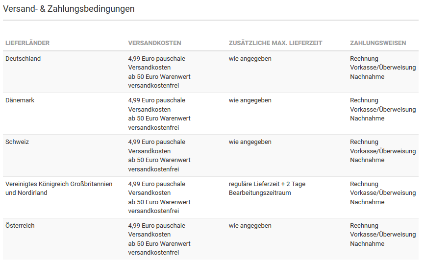

CAUTION:

Ohne den Plartzhalter \{$shipping\_and\_payment\_matrix\} wird die Matrix nicht angezeigt. Dieser Text muss also im Content bestehen bleiben, wenn die Matrix verwendet werden soll.

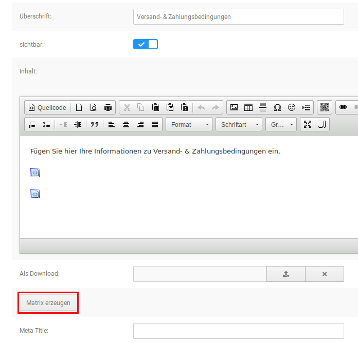

Um diesen Inhalt für deinen Shop zu erzeugen, öffne Darstellung \> Content Manager und bearbeite den Content Versand- & Zahlungsbedingungen \(ID 3889891\). Klicke auf die Schaltfläche Matrix erzeugen, die du links unter dem Texteingabefeld findest.

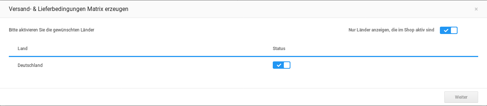

Im ersten Schritt werden die Versandländer bestätigt. Diese werden in alphabetischer Reihenfolge mit ihrem jeweiligen Status aufgelistet. Mit Hilfe des Hakens, der für das Feld Nur Länder anzeigen, die im Shop aktiv sind gesetzt werden kann, lässt sich die Auswahl entsprechend einschränken. Aktiviere bzw. deaktiviere die Länder, indem du den zugehörigen Haken in der Spalte Status setzt respektive entfernst, um die Zusammenstellung deiner Versandländer festzulegen.

!!! Info "Hinweis"
	 Die für den Versand aktivierten und für die Matrix aktivierten Länder sind unabhängig voneinander. Die in der Matrix als aktiviert angezeigten Länder müssen also nicht zwangsläufig unter Shop Einstellungen \> Land/Steuer \> Länder aktiviert sein. Änderungen in einem Bereich haben keine Auswirkungen auf den anderen Bereich.

Mit Klick auf Weiter wird die Auswahl bestätigt und die Ansicht wechselt zu den Eingabebereichen der Matrix.

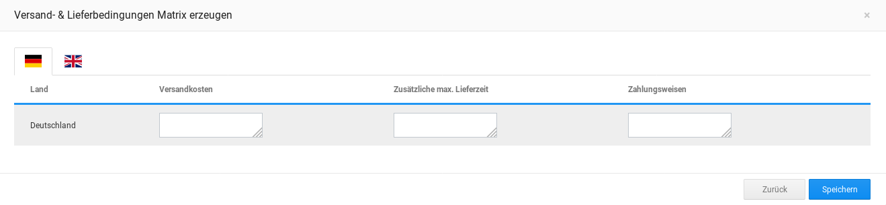

Hier können, für jedes Land individuell, folgende Informationen eingetragen werden

-   Versandhinweise: dieses Feld wird im Shop als Versandkosten angezeigt, hier können die einzelnen Versandkosten sowie Hinweise hierzu aufgeführt werden.
-   Zusätzliche max. Lieferdauer
-   Zahlungshinweise: dieses Feld wird im Shop als Zahlungsweisen angezeigt, hier werden die verfügbaren Zahlungsmethoden \(z.B. Paypal oder Vorkasse/Überweisung\) sowie Hinweise hierzu aufgeführt.

Die Eintragung kann nach Sprachen getrennt \(standardmäßig deutsch/englisch\) vorgenommen werden. Wenn über die Flaggen links oben zwischen den Sprachen umgeschaltet wird, bleiben die jeweils im anderen Bereich vorgenommenen Eintragungen erhalten.

Mit Klick auf Speichern werden die Einstellungen aus beiden Schritten gespeichert. Mit Klick auf Zurück wird die Länderauswahl erneut aufgerufen. Auch beim Wechsel zwischen den beiden Bildschirmen bleiben die im jeweils anderen Teil gemachten Einstellungen erhalten.

## Sendungsnummer zuordnen 

Um einen Paketdienst einer Bestellung zuzuordnen, gehe bitte im Gambio Admin in das Menü Bestellungen \> Bestellungen. Wähle die Bestellung durch einen Klick aus, sodass sie blau hinterlegt ist und klicke auf das Augen-Symbol, um die Bestellung aufzurufen.

Trage die Sendungsnummer in das Eingabefeld Sendungsnummer ein und wähle im Dropdown-Menü den zugehörigen Versanddienstleister aus. Klicke abschließend auf Hinzufügen.

Nun kann der Kunde, wenn er seine Bestellung unter Ihr Konto aufruft, über einen Link direkt zur Sendungsverfolgung des jeweiligen Anbieters gelangen.

Die zugewiesene Sendungsnummer, der Paketdienst, sowie das Datum der Zuweisung wird nun in der Detailansicht der Bestellung angezeigt.

## Einstellen des Widerrufsrechts 

Die Grundeinstellungen zum Widerrufsrecht werden unter Shop Einstellungen \> Rechtliches vorgenommen. Hierzu zählen der Reihe nach:

|Feldname|Beschreibung|
|--------|------------|
|Webformular anbieten|Soll der Link zum Online-Widerrufsformular angezeigt werden?|
|PDF-Formular anbieten|Soll das Widerrufsformular als PDF-Datei zur Verfügung stehen?|
|Content ID|ID

Diese Einstellung wird nur angezeigt, wenn die vergebene Content ID nicht dem Standardwert 3889895 entspricht.

|
|Webformular anbieten|Widerrufsformular zum online ausfüllen anbieten|
|PDF-Formular anbieten|Widerrufsformular zum Herunterladen als PDF anbieten|
|Widerrufsrecht-Link innerhalb der Bestellinformationen unter Mein Konto anzeigen|Der Abschnitt Widerrufsformular wird in den einzelnen Bestellungen unter Ihr Konto angezeigt. Dieser beinhaltet die Verweise unter Webformular anbieten und PDF-Formular anbieten.|
|AGB als PDF an Bestellbestätigung anhängen|Die Allgemeinen Geschäftsbedingungen werden der Bestellbestätigung als PDF-Anhang hinzugefügt.|
|Widerrufsbelehrung als PDF an Bestellbestätigung anhängen|Die Widerrufsbelehrung wird der Bestellbestätigung als PDF-Anhang hinzugefügt.|
|Widerrufsformular als PDF an Bestellbestätigung anhängen|Das Widerrufsformular wird der Bestellbestätigung als PDF-Anhang hinzugefügt.|
|Downloadverzögerung bei Verzicht auf das Widerrufsrecht|Zeit, bis das Herunterladen eines Download- Artikels möglich ist, wenn auf das Widerrufsrecht verzichtet wurde.|
|Downloadverzögerung ohne Verzicht auf das Widerrufsrecht|Zeit, bis das Herunterladen eines Download-Artikels möglich ist, wenn nicht auf das Widerrufsrecht verzichtet wurde.|
|Verzicht auf Widerrufsrecht für Download-Artikel als Pflichtfeld|Muss bei Download-Artikeln zwangsweise auf das Widerrufsrecht verzichtet werden?|
|Verzicht auf Widerrufsrecht für Dienstleistungen als Pflichtfeld|Muss bei Dienstleistungen zwangsweise auf das Widerrufsrecht verzichtet werden?|

Lege hier fest, in welchem Format du das Widerrufsformular anbieten möchtest, als PDF-Download und/oder Online-Formular. Stelle ein, ob die Verlinkung zum Widerrufsrecht unter Ihr Konto angezeigt werden soll. Außerdem kannst du wählen, welche deiner Rechtsinformationen \(AGB, Widerrufsbelehrung, Widerrufsformular\) der Bestellbestätigung als Anhang beigegeben werden soll. Zudem kann eingestellt werden, ob der Verzicht auf das Widerrufsrecht bei Download-Artikeln oder Dienstleitungen als Pflichtangabe gemacht werden soll. Schlussendlich kannst du die sogenannte Downloadverzögerung festlegen, sowohl mit als auch ohne den Verzicht auf das Widerrufsrecht.

## Lieferung 

#### Lieferstatus 

|Feldname|Beschreibung|
|--------|------------|
|Lieferstatus|Über aufrufen kann die Seite zum Anlegen und Konfigurieren der Lieferstatus angezeigt werden.|
|Lieferstatusanzeige aktivieren|Aktiviert bzw. deaktiviert die Lieferstatus-Anzeige im gesamten Shop|
|Lieferstatus automatisch aktualisieren|Hier sollte der Haken gesetzt werden, wenn der Lieferstatus nach einer Bestellung aktualisiert werden soll. Ist der Haken nicht gesetzt, findet keine Aktualisierung statt.|
|Versandkosten in Artikelinfos|Zeigt Link zu den Versandkosten-Informationen im Artikel an|
|Versandgewicht im Warenkorb|Zeigt das Versandgewicht im Warenkorb an|
|Versandkostenrechner im Warenkorb|Aktiviert die Versandkostenberechnung im Warenkorb|
|Postleitzahl des Versandstandortes|Postleitzahl des Standortes von dem versendet wird|
|Versandland|Land des Standortes vom dem versendet wird|
|Maximalgewicht, das als ein Paket versendet werden kann|Gibt das maximal pro Paket mögliche Gewicht ein. Die Eingabe erfolgt in Kilogramm|
|Versandkosten Content Seiten ID|Interne ID des Contents für Versand- & Zahlungsinformationen, standardmäßig 3889891|
|Paketleergewicht|Wenn du das Gewicht der Verpackung in den Versandkosten berücksichtigen möchtest, kannst du hier einen fixen Wert eingeben, zum Beispiel 0.4, wenn die Verpackung immer mit 400g berücksichtigt werden soll.|
|Bei größeren Leerpaketen - Gewichtszuwachs in %|Diese Eingabe ist ebenfalls optional und wird nur berücksichtigt, wenn das Paketleergewicht nicht ausgefüllt wurde. Du hast also die Möglichkeit, entweder das Paketleergewicht mit einem fixen Gewicht anzugeben oder einen Gewichtszuwachs, der einen bestimmten Prozentsatz des Artikelgewichtes beträgt. Gehst du bei der Berechnung der Versandkosten also davon aus, dass das Gewicht der Verpackung immer ca. 10% des Gesamtgewichtes ausmachen wird, so gib hier eine 10 ein.|

#### Versanddienstleister 

|Feldname|Beschreibung|
|--------|------------|
|Paketdienste|Klicke auf aufrufen, um die Konfigurationsseite für die Paketdienste anzuzeigen.|

## Lagerverwaltungs-Optionen 

Unter Shop Einstellungen \> Lagerverwaltungs-Optionen lässt sich die shopeigene Lagerverwaltung einrichten. Folgende Einstellungsmöglichkeiten sind gegeben:

|Feldname|Beschreibung|
|--------|------------|
|Artikel inaktiv setzen|Artikel auf inaktiv setzen, wenn diese nach einer Bestellung nicht mehr auf Lager sind|
|Attribut inaktiv setzen|Attributwerte/Attribut-Optionswerte ausblenden, wenn diese nicht mehr auf Lager sind|
|Attributlagerbestand anzeigen|Attributlagerbestand hinter jedem Attribut-Optionswert anzeigen|
|Überprüfen des Artikelbestandes|Prüfen, ob die Artikel in angeforderter Menge auf Lager sind, um Bestellung ausführen zu können|
|Überprüfen des Artikelattribut-Bestandes|Überprüfen, ob der Bestand von Artikelattributen in ausreichender Menge auf Lager ist, um Bestellung ausführen zu können|
|Artikelmenge abziehen|Artikelmenge vom Artikelbestand abziehen, wenn der Artikel bestellt wurde|
|Einkaufen nicht vorrätiger Artikel erlauben|Erlauben zu bestellen, auch dann, wenn bestimmte Artikel laut Lagerbestand nicht verfügbar sind|
|Kennzeichnung vergriffener Artikel|Kennzeichnung vergriffener Artikel, um dem Kunden kenntlich zu machen, welche Artikel nicht mehr verfügbar sind|
|Meldung an den Shopbetreiber, dass ein Artikel nachbestellt werden muss|Stückzahl ab welcher diese E-Mail versendet werden soll|
|Lagerbestand vor dem Warenkorb prüfen?|Überprüft den Lagerbestand bereits auf der Artikeldetailseite.|

!!! Info "Hinweis"
	 Lagerstands-Einstellungen greifen nur bedingt bei Artikel-Eigenschaften. Wenn Artikel- Eigenschaften verwendet werden, wird die Lagerverwaltung in den Kombinationen des Artikels eingestellt. Bearbeite hierzu den Artikel und klicke auf Eigenschaften.

#### Artikel inaktiv setzen 

Wenn Artikel inaktiv gesetzt werden sollen, müssen Überprüfen des Artikelbestandes und Artikelmenge abziehen auf Ja gesetzt sein, Einkaufen nicht vorrätiger Artikel hingegen auf Nein.

#### Attribute inaktiv setzen 

Diese Funktion sollte nur in Verbindung mit Artikel inaktiv setzen verwendet werden, damit Artikel, die nicht mehr auf Lager sind, nicht angezeigt werden. Anderenfalls können Artikel, dessen Attribute nicht mehr auf Lager sind, ohne Attribute in den Warenkorb gelegt werden.

## Paketdienste anlegen und bearbeiten 

Unter Shop Einstellungen \> Paketdienste kannst du die Dienstleister hinterlegen und bearbeiten. Klicke auf Hinzufügen, um einen neuen Paketversender anzulegen. Gib unter Name einen allgemeinen Bezeichner ein, z.B. DHL.

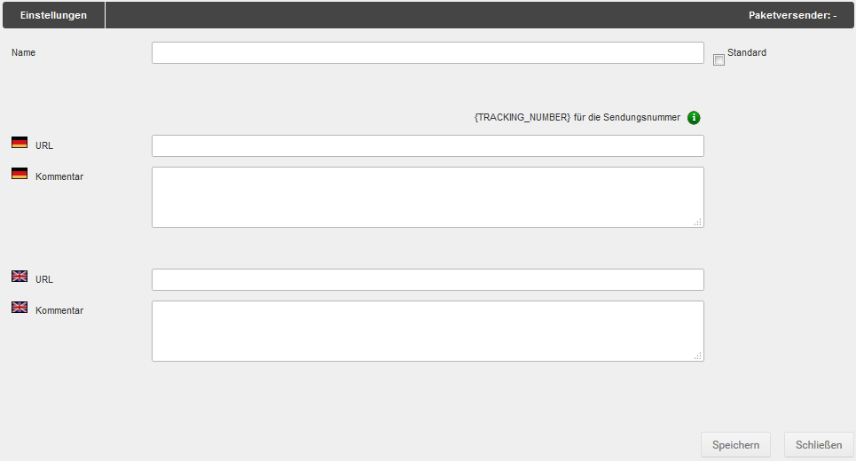

Trage bitte im Feld URL die Internetadresse ein, unter der sich die Sendungsverfolgung des jeweiligen Dienstleisters aufrufen lässt. Gib hierbei für die Sendungsnummer den Platzhalter \{TRACKING\_NUMBER\} ein.

In das Kommentarfeld kann zusätzlicher Text zum Paketdienst hinterlegt werden, der dem Kunden angezeigt wird, wenn er seine Bestellung unter Ihr Konto aufruft.

Wenn du unter mehreren Paketdiensten einen Anbieter üblicherweise verwedest, kannst du den Haken für Standard setzen. Der Paketdienst wird dann beim Zuweisen der Sendungsnummer zu einer Bestellung vorausgewählt \(siehe Sendungsnummer zuordnen\).

Mit einem Klick auf Speichern wird der Paketdienst angelegt bzw. die Änderung übernommen. Über Schließen kannst du das Eingabefenster ohne Übernahme der Änderungen verlassen.

Über das Bleistift-Symbol kannst du einen angelegten Paketdienst bearbeiten. Über das rote X kannst du einen angelegten Paketdienst wieder löschen.

