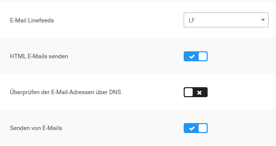
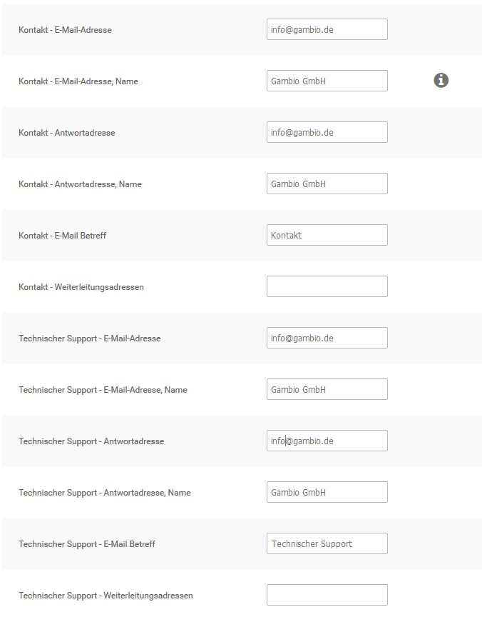

# E-Mail-Optionen 

An der Grundkonfiguration der E-Mail-Optionen muss bei Verwenden der E-Mail Transport- Methode mail keine Änderung vorgenommen werden.

## Sendmail 

Die E-Mail Transport-Methode sendmail sollte nicht verwendet werden. Wenn du sendmail aus technischen Gründen verwenden musst, stelle sicher, dass der Pfad zu Sendmail korrekt konfiguriert ist. Wenn du sendmail verwendest, stelle außerdem sicher, dass unter Shop Einstellungen \> Mein Shop im Feld E-Mail von eine gültige E-Mail Adresse eingetragen ist.

## SMTP-Einstellungen 

Wenn du die E-Mail Transport-Methode auf SMTP umstellst, beachte die Konfigurationsvariablen aus der Tabelle SMTP Konfigurationsvariablen.

|Feldname|Beschreibung|
|--------|------------|
|Adresse des SMTP Servers|Die Adresse des Servers für den E-Mail Versand|
|Adresse des SMTP Backup Servers|Falls der Server für den E-Mail Versand nicht erreichbar ist, werden E-Mails über den Backup Server verschickt|
|SMTP Port|Port für den E-Mail Versand \[25\]|
|SMTP Username|Benutzername für den E-Mail Versand|
|SMTP Passwort|Passwort für den E-Mail Versand|
|SMTP AUTH|Aktivieren, wenn der SMTP-Server AUTH voraussetzt \[nein\]|

**Note:** Wenn der Mailversand trotz korrekt vorgenommener Konfiguration im Shop nicht erfolgt, wende dich an deinen Hosting-Provider.

## Erweiterte Einstellungen 

CAUTION:

Änderungen an den erweiterten Einstellungen können dazu führen, dass E-Mails fehlerhaft angezeigt oder gar nicht versendet werden.

|Feldname|Beschreibung|
|--------|------------|
|E-Mail Linefeeds|Art der Zeilenumbrüche, die in E-Mails verwendet werden sollen|
|HTML E-Mails senden|Versenden von E-Mails als MIME HTML oder Reintext|
|Überprüfen der E-Mail- Adressen über DNS|E-Mails von Kunden vor dem Senden automatischer Mails auf Erreichbarkeit prüfen|
|Senden von E-Mails|Automatischen Versand von E-Mails aktivieren \(beispielsweise Bestellbestätigungen\)|
|Maximale Anzahl E-Mails pro Versand|Schränkt die Anzahl der E-Mails ein, die gleichzeitig versendet werden können|

## E-Mail Einstellungen 

Das Shopsystem versendet E-Mails von und an drei verschiedene shopinterne E-Mail Konten. In der Grundkonfiguration wird allen E-Mail Konten die bei Erstellung des Hauptadministrators während der Installationsroutine angegebene E-Mail Adresse hinterlegt.

Alle E-Mails werden im Namen des Shopbetreibers versandt. Den Namen des Shopbetreibers kannst du unter Shop Einstellungen \> Mein Shop im Feld Inhaber festlegen.

|Kontoname|Beschreibung|
|---------|------------|
|Kontakt|Vom E-Mail Konto Kontakt werden E-Mails von Kontaktformularen verschickt \(zum Beispiel Kundenkontakt, Artikel Weitermpfehlen\)|
|Technischer Support|Vom E-Mail Konto Technischer Support werden Kundenkonto bezogene E-Mails versendet \(zum Beispiel Kontoerstellungsmails, Passwortänderungen\)|
|Verrechnung|Vom E-Mail Konto Verrechnung werden E-Mails aus dem Verrechnungssystem verschickt \(zum Beispiel Bestellbestätigungen, Bestellstatus-Änderungen\)|

Jedem E-Mail Konto sind die folgenden Konfigurationsvariablen zugewiesen. Das Feld Weiterleitungsadressen ist im jeweiligen E-Mail Konto optional.

|Feldname|Beschreibung|
|--------|------------|
|E-Mail-Adresse|gib hier die Absenderadresse ein|
|E-Mail-Adresse, Name|gib hier den Absendernamen ein|
|Antwortadresse|gib hier eine gegebenenfalls abweichende Antwortadresse ein|
|Antwortadresse, Name|gib hier den Namen für die abweichende Anwortadresse ein|
|E-Mail Betreff|gib hier den Betreff für E-Mails von diesem Konto ein|
|Weiterleitungsadressen|gib hier kommagetrennt weitere E-Mail Adressen ein, an die ausgehende Nachrichten ebenfalls gesendet werden sollen; darf nicht die Adresse aus dem Feld E-Mail-Adresse enthalten|

**Note:** Bei manchen Server- und E-Mail-Konfigurationen kann der E-Mail Empfang beim Kunden fehlschlagen. Wenn deine Kunden keine Bestellbestätigungsmails erhalten, stelle sicher, dass die Option Absender der Bestellbestätigungsmail auf Betreiber E‑Mail steht.

