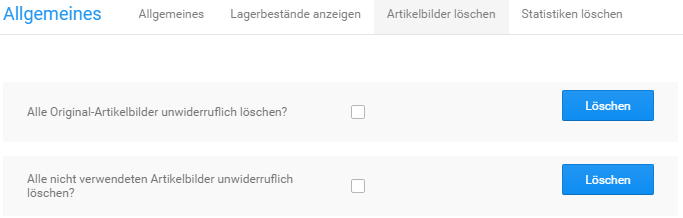

# Artikelbilder löschen {#artikelbilder_loeschen}

Unter Shop Einstellungen \> Allgemeines \> Artikelbilder löschen besteht die Möglichkeit Artikelbilder bei Bedarf zu löschen. Es können die Originalbilder \(Verzeichnis /images/product\_images/original\_images\) sowie nicht benötigte Artikelbilder, die keinem Artikel mehr zugeordnet sind, entfernt werden.

Setze hierzu den Haken in das Kästchen hinter die gewünschte Funktion und klicke auf Löschen.

CAUTION:

Die Original-Bilder werden für den Bilderzoom verwendet. Werden diese gelöscht, steht die Vergrößerung nicht mehr in der bisherigen Auflösung zur Verfügung.

