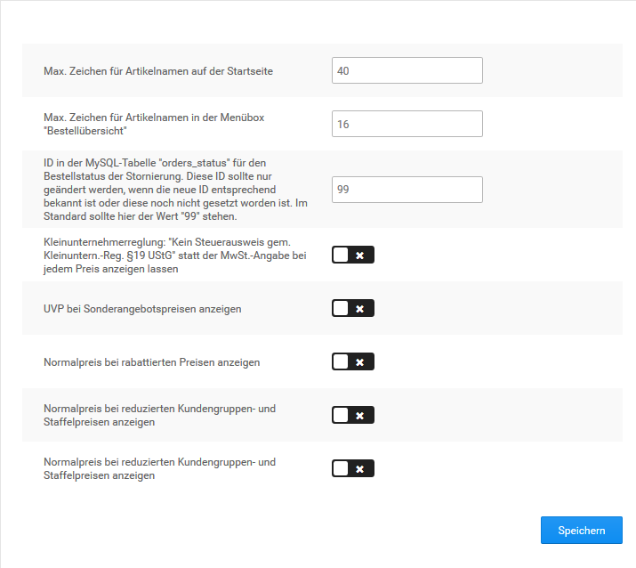

# Einstellungen zur Darstellung 

An mehreren Stellen unter dem Menüpunkt Shop Einstellungen kannst du allgemeine Einstellungen zu Darstellungsoptionen deines Shops vornehmen. Einstellungen zum Aussehen deines Shops nimmst du mit dem Zusatzmodul StyleEdit vor. Nähere Informationen zu StyleEdit erhältst du im Kapitel Darstellung.

Die Tabelle Darstellungsoptionen unter Shop Einstellungen \> Mein Shop bietet eine Übersicht über die Konfigurationsfelder, die unter Shop Einstellungen \> Mein Shop bezüglich der Darstellung bearbeitet werden.

|Feldname|Beschreibung|
|--------|------------|
|Reihenfolge für Artikelankündigungen|die Reihenfolge, in der angekündigte Artikel angezeigt werden \[aufsteigend\]|
|Artikelankündigungen sortieren nach|wonach die Artikelankündigungen sortiert werden sollen \[Erscheinungsdatum\]|
|Soll nach Ablegen eines Artikels in den Warenkorb der Warenkorb angezeigt werden?|bei ✔ wird der Warenkorb angezeigt, sobald ein Artikel hineingelegt wurde \[✔\]|
|Artikelanzahl hinter Kategorienamen?|bei ✔wird hinter den Kategorienamen im Kategoriemenü die Anzahl der enthaltenen Artikel angezeigt \[✖\]|
|Eigenschaft-Artikelnummer anhängen|bei ✔ wird Artikeln mit Eigenschaften die Artikelnummer der Kombination angehängt, bei ✖ wird die Artikelnummer des Artikels ersetzt \[✔\]|
|Artikelnummer im Warenkorb/ Merkzettel anzeigen|bei ✔ wird im Warenkorb und auf dem Merkzettel die Artikelnummer angezeigt \[✖\]|

Die Tabelle Darstellungsoptionen unter Shop Einstellungen \> Maximum Werte bietet eine Übersicht über die Konfigurationsfelder, die unter Shop Einstellungen \> Maximum Werte bezüglich der Darstellung bearbeitet werden.

|Feldname|Beschreibung|
|--------|------------|
|Artikelanzahl in Kategorie / auf Suchergebnisseite|Anzahl der Artikel, die auf Kategorie-Seiten oder auf der Suchergebnisseite angezeigt werden \[8\]|
|Seiten blättern - Einzelseiten|Anzahl der Einzelseiten, für die im Seitennavigationsmenü ein Link angezeigt werden soll \[4\]|
|Sonderangebote|maximale Anzahl an Sonderangeboten, die angezeigt werden sollen \[8\]|
|Artikelankündigungen|maximale Anzahl an angekündigten Artikeln, die auf der Startseite angezeigt werden sollen \[0\]|
|Hersteller-Liste Schwellenwert|Hersteller-Box: Wenn die Anzahl der Hersteller diesen Schwellenwert übersteigt, wird anstatt der üblichen Liste eine Drop-Down-Liste angezeigt. \[1\]|
|Hersteller-Liste|Hersteller-Box: Wenn der Wert auf „1“ gesetzt wird, wird die Hersteller-Box als Drop-Down-Liste angezeigt. Andernfalls als Liste \(Wert auf „0“\)|
|Länge des Herstellernamens|Hersteller-Box: maximale Länge von Herstellernamen in der Hersteller-Box \[15\]|
|Neue Bewertungen|maximale Anzahl an neuen Bewertungen, die pro Seite angezeigt werden sollen \[6\]|
|Auswahlpool der Bewertungen|Aus wie vielen Bewertungen sollen die zufällig angezeigten Bewertungen in der Box ausgewählt werden? \[10\]|
|Auswahlpool der neuen Artikel|Aus wie vielen neuen Artikeln sollen die zufällig angezeigten neuen Artikel in der Box und auf der Startseite ausgewählt werden? \[30\]|
|Auswahlpool der Sonderangebote|Aus wie vielen Sonderangeboten sollen die zufällig angezeigten Sonderangebote in der Box und auf der Startseite ausgewählt werden? \[10\]|
|Anzahl an Kategorien pro Zeile|Anzahl an Kategorien, die pro Zeile in den Übersichten angezeigt werden sollen \[2\]|
|Neue Artikel Liste|maximale Anzahl neuer Artikel, die in der Liste angezeigt werden sollen \[10\]|
|Bestseller|maximale Anzahl an Bestsellern, die angezeigt werden sollen \[5\]|
|Ebenfalls gekauft|maximale Anzahl der ebenfalls gekauften Artikel, die in der Artikeldetailansicht angezeigt werden sollen \[4\]|
|Bestellübersichts-Box|maximale Anzahl an Artikeln, die in der persönlichen Bestellübersichts-Box des Kunden angezeigt werden sollen \[6\]|
|Bestellübersicht|maximale Anzahl an Bestellungen, die in der Übersicht im Kundenbereich des Shops angezeigt werden sollen \[5\]|
|Bewertungen in Artikeldetailansicht|Anzahl der angezeigten Bewertungen in der Artikeldetailansicht \[5\]|

**Note:** Die Einstellung Anzahl an Kategorien pro Zeile wirkt sich nur im EyeCandy aus. Für das Honeygrid wird die Einstellung hierzu im StyleEdit vorgenommen.

